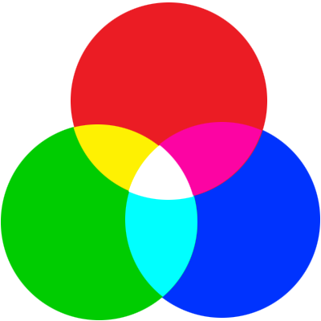
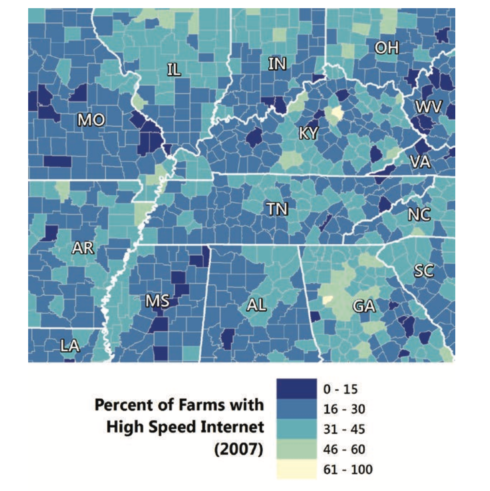

```{r setup, include=FALSE}
knitr::opts_chunk$set(echo = TRUE, tidy = F,  collapse = TRUE, warning=F, message = F, out.width = '80%', 
                      size = 'footnotesize')
options(scipen = 999)
library(ggplot2)
library(gplots)
library(ggpubr)
library(dplyr)
library(colorspace)
library(scales)
library(knitr)
library(RColorBrewer)
library(viridis)
```


```{r, echo = F}
def.chunk.hook  <- knitr::knit_hooks$get("chunk")
knitr::knit_hooks$set(chunk = function(x, options) {
  x <- def.chunk.hook(x, options)
  ifelse(options$size != "footnotesize", paste0("\n \\", options$size,"\n\n", x, "\n\n \\footnotesize"), x)
})
```


```{r, echo = F}
## Function for color wheel
colorwheel <- function(hex){
  df <- data.frame(colors = rep(1,length(hex)), hex = hex, stringsAsFactors = F)
  ggplot(df, aes(x = "", y = colors, fill = hex)) + 
    geom_bar(stat='identity', width = 1) + 
    coord_polar(theta = 'y', start=0, direction = -1) + 
    scale_fill_manual(values = df$hex) + 
    theme(legend.position = "none", axis.ticks = element_blank(),
          axis.text = element_blank(), 
          axis.line = element_blank(),
          panel.grid = element_blank(), 
          axis.title = element_blank())
}

```


## Color

How do we see color ?
\


```{r, echo = F, out.height='85%'}

```

## Color

- Rods and cones are the receptors in the retina responsible for your sense of sight. 
- They are the part of the eye responsible for converting the light that enters your eye into electrical signals that can be decoded by the vision-processing center of the brain. 
- Cones are responsible for color vision.

## Color

- As a rule, humans have three different types of cones with photo-pigments that sense three different portions of the visible spectrum.
- Each cone is tuned to perceive primarily long wavelengths (red), middle wavelengths (green), or short wavelengths (blue), referred to as L-, M-, and S- cones respectively.

## Color

**My red is not the same as your red**

\

Different people can see the same color differently. Color perception depends on a lot of things, such as distribution of red, green, blue cones, context, etc.

That is how we are ending up with the color blindness

*Color blindness can occur when one or more of the cone types are not functioning as expected. Cones can be absent, non-functioning or detect a different color than normal. Red-green color blindness is the most common, followed by blue-yellow color blindness. Men are more likely to have color blindness than women.*

## Color

Context: 

**The dress** is a photograph that became a viral internet sensation on 26 February 2015, when viewers disagreed over whether the dress pictured was coloured black and royal blue, or white and gold.

\


```{r, echo = F, out.height='60%'}
include_graphics('Img/color 6.png')
```


## Color

Still no consensus...

\

```{r, echo = F}

```

## Color

Color perception is a property of an object.

\
\

When you look at your white car, your brain instantly identifies it as a white, regardless of how the light is reflected from the car.

## Color

A "color model" is an abstract mathematical model describing the way colors can be represented as tuples of numbers (e.g. triples in RGB or quadruples in CMYK).

The first pioneers of color theory were Isaac Newton and Johann Wolfgang von Goethe.

## Color

Goethe presented a circular diagram (color wheel) in which the three primary colors of red, blue and yellow alternate with the three secondary colors of orange, violet and green.

\

```{r, echo = F, out.height='70%'}

```


## Color Model:

Color model can be described by primary colors and how other colors are created. Primary colors are also called primary **hues**.

There are numerous color models:

- *RGB* (Red Green Blue) - color model used by computers and for digital visuals
- *CMYK* (Cyan, Magenta, Yellow, Key(Black)) - color model used for printing
- *HCL* - Hue Chroma Luminance and its variations such as HLS, etc


# Color models


## Color model: RGB

RGB: Red, Green, Blue color model is based on the three primary colors of light.

\

```{r, echo = F, out.height='60%'}

```

## Color Model: RGB

Secondary colors in RGB model are created by adding primary colors to each other:
\
```{r, echo = F}

```

## Color Model: RGB

Colors are defined with the values from 0 to 255, where 255 is the highest expression of the color, while 0 is its absence.

That is why white will have an RGB [255,255,255] and black will have RGB of [0,0,0]


## Color Model: RGB

Tertiary colors are achieved by a mixture of primary and secondary colors.

\

```{r, echo = F, out.height='70%'}

```


## Color Model: RGB

Complementary colors are pairs of colors which, when combined or mixed, cancel each other out  by producing a grayscale color like white or black.When placed next to each other, they create the strongest contrast for those two colors. Complementary colors may also be called "opposite" colors.

Complementary colors are located on the opposite sides of the color wheel, examples of complementary colors:

- Cyan - Red
- Green - Magenta
- Yellow - Blue

## Color model

If you are plotting categorical data, then use complementary colors.
Here is how ggplot is generating the default palette for categorical variables

If there are only two categories, then choose them as opposite to each other
\
```{r, echo=F}
swatchplot(hue_pal()(2))
```

## Color model

The color wheel (approximate)
\
```{r, echo=F, out.height='70%'}
colorwheel(hue_pal()(100))
```


## Color model

If there are three categories, then choose the colors in such a way that they will be $120^\circ$ apart (360/3)

\
```{r, echo=F}
swatchplot(hue_pal()(3))
```


## Color model

With 4 categories, $90^\circ$ apart

\
```{r, echo=F}
swatchplot(hue_pal()(4))
```


## HCL model

HCL stands for *Hue*,  *Chroma*, *Luminance*

in simpler terms:

- **Hue**: defines the color, the name of the color, or the dominant wavelength
- **Chroma**: defines the colorness
- **Luminance**: defines the brightness

## HCL model

- Hue is a number between 0 and 360 (an angle on the color wheel).
- Chroma is the purity of a colour. A chroma of 0 is gray, and the maximum value of chroma varies with luminance.
- Luminance is the lightness of the colour. A luminance of 0 produces black, and a luminance of 1 produces white.


## HCL model: Hue

```{r}
cols <- hcl(h = c(0,60,120,180, 240), c = 60, l = 65)
cols
```

## HCL model: Hue

```{r}
swatchplot(cols)
```

## HCL model: Luminance

Decreasing the luminance makes the plot darker

```{r}
cols <- hcl(h = c(0,60,120,180, 240), c = 60, l = 25)
swatchplot(cols)
```


## HCL model: Chroma

Increase of chroma brings more colorfulness.

```{r}
cols <- hcl(h = c(0,60,120,180, 240), c = 200, l = 65)
swatchplot(cols)
```


## HCL model: Chroma

Setting chroma to 0 will give achromatic color

```{r}
cols <- hcl(h = c(0,60,120,180, 240), c = 0, l = 85)
swatchplot(cols)
```

## HCL model

What will happen, if chroma is 0 and you gradually increase the luminance from 0 to 50?

\

```{r, echo = F}

```

## HCL model


```{r}
cols <- hcl(h = 1, c = 0, l = 0:50)
swatchplot(cols)
```


## HCL model: color palettes

1. Sequential palettes, which are suited to ordered data that progress from low to high (gradient) - are used with ordinal data. 
2. Qualitative palettes (second list of colors), are best suited to represent nominal or categorical data. They do not imply magnitude differences between groups. 
3. Diverging palettes put equal emphasis on mid-range critical values and extremes at both ends of the data range. 


## HCL model: color palettes

RColorbrewer provides set of palettes for plotting

```{r, echo = F, out.height='70%'}

```

## HCL model: color palettes

```{r, size = 'small'}
display.brewer.pal(n=8, 'Set2')
```


## HCL model: color palettes

Get the hex codes for the palettes

```{r, size = 'small'}
brewer.pal(8, 'Set2')
```


## HCL model: color palettes

We can use specplot() from colorspace to visualize the palette showing how hue, chroma, and luminance are changing.

**Qualitative** palettes

```{r, out.height='65%'}
specplot(brewer.pal(8, 'Set2'))
```

## HCL model: color palettes

```{r}
specplot(brewer.pal(8, 'Dark2'))
```


## HCL model: color palettes

```{r}
specplot(brewer.pal(8, 'Paired'))
```

## HCL model: color palettes

Sequential palettes

```{r}
specplot(brewer.pal(9, 'Blues'))
```

## HCL model: color palettes

Sequential palettes

```{r}
specplot(brewer.pal(9, 'Reds'))
```

## HCL model: color palettes

Diverging palette

```{r}
specplot(brewer.pal(11, 'RdBu'))
```


## HCL model: Create your own palette

We can use colorspace to add additional palettes or create the ones we need

```{r, size = 'tiny'}
hcl_palettes()
```


## HCL model: Sequential palettes

- Single-hue: In each palette the hue is fixed and chroma decreases monotonically (along with increasing luminance). This is typically sufficient to clearly bring out the extreme colors (dark/colorful vs. light gray).
- Single-hue (advanced): The hue is fixed (as above) but the chroma trajectory is triangular. Compared to the basic single-hue palette above this better distinguishes the colors in the middle and not only the extremes.
- Multi-hue (advanced): As in the advanced single-hue palette the chroma trajectory is triangular but additionally the hue varies slightly. This can further enhance the distinction of colors in the middle of the palette.


## HCL model: Single hue

```{r}
s_hue <- sequential_hcl(n=20, h = 260, l = c(30, 90))
swatchplot(s_hue)
```

## HCL model: Single hue

```{r}
specplot(s_hue)
```


## HCL model: Single hue

Change the hue

```{r}
s_hue <- sequential_hcl(n=20, h = 160, l = c(30, 90))
swatchplot(s_hue)
```

## HCL model:

\scriptsize
```{r, eval = F}
swatchplot('Single Hue' = sequential_hcl('Blues 2', n=20),
           'Single Hue Advanced' = sequential_hcl('Blues 3', n=20),
           'Multi Hue (Red-Blue)' = sequential_hcl('Red-Blue', n=20))
```


## HCL model:


```{r, echo = F}
swatchplot('Single Hue' = sequential_hcl('Blues 2', n=20),
           'Single Hue Advanced' = sequential_hcl('Blues 3', n=20),
           'Multi Hue (Red-Blue)' = sequential_hcl('Red-Blue', n=20))
```

## HCL model: Single-hue (advanced)

```{r}
specplot(sequential_hcl('Red-Blue', n = 10))
```


## HCL model: Diverging palettes

In RColorBrewer

```{r}
specplot(brewer.pal(9, 'PuOr'))
```


## HCL model: Diverging palettes

From colorspace

```{r, out.height='70%'}
pal <- diverging_hcl(10, h = c(180, 0), c = 80, l = c(30, 90))
specplot(pal)
```

## HCL model: Single-hue (advanced)

Diverging Palette in colorspace

```{r}
specplot(diverge_hcl('Blue - Red',n= 100))
```

## Palettes in use

- RColorbrewer and its packages are based on the colorbrewer.org project.

- The colorbrewer project is based on the work of Cynthia Brewer - Designing "Better Maps: A Guide for GIS Users"

## Palettes in use

**An example of the usage of sequential palette**

Some counties had almost no farms with access to high-speed Internet in 2007. The color sequence is reversed from the standard: “dark represents high” convention to emphasize lack of access (p 153).

```{r, echo = F, out.height = '60%'}

```


## Palettes in use: Diverging scale

This map shows median house value by census block group in Atlanta, Georgia. It uses a diverging color scheme with two hues (magenta and green) and a light-gray middle class for block groups between overall median values for Atlanta and the United States.(p. 154)

```{r, echo = F, out.height='60%'}

```


# Colors in R

## Colors in R

R has a predefined, named list of colors

```{r, size = 'small'}
length(colors())
colors()[1:10]
```


## Colors in R

function col2rgb() translates any color to RGB notation

```{r}
col2rgb(col=1:6)
```

or refer by name

```{r}
col2rgb("seagreen")
```


get the hexadecimal code

```{r}
rgb(46,139,87, maxColorValue = 255)
```


## Colors in ggplot2

You can use either the color name or its hexadecimal code in ggplot

\scriptsize
```{r}
ggplot(mtcars, aes(x = hp, y = mpg)) + geom_point(color = "seagreen")
```


## Colors in ggplot2

The same with the hexadecimal notation

\scriptsize
```{r}
ggplot(mtcars, aes(x = hp, y = mpg)) + geom_point(color = "#2E8B57")
```

## Colors in ggplot2

- Colors for different aesthetics are controlled by the scale.
- Depending on how you are planning to access and use colors, different layers are available
  - scale_XXX_manual - for manual entry of the colors
  - scale_XXX_brewer - to use color_brewer
  - and many more

## Colors in ggplot2

\scriptsize
```{r}
ggplot(data=iris, aes(x=Sepal.Length, y=Sepal.Width, color=Species)) + 
  geom_point()+ scale_color_manual(values = c("red", "cyan", "violet"))
```

## Colors in ggplot2

The same with hex codes

\scriptsize
```{r, out.height='67%'}
ggplot(data=iris, aes(x=Sepal.Length, y=Sepal.Width, color=Species))+
  geom_point()+
  scale_color_manual(values = c("#FF0000", "#00FFFF", "#EE82EE"))
```

## Colors in ggplot2

Color palettes with Brewer

\scriptsize
```{r, out.height='70%'}
ggplot(data=iris, aes(x=Sepal.Length, y=Sepal.Width, color=Species))+
  geom_point() + scale_color_brewer(palette = 'Dark2')
```

## Colors in ggplot2

With the continuous variable we are going to use color gradient that can be either diverging or sequential. By default the Blues palette is used.

\scriptsize
```{r, out.height='67%'}
ggplot(data=iris, aes(x=Sepal.Length, y=Sepal.Width, color=Petal.Length))+
  geom_point()
```


## Colors in ggplot2: Color gradient

When you have continuous variable, you cannot use diverging or sequential palettes as it is.
Instead you use color gradient by specifying

- low and high hues for sequential palettes
- low, high and optionally midpoint

**The colour gradient scale maps a segment of the real line to a path through a colour space.**

## Colors in ggplot2: Color gradient

Define high and low values

\scriptsize
```{r, out.height='70%'}
ggplot(data=iris, aes(x=Sepal.Length, y=Sepal.Width, color=Petal.Length)) +
  geom_point() + scale_color_continuous(low = "#56B1F7", high =  "#132B43")
```

## Colors in ggplot2

Any two hues will work

\scriptsize
```{r, out.height='70%'}
ggplot(data=iris, aes(x=Sepal.Length, y=Sepal.Width, color=Petal.Length)) +
  geom_point() + scale_color_continuous(low = "blue", high = "red")
```

## Colors in ggplot2

- scale_XXX_gradient() gives some more capabilities
- scale_XXX_gradient2() for diverging colors

\scriptsize
```{r, out.height='60%'}
ggplot(data=iris, aes(x=Sepal.Length, y=Sepal.Width, color=Petal.Length)) +
  geom_point() + scale_color_gradient2(low = "violet", high = "red", 
                                       midpoint = mean(iris$Petal.Length))
```

## Colors in ggplot2

Define the color for midpoint

\scriptsize
```{r, out.height = '60%'}
ggplot(data=iris, aes(x=Sepal.Length, y=Sepal.Width, color=Petal.Length)) +
  geom_point() + 
  scale_color_gradient2(low = "violet", high = "red",
                        midpoint = mean(iris$Petal.Length), mid = 'black')
```

## Viridis color palette

The viridis package developed by Stéfan van der Walt and Nathaniel Smith for the Python matplotlib library, to replace ugly MATLAB palettes.

Viridis color palettes is designed as:

- Colorful, spanning as wide palette as possible to make differences easy to see,
- Perceptually uniform, meaning that values close to each other have similar-appearing colors and values far away from each other have more different-appearing colors, consistently across the range of values,
- Robust to colorblindness, so that the above properties hold true for people with common forms of colorblindness, 
- Well suited for gray scale printing, and
- Pretty (according to the [authors](https://youtu.be/xAoljeRJ3lU?list=PLYx7XA2nY5Gcpabmu61kKcToLz0FapmHu&t=166))


## Viridis color palette

scale_color_viridis() comes from a package viridis (even though ggplot has its own layers for viridis)

\scriptsize
```{r, out.height='65%'}
ggplot(data=iris, aes(x=Sepal.Length, y=Sepal.Width, color=Petal.Length)) +
  geom_point() + scale_color_viridis()
```

## Viridis color palette

Four viridis perceptually uniform colormaps are available


- **inferno**	perceptually uniform shades of black-red-yellow
- **magma**	perceptually uniform shades of black-red-white
- **plasma**	perceptually uniform shades of blue-red-yellow
- **viridis**	perceptually uniform shades of blue-green-yellow


