```{r setup, include = FALSE}
knitr::opts_chunk$set(echo = TRUE, warning = FALSE, message = FALSE)
options(tinytex.verbose = T)

options(scipen = 999)
library(devtools)
library(knitr)
library(dplyr)
```


# Intro to R

## Intro to R

- Go to [Comprehensive R Archive Network (CRAN)](https://cran.r-project.org/) and install version for your operating system
- Go to [RStudio](https://www.rstudio.com/products/rstudio/download/) and install RStudio IDE
- You need to install R before installing RStudio

\hfill\break

**Alternatives**

- Install [Microsoft R](https://mran.microsoft.com/open)
- Use Microsoft Visual Studio (free version available)

```{r, echo = F, out.height = '40%', out.width = '30%', fig.align = 'right'}

```


## Intro to R

Configure the pane layout of RStudio as you wish

\hfill\break

```{r, echo = F, out.width = "90%"}
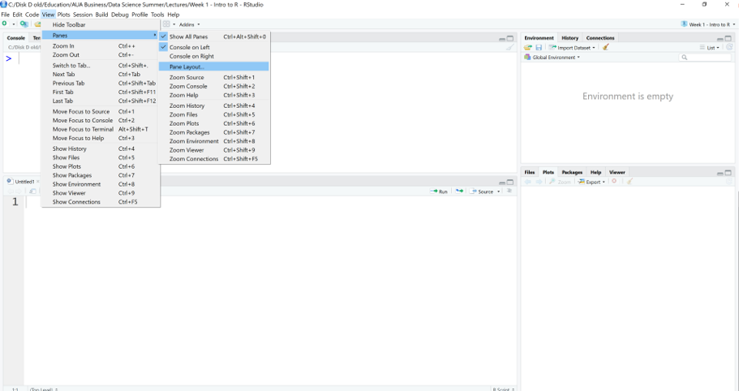
```


## Intro to R

```{r, echo = F, out.width = "90%"}
include_graphics('Img/RStudio_Pane-Layout2.png')
```


## Intro to R

RStudio projects make it straightforward to divide your work into multiple contexts, each with their own working directory, workspace, history, and source documents.

\hfill\break

**Creating Projects**

- RStudio projects are associated with R working directories. You can create an RStudio project:
    - in a brand new directory;
    - in an existing directory where you already have R code and data;
    - by cloning a version control (Git or Subversion) repository.


## Intro to R

- Create an empty directory
- Go to File $\rightarrow$ New Project
- Choose existing directory

\hfill\break

```{r, echo = F, out.height = '50%', out.width = '50%', fig.align = 'right'}
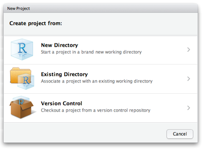
```


## Intro to R

- Now when you have created your project, all files associated with the project need to be saved in the project directory
- To check the project directory do getwd() in Console

\hfill\break

```{r, echo = F, out.width = '60%'}
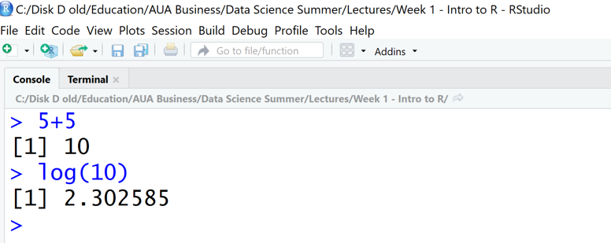
```

\hfill\break

The name of the project appears at the top of RStudio window


## Why do we need RStudio Project?

The benefits of RStudio project:

- Can have different projects with their own environment.
- While opening a project, R restores previous work and project history includes recent commands which had been used in the project.
- Source pane remembers the files which had been opened.


## Intro to R

When a new project is created, RStudio:

- Creates a project file (with an .Rproj extension) within the project directory. This file contains various project options (discussed below) and can also be used as a shortcut for opening the project directly from the filesystem.
- Creates a hidden directory (named .Rproj.user) where project-specific temporary files (e.g. auto-saved source documents, window-state, etc.) are stored. This directory is also automatically added to .Rbuildignore, .gitignore, etc. if required.
- Loads the project into RStudio and displays its name in the Projects toolbar (which is located on the far right side of the main toolbar).


## Intro to R

**Opening Projects**

\hfill\break

There are several ways to open a project:

- Using the **Open Project** command (available from both the Projects menu and the Projects toolbar) to browse for and select an existing project file (e.g. MyProject.Rproj).
- Selecting a project from the list of the most recently opened projects (also available from both the Projects menu and toolbar).
- Double-clicking on the project file within the system shell (e.g. Windows Explorer, OSX Finder, etc.).


## Intro to R

**The source editor**

- If you plan to reuse your code, write it in source editor

\hfill\break

```{r, echo = F, out.width = '90%'}
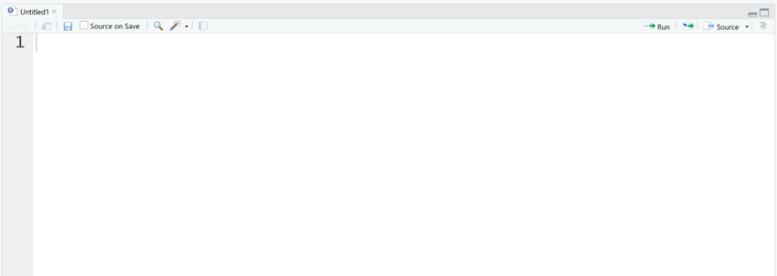
```


## Intro to R

Here you can type any valid R command after the > prompt followed by **Enter** and R will execute that command. 

\hfill\break

```{r, echo = F, out.height = '40%', out.width = '60%'}
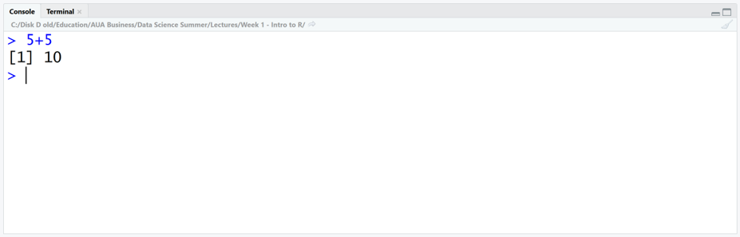
```

\hfill\break
Use console as a calculator
\hfill\break

[1] is the index for the output, just ignore it


## Intro to R

This will create new script file

\hfill\break

```{r, echo = F, out.height = '70%', out.width = '70%'}
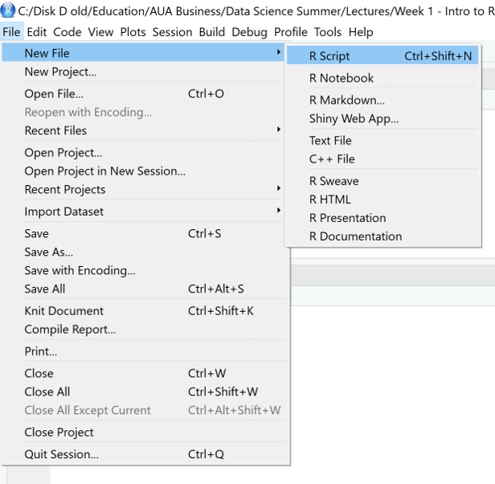
```


## Intro to R

- To run the script line from source editor, put the cursor anywhere on the line and hit **Ctrl+Enter**
- You will see the output in the console

\hfill\break

```{r, echo = F, out.height = '50%', out.width = '50%'}
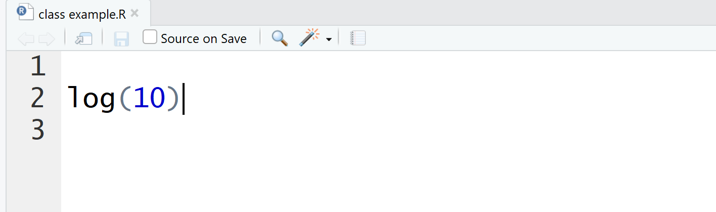
```


## Intro to R

- If you have a piece of text in your editor that is not a code (thus is not executable by R) then you need to comment it, add # before each line
- When you run this line of code, it will be printed in Console as a text
- To comment large chunk of text, use **Ctrl+Shift+C**

\hfill\break

```{r, echo = F, out.height = '60%', out.width = '60%'}
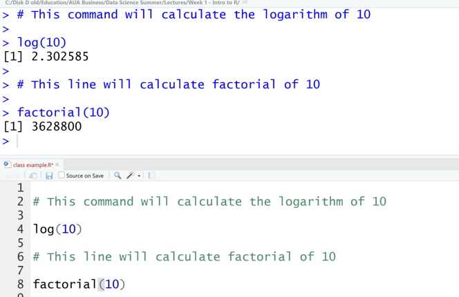
```


## Intro to R

- The environment window contains objects (data, values, functions) R has currently stored in its memory. 
- The history window shows all commands that were executed in the Console.

\hfill\break

```{r, echo = F, out.height = '50%', out.width = '50%'}
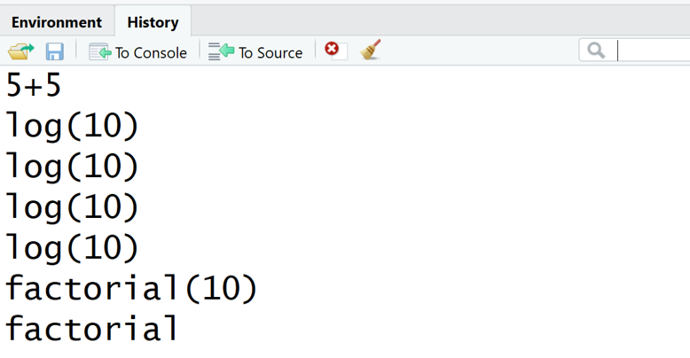
```


## Intro to R

Bottom right: files, plots, packages, help, & viewer pane. Here you can open files, view plots, install and load packages, read main pages, and view markdown and other documents in the viewer tab.

\hfill\break

```{r, echo = F, out.height = '50%', out.width = '50%'}
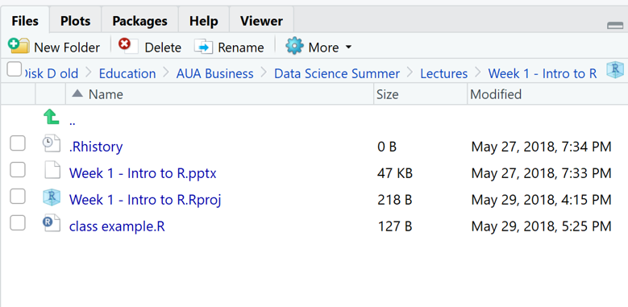
```


## Intro to R

Some useful shortcuts:

- type first few letters of the function/object then hit Tab to open dropdown menu with possible options

\hfill\break

```{r, echo = F, out.height = '60%', out.width = '60%'}
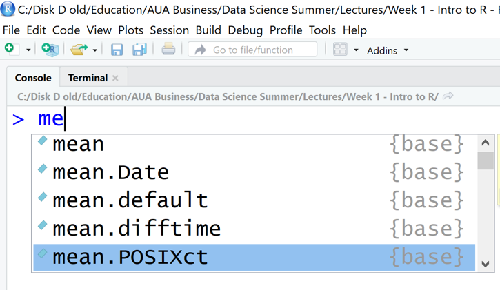
```


## Intro to R

It's often the case that you want to re-execute commands that you previously entered. The RStudio console supports the ability to recall previous commands using the arrow keys:

- **Up** - Recall previous command(s)
- **Down** - Reverse of Up

\hfill\break

You can even view a list of your recent commands by pressing **Ctrl+Up** on Windows or **Command+Up** on a Mac.

\hfill\break

```{r, echo = F, out.width = "60%"}
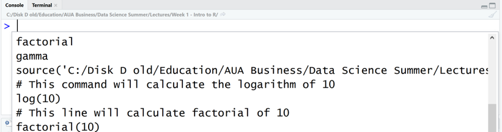
```


## Intro to R

- When you download R from the CRAN, you get that "base" R system.
- The base R system comes with basic functionality; implements the R language.
- One reason R is so useful is the large collection of packages that extend the basic functionality of R.
- R packages are developed and published by the larger R community.


## Intro to R

- Packages can be installed with the install.packages() function in R.
- To install a single package, pass the name of the library to the install.packages() function as the first argument.
- The following code installs the devtools package from CRAN.

\hfill\break

install.packages("devtools")


## Intro to R

- The package needs to be installed only once
- To load the package into R environment you need to use function library()
- You need to load the library everytime you start a new R 

```{r, eval=F}
library(devtools)
```


## Intro to R

- You can also install packages from github
- The following code will install the following package from github

```{r, eval=F}
library(devtools)
install_github("christophM/iml")
```

\hfill\break
If you do not want to load the entire package but want to use some function from it, use the following command

\hfill\break
package::function_name

```{r eval=F}
devtools::install_github("christophM/iml")
```


## Intro to R

To access help/documentation on a function from R base package

```{r eval=F}
?mean
```

To access help/documentation on function from a library

```{r eval=F}
#??geom_path
```

The same

```{r eval=F}
#?ggplot2::geom_path
```

Help on the package

```{r eval=F}
help(package='ggplot2')
```


## Intro to R

- Each package on CRAN has its own webpage
- This includes documentation and sometimes includes vignettes 

\hfill\break

- If you have a specific task to do, then look at R Task View
- [Here](https://cran.r-project.org/web/views/TimeSeries.html) are all the packages and R functionality described for the Time series analysis


# Intro to R programming language

## Intro to R programming language

- Anything in R is an object.
- Objects are assigned values using <- . (An equal sign = can also be used.) For e.g., the following command assigns value 5 to object x.

```{r}
x <- 5
x
```
\hfill\break

- R is case sensitive, thus Data10 and data10 are two different objects.
- A tidy code requires a space before the assignment operator and a space after.
    - You can see what is inside the object just by simple entering the name of the object in command line
    - When the object is created it should appear in your Environment Window
    - If the object is not in your environment window you cannot work with it
    - The assignment operator works in the opposite direction as well

```{r}
5 -> x
x
```


## Data Structres in R

R programming supports five basic types of data structure.
\hfill\break

```{r, echo = F, out.width = "80%"}
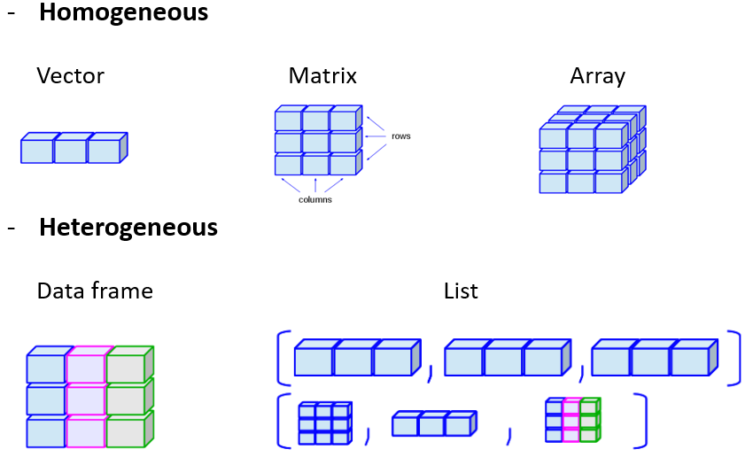
```


## Data Structures: Vector

**Vector** is a type of data structure that contains similar types of data, i.e., integer, double, logical, complex, etc. In order to create a vector c() function is used.

```{r}
(x <- c(10,5,6))
```
\hfill\break

```{r}
(x1 <- c(1:10))
```
\hfill\break

The same as (only when you have a sequence)

```{r}
(x1 <- 1:10)
```
\hfill\break

```{r}
class(x)
```
\hfill\break

A character vector

```{r}
y <- c("CS", "DS", "EC")
class(y)
```


## Coercion

- All elements of an atomic vector must be the same type, so when you attempt to combine different types they will be coerced to the most flexible type. 
- Types from least to most flexible are: logical, numeric, and character.
- For example, combining a character and an integer yields a character:

```{r}
(x3 <- c("A",1))
```

```{r}
class(x3)
```


## Data Structures: Matrix

- **Matrix** is a two-dimensional data structure and can be created using matrix() function. 
- Matrix is a collection of vectors with the same length and type

```{r}
m <- matrix(data=1:15, nrow=3)
m
```


## Function

- To look at the function arguments, hit Tab
- You need to name the arguments if they are not in the same order as defined within the function
- If the order is the same you can skip the names 

\hfill\break

```{r, echo = F, out.width = "80%"}
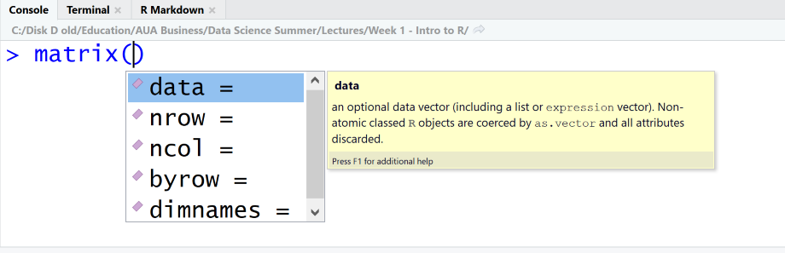
```


## Data Structures

Example: function matrix with arguments flipped
\hfill\break

The same result

```{r}
(m <- matrix(1:15, 3))
```

\hfill\break

Different result

```{r}
(m <- matrix(3, 1:15))
```


## Data Structures

Other ways of building a matrix

- Create two vectors of the same length

```{r}
x <- 0:5
y <- -5:0
```

- Combine together by row

```{r}
(m1 <- rbind(x,y))
```


## Data Structures

The matrix has row names but does not have column names

```{r}
colnames(m1)
```

```{r}
rownames(m1)
```


## Data Structures

- Combine together by column

```{r}
(m2 <- cbind(x,y))
```
\hfill\break

Pay attention, the matrix has column names, but does not have row names 

```{r}
colnames(m2)
```

```{r}
rownames(m2)
```


## Data Structures

Check if the resulting object is a matrix

```{r}
is.matrix(m1)
```

```{r}
is.matrix(m2)
```


## Data Structures

Set the rownames

```{r}
rownames(m2) <- c('A', 'B', 'C', 'D', 'E', 'F')
m2
```


## Data Structures

Subset by either integer position, or by rowname

```{r}
m2[1:3,]
```

```{r}
m2[c('A', 'B', 'C'),]
```


## Data Structures: Data frame

- A **data frame** is the most common way of storing data in R, and if used systematically makes data analysis easier. 
- Under the hood, a data frame is a list of equal-length vectors that can also have different types.

```{r}
df <- data.frame(x=1:10, y=11:20)
head(df, n=5)
```


## Data Structures

- Dataframe always has both column and row names
- If you don’t specify row names it is just the row number

```{r}
colnames(df)
```

```{r}
rownames(df)
```


## Data Structures

- You can combine vectors with different type into a dataframe
- First create a matrix with two vectors of different types

```{r}
Club <- c("Juventus", "Napoli", "Roma", "Inter")
Points <- c(95,91,77,72)
```

```{r}
s_matrix <- cbind(Club, Points)
str(s_matrix)
```

```{r}
class(s_matrix)
```

```{r}
typeof(s_matrix)
```


## Data Structures

Create a dataframe

```{r}
df_seriea <- data.frame(Club, Points)
str(df_seriea)
```

\hfill\break
\hfill\break

Two columns (vectors) in the data frame have different types


## Data Structures: List

**List**

\hfill\break

- In R lists act as containers. 
- Unlike vectors, the contents of a list are not restricted to a single type and can encompass any mixture of data types. 
- Lists are sometimes called generic vectors, because the elements of a list can be of any type of R object, even lists containing further lists. 
- This property makes them fundamentally different from atomic vectors.
- A list is a special type of vector. Each element can be a different type.


## Data Structures

List containing dataframe and a matrix

```{r}
my_list <- list(df_seriea, m1)
str(my_list)
```


## Data Structures

Look what is inside

```{r}
my_list
```


## Data Structures

The unlist() function will flatten the list into a vector

```{r}
z <- unlist(my_list)
z
```


## Data Structures

**Attributes**

\hfill\break

- All objects can have arbitrary additional attributes, used to store metadata about the object. 
- Attributes can be thought of as a named list (with unique names). 
- Attributes can be accessed individually with attr() or all at once (as a list) with attributes().

```{r}
attr(df_seriea, "topic") <- "sports"
df_seriea
```

```{r}
attr(df_seriea, "topic")
```


# Data Types

## Data Types

Data types used in R

- Logical
- Numeric
- Factor
- Character


## Data Types

Logical data type is one of the frequently used data types usually used for comparing two values. Values that a logical data type takes is TRUE or FALSE.

```{r}
a <- 10
a > 5
```

```{r}
log1 <- c(5, 6, TRUE)
typeof(log1)
```

```{r}
log1
```

\hfill\break
\hfill\break

Coercion of numeric and logical values will result as numeric.


## Data Types

String literals or string values are stored as Character objects in R.

```{r}
b <- c("Armenia", "Georgia", "Azerbaijan")
typeof(b)
```

```{r}
(b1 <- c(b, TRUE))
```


## Data Types

- A **factor** is a vector that can contain only predefined values, and is used to store categorical data. 
- Factors are built on top of integer vectors using two attributes: the class, factor, which makes them behave differently from regular integer vectors, and the levels, which defines the set of allowed values.

```{r}
b <- as.factor(c("Armenia", "Georgia", "Azerbaijan"))
```

Factors in R are stored as a vector of integer values with a corresponding set of character values used when the factor is displayed.

```{r}
typeof(b)
```
\hfill\break

```{r}
as.numeric(b)
```
\hfill\break

```{r}
b
```


## Data Types

You can relevel the factor variable by changing the reference value

```{r}
b<- relevel(b, ref='Azerbaijan')
levels(b)
```

```{r}
as.numeric(b)
```


# Special Values in R

## Special Values in R

**Missing Values**

\hfill\break

The examples and reasons of having missing values:

- The information was not collected (e.g. some people decline to give their age or weight).
- Some attributes are not applicable to all objects  (e.g. forms have conditional parts that are filled out only when a person answers a previous question in a certain way).
- The information is not imported in the database (system missing).
- In R missing or undefined values are represented by NA.


## Special Values in R

**NA**

\hfill\break

- In R, the NA values are used to represent missing values. (NA stands for “not available”).
- You may encounter NA values in text loaded into R (to represent missing values) or in data loaded from databases (to replace NULL values).

```{r}
v1 <- c(1,2,4,NA,5)
```

```{r}
is.na(v1)
```


## Special Values in R

```{r}
v2 <- c(10, "A", 20)
```

```{r, warning=T}
as.numeric(v2)
```


## Special Values in R

**Inf and -Inf**

\hfill\break

If a computation results in a number that is too big, R will return Inf for a positive number and -Inf for a negative number (meaning positive and negative infinity, respectively).

```{r}
120/0
```

```{r}
-120/0
```

\hfill\break

Too big to show

```{r}
45^12500
```


## Special Values in R

**NaN**

\hfill\break

Sometimes, a computation will produce a result that makes little sense. In these cases, R will often return NaN (meaning "Not a Number").

```{r}
0/0
```


## Special Values in R

**NULL**

\hfill\break

- There is a null object in R, represented by the symbol NULL. 
- NULL is often used as an argument in functions to mean that no value was assigned to the argument.
- Some functions may return NULL.
- NULL is not the same as NA, Inf, -Inf, or NaN.
- NULL represents the null object in R. 
- NULL is used mainly to represent the lists with zero length, and is often returned by expressions and functions whose value is undefined.


# Importing Data to R

## Importing Data to R

**Flat files**

\hfill\break

- A flat file database is a database that stores data in a plain text file. 
- Each line of the text file holds one record with fields separated by delimiters, such as commas or tabs. 
- While it uses a simple structure, a flat file database cannot contain multiple tables like a relational database can.


## Importing Data to R

**Delimiter-Separated Values**

\hfill\break

- Formats that use delimiter-separated values (also DSV) store two-dimensional arrays of data by separating the values in each row with specific delimiter characters. 
- Most database and spreadsheet programs are able to read or save data in a delimited format.
- Most widely used delimiters are: 
    - comma (CSV – comma separated values)
    - tab (TSV – tab separated values)


## Importing Data to R

- File winter.csv contains data on winter Olympic games from 1924 to 2014.
- The file is comma-separated.
- Use readLines() with n=5 to look at the first five lines of the text file.
- You can see that the values are separated by comma.

```{r}
readLines('Data/winter.csv', n=5)
```


## Importing Data to R

Use the function read.csv() to load the file into R environment

```{r}
winter <- read.csv('Data/winter.csv')
str(winter)
```

\hfill\break

\textcolor{red}{Be sure that you can see the new object in the environment. Otherwise you cannot work with it}

\hfill\break

```{r, echo = F, out.width = "40%"}
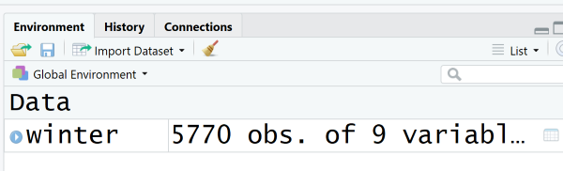
```


## Importing Data to R

- Look the help for read.csv (?read.csv), several options on how the file is imported.
- stringsAsFactors = F – the strings are loaded as a text rather than as a factor.

```{r}
winter <- read.csv('Data/winter.csv', stringsAsFactors = F)
str(winter)
```


## Importing Data to R

- The same data is saved in tab delimited file.
- A tab-separated values (TSV) file is a simple text format for storing data in a tabular structure, e.g., database table or spreadsheet data, and a way of exchanging information between databases. Each record in the table is one line of the text file.

```{r}
readLines('Data/winter.txt', n=5)
```


## Importing Data to R

You can use the same read.csv() file but need to specify the separator (delimiter)

```{r}
winter <- read.csv('Data/winter.txt', sep="\t", stringsAsFactors = FALSE)
str(winter)
```


## Importing Data to R

R can work with other data files as well

\hfill\break

- STATA files
- SPSS
- SAS
- MS Excel
- Databases
- XML
- HTML
- Etc.


# Subsetting Data

## Subsetting Data: Vectors

Create named vector

```{r}
Club <- c("Juventus", "Napoli", "Roma", "Inter")
Points <- c(95,91,77,72)
names(Points) <- Club
Points
```


## Subsetting Data: Vectors

- In R (unlike Python) the indexing starts with 1.
- Subsetting by index location.
- The vector has one dimension, so to subset it you need to specify the location of 1 index only.

```{r}
Points[2]
```

\hfill\break
\hfill\break

Subset by name

```{r}
Points["Juventus"]
```


## Subsetting Data: Vectors

- Subset several elements
- First two elements

```{r}
Points[1:2]
```

\hfill\break

- 1 and 3 elements

```{r}
Points[c(1,3)]
```

\hfill\break

- Subsetting by name

```{r}
Points[c("Napoli","Inter")]
```


## Subsetting Data: Vectors

Why R you getting an eRRoR ?

```{r, error=T}
Club[1,2]
```

```{r, error=T}
Club[2,4]
```


## Subsetting Data: Data frames

Load nba dataset

```{r}
load('Data/nba2009_2018.rda')
summary(nba2009_2018)
```
r

## Subsetting Data: Data frames

Data frame has two dimensions: Rows (first dimension) and Columns (second dimension)

\hfill\break

```{r, echo = F, out.width = "60%"}
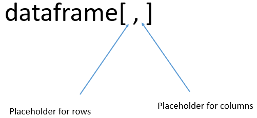
```


## Subsetting Data: Data frames

Will return the value on first row and forth column

```{r, echo = F, out.width = "60%"}

```

Will return the value of the first 10 rows and columns 4,5,6

```{r, echo = F, out.width = "60%"}

```


## Subsetting Data: Data frames

Will return the first 10 rows and all columns

```{r, echo = F, out.width = "60%"}

```

If you want to select all elements for the given index, just leave the placeholder empty.

\hfill\break

What will this command return?

```{r, echo = F, out.width = "60%"}

```


## Subsetting Data: Data frames

Indexing by column names

```{r}
colnames(nba2009_2018)
```

```{r}
nba1 <- nba2009_2018[,c("home.PTS", "away.PTS")]
colnames(nba1)
```

```{r}
dim(nba1)
```


## Subsetting Data: Data frames

- Negative indexing is used to exclude certain records from the dataframe.
- This does not work with column names indexing.

```{r}
nba2 <- nba2009_2018[,-c(1,2,4:6)]
head(nba2)
```


## Subsetting Data: Data frames

Exercises

\hfill\break

- Create new data frame from nba dataset
- Include first 100 rows and columns 2, 3, 5
- Exclude rows 250, 300 to 350 and exclude column 5


## Subsetting Data: Data frames

You can access specific column in data frame by using dollar sign

```{r}
mean(nba2009_2018$home.PTS)
```

```{r}
table(nba2009_2018$home.WL)
```


## Subsetting Data: Data frames

Subset one variable
\hfill\break

- First approach gives you a dataframe with one columns
- Second gives you a vector

```{r}
home_pts <- nba2009_2018['home.PTS']
str(home_pts)
```

```{r}
home_pts <- nba2009_2018[,'home.PTS']
str(home_pts)
```


## Subsetting Data: Data frames

Conditional indexing
\hfill\break

- Create new dataframe with games only from season 2009
- We need all the rows where the value for SEASON_ID is 2009
- Note that the type for column SEASON_ID is character


```{r}
nba4 <- nba2009_2018[nba2009_2018$SEASON_ID=='2009',]
```

Check if everything is done right

```{r}
table(nba4$SEASON_ID)
```


## Subsetting Data: Data frames

- Take only seasons 2009 and 2010
- As the SEASON_ID is character we will do the following

```{r}
nba5 <- nba2009_2018[nba2009_2018$SEASON_ID %in% c("2009", "2010"),]
table(nba5$SEASON_ID)
```


## Subsetting Data: Data frames

- Workaround: make SEASON_ID numeric vector

```{r}
nba2009_2018$SEASON_ID <- as.numeric(nba2009_2018$SEASON_ID)
nba5 <- nba2009_2018[nba2009_2018$SEASON_ID < 2011,]
table(nba5$SEASON_ID)
```

 
## Subsetting Data: Data frames

Logical operators in R

\hfill\break

```{r, echo = F, out.width = "80%"}
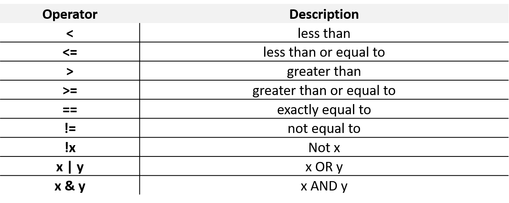
```


## Subsetting Data: Data frames

- Indexing on multiple conditions
- Take all the home game records for Detroit Pistons for seasons 2010 and 2011

```{r tiny=F}
nba6 <- nba2009_2018[nba2009_2018$SEASON_ID %in% c(2010,2011) &
                       nba2009_2018$home.TEAM_NAME =="Detroit Pistons",]

table(nba6$home.TEAM_NAME, nba6$SEASON_ID)
```


## Subsetting Data: Data frames

Using OR (|) operator in R

```{r}
nba7 <- nba2009_2018[nba2009_2018$away.TEAM_NAME=="Detroit Pistons" |
                       nba2009_2018$home.TEAM_NAME =="Detroit Pistons",]

head(nba7)
```


## Subsetting Data: Data frames

Adding new variable in dataframe

- Point differential

```{r, out.height = '60%'}
nba2009_2018$Diff <- nba2009_2018$home.PTS-nba2009_2018$away.PTS
hist(nba2009_2018$Diff)
```


## Indexing List

```{r}
(seriea <- data.frame(Club, Points))
```
\hfill\break

- We have created a dataframe. Note that the dataframe has rownames
- Create a list

```{r}
(list1 <- list(Club, "Italy", 2017, seriea))
```


## Indexing List

- If you index the list with [], the result is a list. 
- If you index the list with [[]] the result has the same structure as the list element

```{r}
list1[4]
```

```{r}
list1[[4]]
```

```{r}
is.data.frame(list1[[4]])
```

```{r}
is.data.frame(list1[4])
```


## Indexing List

Two elements
```{r}
list1[1:2]
```

\hfill\break
\hfill\break

Slicing element from the element
\hfill\break

This will bring the second element from the first element in the list

```{r}
list1[[1]][2]
```


## Indexing List

Named elements in the list

```{r}
list1 <- list(Teams = Club, country = "Italy", 
              year = 2017, standings = seriea)
list1
```


## Indexing List

Indexing by name

```{r}
list1$standings
```

```{r}
list1$year
```


# Functions

## Functions

- In programming, you use functions to incorporate sets of instructions that you want to use repeatedly or that, because of their complexity, are better self-contained in a sub program and called when needed. 
- A function is a piece of code written to carry out a specified task; it can or can not accept arguments or parameters and it can or can not return one or more values.
- In fact, there are several possible formal definitions of ‘function’ spanning from mathematics to computer science.
- **Generically, its arguments constitute the input and return values as output.**


## Functions

- Functions have named arguments which potentially have default values. 
- The formal arguments are the arguments included in the function definition.
- The formals function returns a list of all the formal arguments of a function.
- Not every function call in R makes use of all the formal arguments.
- Function arguments can be missing or might have default values.


## Functions

The function runif() generates random numbers from continuous uniform distribution
\hfill\break

Arguments are:

- n, number of observations, with no default - so needs to be specified
- min, the minimum
- max, the maximum

```{r}
formals(runif)
```

```{r}
args(runif)
```


## Functions

R functions' arguments can be matched **positionally** or **by name**. So the following calls to runif() are all equivalent (you can mix them as well).

- Matching by name

```{r}
runif(min=1, n=10, max=2)
```
\hfill\break

- Matching by position

```{r}
runif(10,1,2)
```

\hfill\break

Note, as the process is random you might get different results.


## Functions

Matched by position, this will give an error

```{r, warning=T}
runif(1,10,2)
```


## Functions

- If the argument has a default value and is not defined then the default value is used.
- Generated 10 numbers with min=0, max=1

```{r}
runif(10)
```


## Functions

You can look at the arguments of the function and their description by hitting **Tab** inside the brackets

\hfill\break

```{r, echo = F, out.width = "80%"}
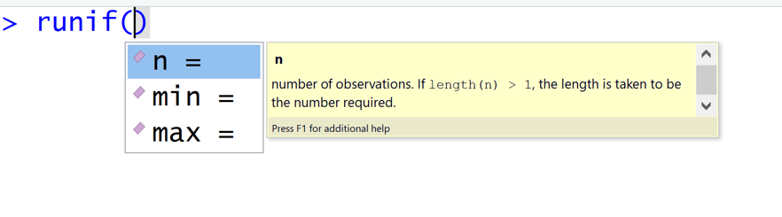
```


## Functions

**General rule: if you have to copy a code more than twice, write a function.**
\hfill\break

f <- function(a, b = 1, c = 2, d = NULL) { 
\hfill\break
	what needs to be done
\hfill\break
} 

\hfill\break

In addition to not specifying a default value, you can also set an argument value to NULL. 


## Functions

- User-defined functions are stored in the global environment and can be accessed easily.
- The following function will calculate the x power of y (default value of y is 2).

```{r}
foo <- function (x, y=2){
  x^y
}

foo(4)
```


## Functions

Arguments to functions are evaluated lazily, so they are evaluated only as needed. 

```{r}
foo <- function (x,y){
  x^2
}

foo(3)
```

\hfill\break
\hfill\break

This function never actually uses the argument \textcolor{red}{y}, so calling f(2) will not produce an error because the 2 gets positionally matched to \textcolor{red}{x}. 


## Functions

- The return value of a function is the last expression in the function body to be evaluated.
- It can be also specified with the function return()


## Functions

The following function will calculate the z-score of a vector

```{r}
norm <- function(x) {
  return((x-mean(x))/sd(x))
}

norm(mtcars$mpg)
```


# Dates and Times in R

## Dates in R

- R provides several options for dealing with date and date/time data. 
- The built in function as.Date() handles dates (without times) 
- Library chron handles dates and times, but does not control for time zones
- The POSIXct and POSIXlt classes allow for dates and times with control for time zones. 
- The general rule for date/time data in R is to use the simplest technique possible. 
- Thus, for date only data, as.Date() will usually be the best choice. If you need to handle dates and times without time-zone information, the chron library is a good choice; the POSIX classes are especially useful when time-zone manipulation is important.


## Dates in R

- Except for the **POSIXlt** class, dates are stored internally as the number of days or seconds from some reference date.
- The function as.Date() stores the number of days passed from 1970-01-01 

```{r}
x <- as.Date("2018-06-18")
class(x)
```

```{r}
as.numeric(x)
```

```{r}
as.numeric(as.Date("1970-01-01"))
```


## Dates in R

- The date can come in different formats.
- Usually, you need to tell R in which format the date is.

```{r, echo = F, out.width = "80%"}

```

```{r}
as.Date("2018/01/15", format = "%Y/%m/%d")
```

```{r}
as.Date("01-15-2018", format = "%m-%d-%Y")
```


## Dates in R

```{r}
oil <- read.csv("Data/oil.csv", stringsAsFactors = FALSE)
head(oil)
```

```{r}
str(oil)
```


## Dates in R

Format the DATE column with as.Date

```{r}
oil$DATE<-as.Date(oil$DATE, format="%d-%b-%y")
str(oil)
```


## Dates in R

- Now we can subset the data frame with DATE column.
- The following code is going to create a data frame with cases only from 2014

```{r}
oil_2014 <- oil[oil$DATE >= "2014-01-01" & oil$DATE < "2015-01-01",]
head(oil_2014)
```


## Dates in R

You can do arithmetic operations with class Date

```{r}
as.Date("2018-06-18")+1
```

```{r}
as.Date("2018-06-18")-as.Date("2018-05-18")
```


## Dates in R

Extracting weekday

```{r}
oil$WEEKDAY <- weekdays(oil$DATE)
head(oil)
```


## Dates in R

Extract month

```{r}
oil$MONTH <- months(oil$DATE)
head(oil)
```


## Dates in R

- To extract the day of the month, use format()
- The returned column is character, but you can make it numeric

```{r}
oil$DAY <- format(oil$DATE, "%d")
str(oil)
```


## Dates in R

Make the variable numeric

```{r}
oil$DAY <- as.numeric(oil$DAY)
head(oil)
```


# R Markdown

## R Markdown

- R Markdown documents are fully reproducible.
- It allows to combine text and code together in one report.
- You can use multiple languages within markdown file (R, python, SQL).
- R Markdown supports dozens of static and dynamic output formats including HTML, PDF, MS Word, Beamer, HTML5 slides, etc.
- R markdown is run in its own environment.

```{r, echo = F, out.height = "30%", out.width = "30%", fig.align='right'}

```


## R Markdown

The Workflow

```{r, echo = F, out.width = "80%",  fig.align='right'}
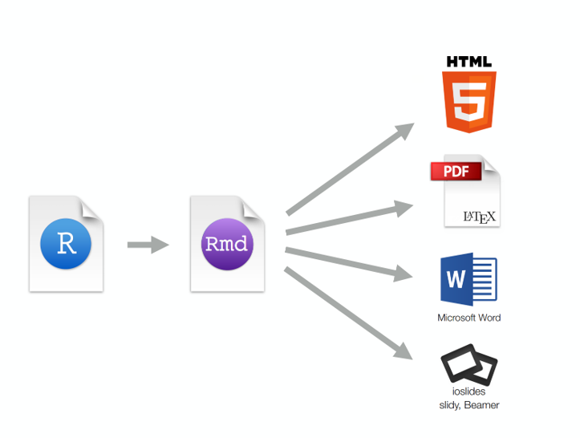
```


## R Markdown

To open new markdown file

\hfill\break

```{r, echo = F, out.width = "80%",  fig.align='right'}
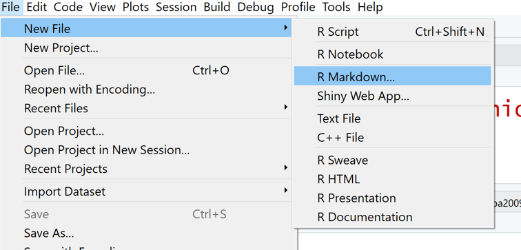
```


## R Markdown

The document below is a template R Markdown document. It includes the most familiar parts of an R Markdown document:

- A [YAML](https://en.wikipedia.org/wiki/YAML) header that contains some metadata (1)
- Narrative text written in Markdown (2)
- R code chunks surrounded by triple backticks {r} and followed by triple backticks; a syntax that comes from the knitr package (3)
\hfill\break

```{r, echo = F, out.width = "80%"}
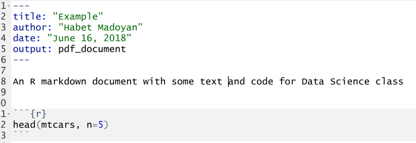
```


## R Markdown

Labeling and reusing code chunks

- Apart from the popular code chunk options you have learned by now, you can define even more things in the curly braces that follow the triple backticks.
- An interesting feature available in knitr is the labeling of code snippets. The code chunk below would be assigned the label simple_sum:

```{r simple_sum, results = 'hide', include = F}
2 + 2
```

\hfill\break

```{r, echo = F, out.width = '40%'}
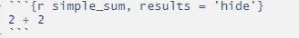
```

\hfill\break

- However, because the results option is equal to hide, no output is shown. 


## R Markdown

- You can embed R code into the text of your document with the `r` syntax. Be sure to include the lower case r in order for this to work properly. 
- R Markdown will run the code and replace it with its result, which should be a piece of text, such as a character string or a number.
- For example, the line below uses embedded R code to create a complete sentence:

\hfill\break

```{r, echo = F, out.width = '50%'}
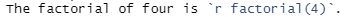
```

\hfill\break

- When you render the document the result will appear as:
\hfill\break

The factorial of four is `r factorial(4)`. 
\hfill\break

- Inline code provides a useful way to make your reports completely automated.


## R Markdown

**LaTeX equations**

\hfill\break

- You can also use the Markdown syntax to embed latex math equations into your reports. To embed an equation in its own centered equation block, surround the equation with two pairs of dollar signs like this,

```{r, echo = F, out.width = '15%'}
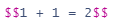
```


- To embed an equation inline, surround it with a single pair of dollar signs, like this:

```{r, echo = F, out.width = '15%'}
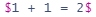
```

- You can use all of the [standard latex math symbols](https://en.wikibooks.org/wiki/LaTeX/Mathematics) to create attractive equations.


## R Markdown

LaTex formula example

$$\frac{n!}{k!(n-k)!} = \binom{n}{k}$$

In Tex

\hfill\break

```{r, echo = F, out.width = '40%'}

```

\hfill\break

Tex script needs to be written in the text portion of the document


## R Markdown

**Lists in R Markdown**
\hfill\break

To make a bullet list in Markdown, place each item on a new line after an asterisk or hyphen and a space, like this:

```{r, echo = F, out.width = "50%"}
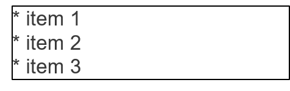
```

You can make an ordered list by placing each item on a new line after a number followed by a period followed by a space, like this

```{r, echo = F, out.width = "50%"}
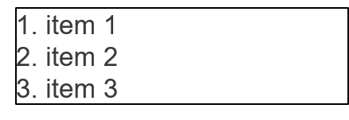
```

In each case, you need to place a blank line between the list and any paragraphs that come before it.


## R Markdown

**R code chunks**

\hfill\break

You can embed R code into your R Markdown report with the knitr syntax. To do this, surround your code with two lines: one that contains triple backticks {r} and the below one contains triple backticks. The result is a code chunk that looks like this:

\hfill\break

```{r, echo = F, out.width = "90%"}
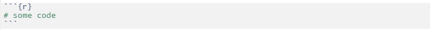
```

\hfill\break

When you render the report, R will execute the code. If the code returns any results, R will add them to your report.


## R Markdown

Customize R code chunks

- You can customize each R code chunk in your report by providing optional arguments after the r in ```{r}, which appears at the start of the code chunk. Let's look at one set of options.
- R functions sometimes return messages, warnings, and even error messages. By default, R Markdown will include these messages in your report. You can use the **message, warning and error** options to prevent R Markdown from displaying these. If any of the options are set to FALSE, R Markdown will not include the corresponding type of message in the output.  Packages often generate messages when you first load them with library(). 
- For example, R Markdown would ignore any messages or warnings generated by the chunk below.

\hfill\break

```{r, echo = F, out.width = '50%'}
include_graphics('Img/Turn-off-warnings-messages.png')
```


## R Markdown

Three of the most popular chunk options are echo, eval and results.

\hfill\break

- If ***echo = FALSE***, R Markdown will not display the code in the final document (but it will still run the code and display its results unless told otherwise).
- If ***eval = FALSE***, R Markdown will not run the code or include its results, (but it will still display the code unless told otherwise).
- If ***results = 'hide'***, R Markdown will not display the results of the code (but it will still run the code and display the code itself unless told otherwise).


## R Markdown

Other important stuff
\hfill\break

```{r, echo = F, out.width = "95%"}
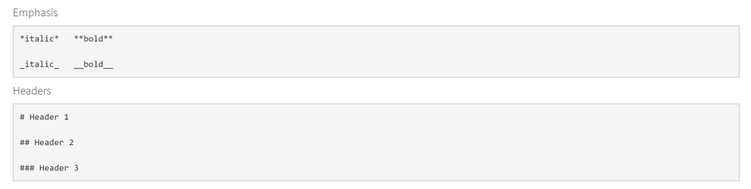
```

\hfill\break

If you want to start from a new page in pdf file, put in text part of the markdown

\hfill\break

```{r, echo = F, out.width = '15%'}
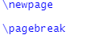
```


# Data Transformation: dplyr

## Grammar of data manipulation

dplyr is a grammar of data manipulation, providing a consistent set of verbs that help you solve the most common data manipulation challenges:

- **mutate()** adds new variables that are functions of existing variables
- **select()** picks variables based on their names.
- **filter()** picks cases based on their values.
- **summarise()** reduces multiple values down to a single summary.
- **arrange()** changes the ordering of the rows.

\hfill\break

These all combine naturally with group_by() which allows you to perform any operation "by group".


## Grammar of data manipulation

- Not necessary, but dplyr works the best with pipe like operator from **magrittr** package
- \%\>\% operator takes the object from its left-hand side and use it as an argument in the function on the right-hand side 

\hfill\break

```{r, echo = F, out.width = "40%", fig.align='right'}
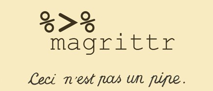
```


## Grammar of data manipulation

- The "pipe" operation is a handy tool to make your code more legible: %>%. 
\hfill\break

Key points:

- It takes the output of your previous operation and uses it as an input to your next operation.
- You can determine where the previous argument goes with the period symbol, . , which acts as a placeholder.
- Understand how to use it by replacing the pipe operation with "then" (in your mind, not in the code). For example, **filter(data, ...) \%\>\% select(...)** filters first then selects columns from the output of filter.


## Grammar of data manipulation

Filtering USA games only

```{r}
summer <- read.csv("Data/summer.csv", stringsAsFactors = F)
```

```{r}
summer_usa <- summer %>% filter(Country=="USA")
```

```{r}
table(summer_usa$Country, summer_usa$Medal)
```


## Grammar of data manipulation

Filter and group_by

```{r}
summer %>%
  filter(Country %in% c("USA", "FRA", "GBR")) %>%
  group_by(Country) %>%
  summarise(Count=n())
```

\hfill\break

- The result is a tibble
- Count=n() creates a new variable named Count with frequencies, n() calculates frequencies


## Grammar of data manipulation

Number of medals by country (is this long or wide format?)

```{r}
summer %>%
  filter(Country %in% c("USA", "FRA", "GBR")) %>%
  group_by(Country, Medal) %>%
  summarise(Count=n())
```


## Grammar of data manipulation

Using ggplot with dplyr

```{r, out.height= "50%"}
summer %>%
  filter(Country %in% c("USA", "FRA", "GBR")) %>%
  group_by(Country, Medal) %>%
  summarise(Count=n())
```

