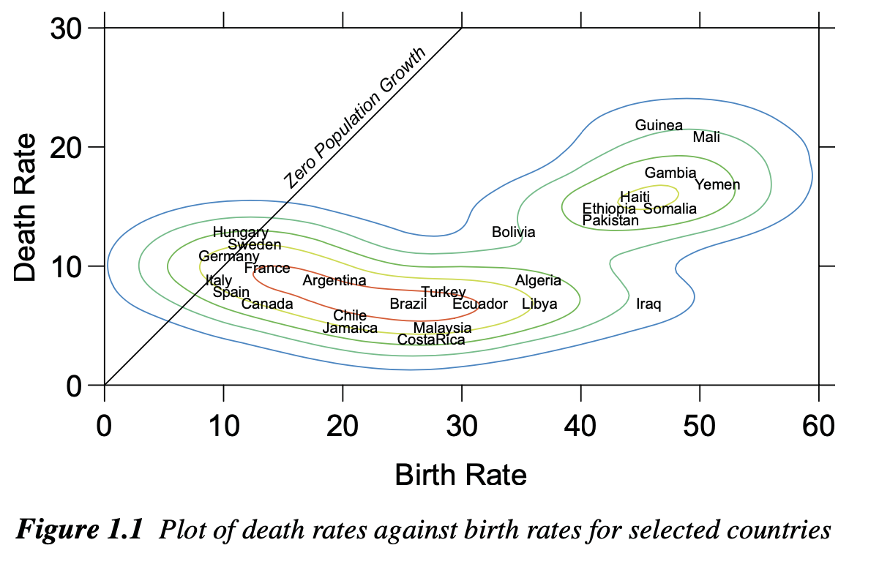
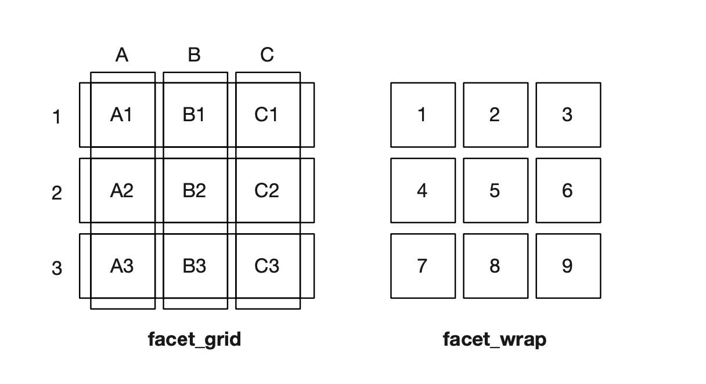
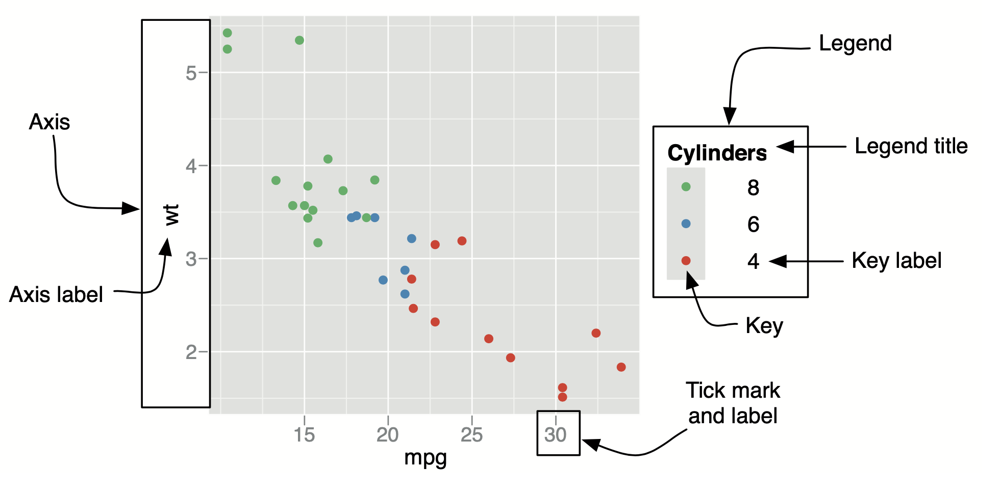

```{r setup, include=FALSE}
knitr::opts_chunk$set(echo = TRUE, tidy = F,  collapse = TRUE, warning=F, message = F, out.width = '80%', out.height = '80%' ,  size = 'footnotesize')

options(scipen = 999)
library(ggplot2)
library(dplyr)
library(knitr)
library(Hmisc)
library(HistData)
library(gridExtra)
```


```{r, echo = F}
def.chunk.hook  <- knitr::knit_hooks$get("chunk")
knitr::knit_hooks$set(chunk = function(x, options) {
  x <- def.chunk.hook(x, options)
  ifelse(options$size != "footnotesize", paste0("\n \\", options$size,"\n\n", x, "\n\n \\footnotesize"), x)
})
```

## Grammar of graphics

**Grammar makes language expressive. A language consisting of words and no grammar (statement = word) expresses only as many ideas as there are words. By specifying how words are combined in statements, a grammar expands a language’s scope.**

\hfill\break

**grammar is “the fundamental principles or rules of an art or science”**


## Grammar of graphics

*(Leland Wilkinson)*
```{r, echo = F}

```


## Grammar of graphics

ggplot2 has a deep underlying grammar, based on the Grammar of Graphics (Wilkinson, 2005). Independent components can be composed in many different ways, so you are not limited to a set of pre-specified graphics.

*(Hadley Wickham)*

- Learning the grammar will help you not only create graphics that you know about now, but will also help you to think about new graphics that would be even better.
- Without the grammar, there is no underlying theory and existing graphics packages are just a big collection of special cases.


## Grammar of graphics

Layered grammar of graphics

**ggplot2 is designed to work in a layered fashion, starting with a layer showing the raw data then adding layers of annotations and statistical summaries.**

## ggplot2

In ggplot the graph building process always starts with **ggplot()** layer

Get the data mpg from the library ggplot2

```{r}
data(mpg)
```


## ggplot2

The result is an empty space

```{r, out.height='65%'}
ggplot(data = mpg, aes(x = hwy, y = cty))
```


## ggplot2

If you want to have a chart, add additional *layer*

\scriptsize
```{r, out.height='65%'}
ggplot(data = mpg, mapping = aes(x = hwy, y = cty)) +
  geom_point()
```

## ggplot2

*Elements of grammar of graphics*

- The **data** that you want to visualise and a set of aesthetic mappings describing how variables in the data are mapped to aesthetic attributes that you can perceive.
- **Geometric objects**, geoms for short, represent what you actually see on the plot: points, lines, polygons, etc.
- **Statistical transformations**, stats for short, summarise data in many useful ways. For example, binning and counting observations to create a histogram.

## ggplot2 (continued)

- The **scales** map values in the data space to values in an aesthetic space, whether it be colour, or size, or shape. Scales draw a legend or axes, which provide an inverse mapping to make it possible to read the original data values from the graph.
- A **coordinate system**, coord for short, describes how data coordinates are mapped to the plane of the graphic. It also provides axes and gridlines.
- A **faceting** specification describes how to break up the data into subsets and how to display those subsets as small multiples.


## ggplot2

ggplot2 uses shortcuts for the elements

- geom_XXX - for geometric objecs
- stat_XXX - for statistical transformations
- scale_ - for scales
- coord_XXX for coordinate systems
- facet_ - for faceting

## ggplot2

If you define data and aesthetics in ggplot(), all other layers are going to inherit them

*ggplot(data = mpg, mapping = aes(x = hwy, y = cty)) + geom_point()*

However you can define data and aesthetics in the layer as well

\scriptsize
```{r, out.height='60%'}
ggplot() + geom_point(data = mpg, mapping = aes(x = hwy, y = cty))
```


## ggplot2

The difference becomes apparent when you add another layer

\scriptsize
```{r, out.height='70%'}
ggplot() + geom_point(data = mpg, mapping = aes(x = hwy, y = cty)) + 
  geom_line()
```


## ggplot2 

Or specify data and aesthetics once, so every layer inherits them

\scriptsize
```{r, out.height='70%'}
ggplot(data = mpg, mapping = aes(x = hwy, y = cty)) + geom_point() + 
  geom_line()
```

## ggplot2

Actually you can save ggplot output and then add layers to it

\small
```{r, out.height='70%'}
p <- ggplot(data = mpg, mapping = aes(x = hwy, y = cty)) 
p + geom_point()
```


## ggplot2

Line chart

\scriptsize
```{r, out.height='75%'}
p + geom_line()
```

## ggplot2

If you are planning to break the line, leave **+** at the end of the line

Like this

```{r, eval = F}
ggplot(data = mpg, mapping = aes(x = hwy, y = cty)) + 
  geom_point() + 
  geom_line()
```


Not Like this

```{r, eval = F}
ggplot(data = mpg, mapping = aes(x = hwy, y = cty))
  + geom_point() + 
  geom_line()
```

## ggplot2

**Aesthetics**

- Aesthetics, in the original Greek sense, offers principles for relating sensory attributes to abstractions.
- In ggplot and data visualization in general, aesthetics map data to the plot. In other words, whatever can be perceived on the graph, is an aesthetics.

## ggplot2

What are the aesthetics on the scatterplot ?

```{r, echo= F}
ggplot(data = mpg, aes(x = hwy, y = cty)) + 
  geom_point()
```


## ggplot2

**aesthetics**

For the scatterplot:

- x coordinate
- y coordinate
- size
- shape
- color

## ggplot2

The aesthetics can be either a constant, or a variable from the data.

**variable**

\scriptsize
```{r, out.height='60%'}
ggplot(data = mpg, mapping = aes(x = hwy, y = cty, color = drv)) + 
  geom_point() 
```


## ggplot2

If you want aesthetics as a constant, don't include it in aesthetics

\scriptsize
```{r, out.height='70%'}
ggplot(data = mpg, mapping = aes(x = hwy, y = cty)) + 
  geom_point(color = 'red') 
```

## ggplot2

Lets see the difference between *mapping* the aesthetics and *setting* it.

Setting

\scriptsize
```{r, out.height='60%'}
ggplot(data = mpg, mapping = aes(x = hwy, y = cty)) + 
  geom_point(color = 'darkblue') 
```

## ggplot2

Mapping

This maps (not sets) the colour to the value “darkblue”. ggplot treats it as a discrete variable with one level, so the colour comes from the default colour wheel.

\scriptsize
```{r, out.height='60%'}
ggplot(data = mpg, mapping = aes(x = hwy, y = cty, color = 'darkblue')) + 
  geom_point() 
```

## ggplot2

Other aesthetics: shape

\footnotesize
```{r, out.height='70%'}
ggplot(data = mpg, mapping = aes(x = hwy, y = cty, shape = drv)) + 
  geom_point() 
```


## ggplot2

Size as a continuous variable

\footnotesize
```{r, out.height='70%'}
ggplot(data = mpg, mapping = aes(x = hwy, y = cty, size = displ)) + 
  geom_point() 
```


## ggplot2

Shape as a continuous variable will raise an error

\footnotesize
```{r, eval = F}
ggplot(data = mpg, mapping = aes(x = hwy, y = cty, shape = displ)) + 
  geom_point() 
```

## ggplot2

geom_text/geom_label is used to label plots.

```{r}
mtcars$car <- rownames(mtcars)
```

## ggplot2

control positions of the labels (horizontal)

\scriptsize
```{r, out.height='70%'}
ggplot(mtcars, aes(x = mpg, y = hp, label = car )) +
  geom_text(check_overlap = T, hjust = 0)
```

## ggplot2

ggplot has a wide range of geometric objects

| Geom | What it draws |
|------|----------------|
| `geom_point()` | scatterplot points |
| `geom_line()` | lines connecting observations |
| `geom_bar()` | bars from counts (stat count) |
| `geom_col()` | bars from values already in the data |
| `geom_histogram()` | binned distribution of a numeric variable |
| `geom_boxplot()` | five-number summary and outliers |
| `geom_text()` | text labels |
| `geom_smooth()` | fitted trend line |

## ggplot2: statistical transformations

Statistical transformations, stats for short, summarise data in many useful ways. 
Every geom has default statistical transformation.

geom_point(...,  **stat = "identity"**,  ...)

geom_histogram(..., **stat = "bin"**, ...)

## ggplot2: statistical transformations

Identity transformation

$$f(x)=x$$

## ggplot2: statistical transformations

stat_XXX and geom_XXX can be used interchangeably 

The same:
ggplot(mtcars, aes(mpg, hp)) + geom_point(stat = 'identity')

\scriptsize
```{r, out.height='60%'}
ggplot(mtcars, aes(mpg, hp)) + stat_identity(geom = 'point')
```

## ggplot2: statistical transformations

| Stat | What it does |
|------|----------------|
| `stat_identity()` | leave the data as they are |
| `stat_bin()` | bin observations and count them |
| `stat_count()` | count observations at each x |
| `stat_smooth()` | fit a smoother through the data |
| `stat_boxplot()` | compute boxplot statistics |

## ggplot2: scales

A scale controls the mapping from data to aesthetic attributes, and we need a scale for every aesthetic used on a plot. Each scale operates across all the data in the plot, ensuring a consistent mapping from data to aesthetics. *(Hadley Wickham)*


## ggplot2: scales

They start with scale_, followed by the name of the aesthetic (e.g., colour_, shape_ or x_), and finally by the name of the scale (e.g., gradient, hue, manual, discrete, etc).

All aesthetics come with the default scale, you can override them with scale_ layers

Example: x, y aesthetics can be either continuous or discrete, thus we have
scale_x_continuous, scale_x_discrete, scale_y_continuous, scale_y_discrete (and many more)

## ggplot2: scales
Set your own breaks

\scriptsize
```{r, out.height='70%'}
ggplot(mpg, aes(x = cty, y = hwy)) + geom_point() + 
  scale_x_continuous(breaks = c(10,20,30))
```


## ggplot2: scales

Setting the limits for y axis (note the minimum value is NA, thus decided by ggplot2)

\scriptsize
```{r, out.height='65%'}
ggplot(mpg, aes(x = cty, y = hwy)) + geom_point() + 
  scale_y_continuous(limits = c(NA,40))
```

## ggplot2: scales

| Scale | What it controls |
|------|----------------|
| `scale_x_continuous()` | numeric x axis: breaks, labels, limits |
| `scale_y_continuous()` | numeric y axis: breaks, labels, limits |
| `scale_x_discrete()` | categorical x axis |
| `scale_y_discrete()` | categorical y axis |
| `scale_x_log10()` | log10 transformation of the x axis |
| `scale_color_manual()` | set colours by hand |
| `scale_color_brewer()` | ColorBrewer palettes |
| `scale_color_gradient()` | continuous colour gradient |

## ggplot2: coordinate system

Coordinate systems tie together the two position scales to produce a 2d location. Currently, ggplot2 comes with six different coordinate systems. All these coordinate systems are two dimensional.

## ggplot2: coordinate system
Transforming the axes: Log-Log plot

\scriptsize
```{r, out.height='70%'}
ggplot(data = diamonds, aes(price, carat)) + geom_point() + 
  coord_trans(x = 'log10', y = 'log10')
```

## ggplot2: coordinate system

You can get "almost" the same result with this

\scriptsize
```{r, out.height='70%'}
ggplot(data = diamonds, aes(log10(price), log10(carat))) + 
  geom_point() 
```

## ggplot2: coordinate system

| Coord | What it does |
|------|----------------|
| `coord_cartesian()` | default Cartesian view; zoom with `xlim` / `ylim` |
| `coord_flip()` | swap x and y |
| `coord_fixed()` | fixed aspect ratio |
| `coord_polar()` | polar coordinates (pies, coxcombs) |
| `coord_trans()` | transform axes after stats are computed |

## ggplot2: faceting

- Faceting creates tables of graphics by splitting the data into subsets and displaying the same graph for each subset in an arrangement that facilitates comparison.
- ggplot2 has two layers for faceting: facet_grid and facet_wrap

## ggplot2: faceting

- facet_grid() produces a 2d grid of panels defined by variables which form the rows and columns, 
- facet_wrap() produces a 1d ribbon of panels that is wrapped into 2d.

```{r, echo = F}

```


## ggplot2: faceting

```{r}
movies_small <- read.csv('Data/movies_small.csv')
```

## ggplot2: faceting
Get the histogram of imdbRating by genre_first

\scriptsize
```{r, out.height='65%'}
ggplot(movies_small, aes(x = imdbRating)) + geom_histogram() + 
  facet_wrap(~genre_first)
```


## ggplot2: faceting

Free y axis to vary

\scriptsize
```{r, out.height='65%'}
ggplot(movies_small, aes(x = imdbRating)) + geom_histogram() + 
  facet_wrap(~genre_first, scales = 'free_y')
```


## ggplot2: faceting

- facet_grid() allows to create 2d grid of panels defined by variables which form the rows and columns.
- Look at the formula: Rated is in rows, has_oscar is in columns

## ggplot2: faceting

\scriptsize
```{r, out.height='65%'}
ggplot(movies_small, aes(x = imdbRating, y = Metascore)) + geom_point() + 
  facet_grid(Rated~has_oscar)
```

## ggplot2: guides and themes

- Collectively, axes and legends are called guides
- They allow you to read observations from the plot and map them back to their original values.


## ggplot2: guides and themes

```{r, echo = F}

```


## ggplot2: guides and themes
The same using labs() layer

\scriptsize
```{r, out.height='60%'}
ggplot(mtcars, aes(x = mpg, y = hp)) + geom_point() + 
  labs(x = 'Miles per gallon', y = 'Horsepower', 
       title = 'Scatterplot of MPG and Horsepower')
```

## ggplot2: guides and themes

- The appearance of non-data elements of the plot is controlled by the theme system. 
- The theme system does not affect how the data is rendered by geoms, or how it is transformed by scales.
- They don’t change the perceptual properties of the plot, but help to make the plot aesthetically pleasing or match existing style guides.

## ggplot2: guides and themes
If you want to remove an element, use element_blank() - remove axis ticks

\small
```{r, out.height='65%'}
ggplot(mtcars, aes(x = mpg, y = hp)) + geom_point() + 
  theme(axis.ticks = element_blank())
```


## ggplot2: guides and themes

controlling element_text()

\small
```{r, out.height='65%'}
ggplot(mtcars, aes(x = mpg, y = hp)) + geom_point() + 
  theme(axis.text.x = element_text(colour = 'red', size = 16))
```


## ggplot2: guides and themes

You can use predefined themes

\small
```{r, out.height='68%'}
ggplot(mtcars, aes(x = mpg, y = hp)) + geom_point() + 
  theme_bw()
```


## ggplot2: guides and themes

\small
```{r, out.height='70%'}
ggplot(mtcars, aes(x = mpg, y = hp)) + geom_point() + 
  theme_classic()
```


## ggplot2: guides and themes

You can also define your own theme, than add it to the plot.

\small
```{r}
theme_my <- theme(
  panel.background = element_rect(fill = '#ffeda0'),
  panel.grid.major.x  = element_blank(),
  panel.grid.major.y = element_line(color = 'red'),
  panel.grid.minor = element_blank(), 
  axis.text = element_text(size = 12)
  )
```


## ggplot2: guides and themes

Than add it to the plot

\small
```{r, out.height='65%'}
ggplot(mtcars, aes(x = mpg, y = hp)) + geom_point() + 
  theme_my
```

## ggplot2: guides and themes

| Theme or element | What it does |
|------|----------------|
| `theme_gray()` | default grey background and white grid |
| `theme_bw()` | white background, grey grid, black border |
| `theme_classic()` | white background, no grid, axis lines |
| `theme_minimal()` | light theme with little ink |
| `theme_void()` | empty canvas, no axes or grid |

## ggplot2: guides and themes

| Element | What it controls |
|------|----------------|
| `element_text()` | titles, tick labels, legend text |
| `element_line()` | axis lines, ticks, grid lines |
| `element_rect()` | backgrounds and borders |
| `element_blank()` | remove an element |

## ggplot2: arrange in grid

Sometimes you have multiple plots on the same page.
You do it using the library gridExtra

```{r, eval = F}
library(gridExtra)
```

\small
```{r}
p1 <- ggplot(movies_small, aes(x = imdbRating, y = Metascore)) + 
      geom_point() + ggtitle('Scatterplot')
p2 <- ggplot(movies_small, aes(x = imdbRating)) + 
      geom_histogram() + ggtitle('Histogram')
```

## ggplot2: arrange in grid

```{r, out.height='75%'}
grid.arrange(p1, p2)
```

## ggplot2: arrange in grid

Arrange by columns

```{r, out.height='70%'}
grid.arrange(p1, p2, nrow=1)
```

## ggplot2: questions

What is the difference between these two?

\scriptsize
```{r, eval = F}
ggplot(mpg, aes(x = hwy, y = cty)) +
  geom_point(color = "red")

ggplot(mpg, aes(x = hwy, y = cty, color = "red")) +
  geom_point()
```

## ggplot2: questions

You start with this plot object:

\scriptsize
```{r, eval = F}
ggplot() +
  geom_point(data = mpg, mapping = aes(x = hwy, y = cty))
```

What happens if you add `+ geom_line()` with no `data` or `aes`? Why?

## ggplot2: exercise

Using the `mpg` data, build one plot that does all of the following:

- scatterplot of `displ` (x) vs `hwy` (y)
- map colour to `drv`
- add a title and axis labels with `labs()`
- facet the plot by `class`
- apply `theme_bw()`

Start from `ggplot(mpg, aes(...))` and add layers.
