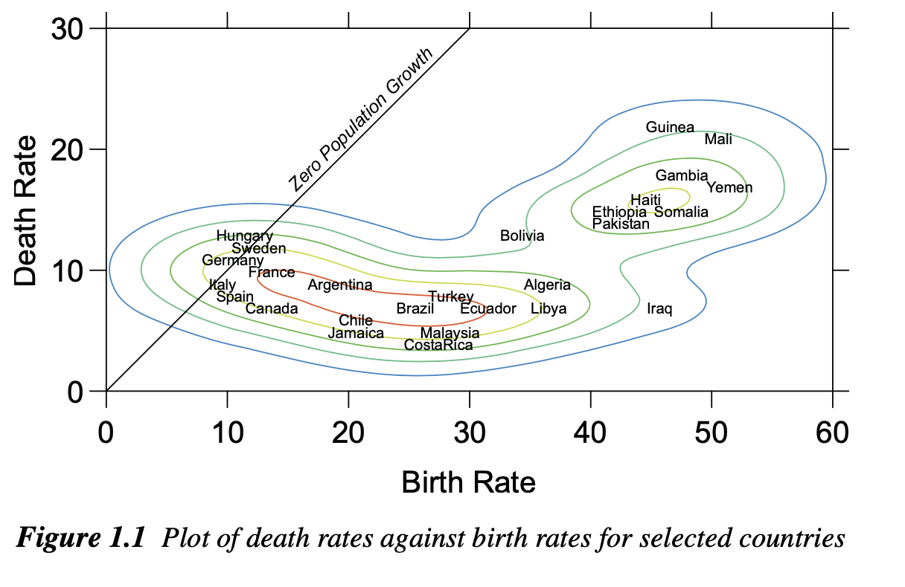
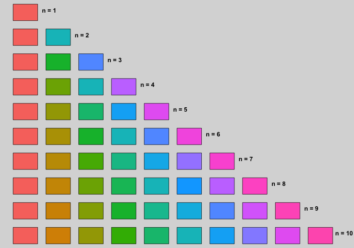
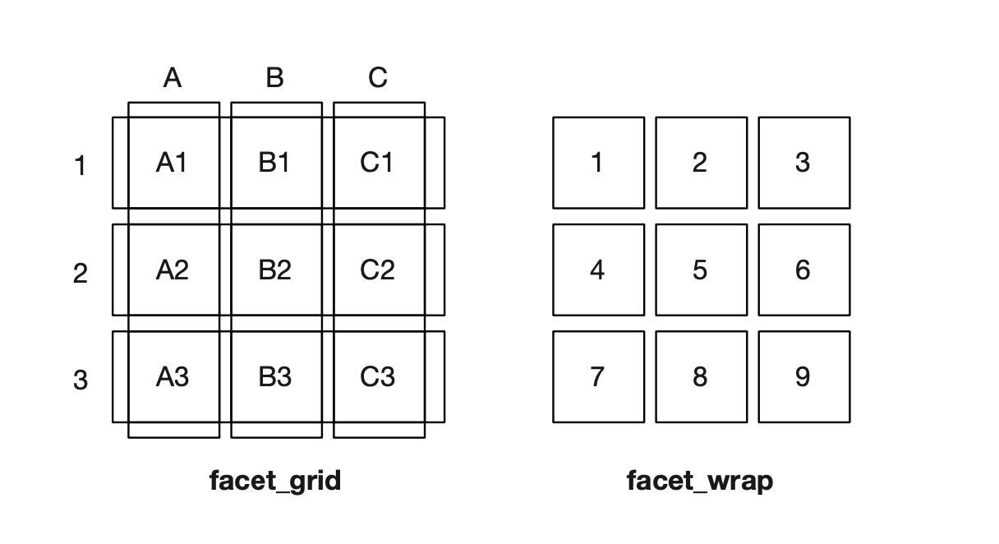

```{r setup, include=FALSE}
knitr::opts_chunk$set(echo = TRUE, tidy = F,  collapse = TRUE, warning=F, message = F, out.width = '80%', out.height = '80%' ,  size = 'footnotesize')

options(scipen = 999)
library(ggplot2)
library(dplyr)
library(knitr)
library(Hmisc)
library(HistData)
library(gridExtra)
```


```{r, echo = F}
def.chunk.hook  <- knitr::knit_hooks$get("chunk")
knitr::knit_hooks$set(chunk = function(x, options) {
  x <- def.chunk.hook(x, options)
  ifelse(options$size != "footnotesize", paste0("\n \\", options$size,"\n\n", x, "\n\n \\footnotesize"), x)
})
```

## Grammar of graphics

There are few definitions of what grammar is

**“the whole system and structure of a language or of languages in general, usually taken as consisting of syntax and morphology (including inflections) and sometimes also phonology and semantics”**

**grammar is “the fundamental principles or rules of an art or science”**


## Grammar of graphics

**Grammar gives language rules. The word stems from the Greek noun for letter or mark. And that derives from the Greek verb for writing, which is the source of English word graph. Grammar means, more generally, rules for art and science, as in the richly illustrated The Grammar of Ornament (Jones, 1856), and Karl Pearson’s The Grammar of Science (Pearson, 1892)**

*(Leland Wilkinson)*


## Grammar of graphics

**Grammar has a technical meaning in linguistics. In the transformational theory of Chomsky (1956), a grammar is a formal system of rules for generating lawful statements in a language.**

*(Leland Wilkinson)*

## Grammar of graphics

**Grammar makes language expressive. A language consisting of words and no grammar (statement = word) expresses only as many ideas as there are words. By specifying how words are combined in statements, a grammar expands a language’s scope.**


## Grammar of graphics

*(Leland Wilkinson)*
```{r, echo = F}

```


## Grammar of graphics


- ELEMENT: point(position(birth*death), size(0), label(country)) 
- ELEMENT: contour(position(smooth.density.kernel.epanechnikov.joint(birth*death)),
  color.hue())
- GUIDE: form.line(position((0,0),(30,30)), label("Zero Population Growth")) 
- GUIDE: axis(dim(1), label("Birth Rate"))
- GUIDE: axis(dim(2), label("Death Rate"))

*(Leland Wilkinson)*

## Grammar of graphics

What Are some other elements and guides that you see on the graph ?


## Grammar of graphics

ggplot2

**ggplot2 is an R package for producing statistical, or data, graphics, but it is unlike most other graphics packages because it has a deep underlying grammar. This grammar, based on the Grammar of Graphics (Wilkinson, 2005), is composed of a set of independent components that can be composed in many different ways. This makes ggplot2 very powerful, because you are not limited to a set of pre-specified graphics, but you can create new graphics that are precisely tailored for your problem. This may sound overwhelming, but because there is a simple set of core principles and very few special cases, ggplot2 is also easy to learn (although it may take a little time to forget your preconceptions from other graphics tools).**

*(Hadley Wickham)*


## Grammar of graphics

- Learning the grammar will help you not only create graphics that you know about now, but will also help you to think about new graphics that would be even better.
- Without the grammar, there is no underlying theory and existing graphics packages are just a big collection of special cases. 


## What's New in ggplot2 4.0.0

ggplot2 4.0.0 was released in September 2025, marking the 18th anniversary of the package.

\hfill\break

**Core Changes:**

- Migrated from S3 to S7 object-oriented system for better type enforcement
- Stricter input validation - invalid arguments are now rejected immediately
- Improved error messages for debugging

\hfill\break

Throughout this lecture, we'll highlight specific updates where relevant topics are introduced.

\hfill\break

*Full changelog: [tidyverse.org/blog/2025/09/ggplot2-4-0-0](https://tidyverse.org/blog/2025/09/ggplot2-4-0-0/)*


## Important Syntax Change: after_stat()

Starting with ggplot2 3.4.0, the "dot-dot" notation (`..variable..`) is **deprecated**.

\hfill\break

| Old (Deprecated) | New (Recommended) |
|------------------|-------------------|
| `aes(y = ..count..)` | `aes(y = after_stat(count))` |
| `aes(y = ..density..)` | `aes(y = after_stat(density))` |
| `aes(y = ..prop..)` | `aes(y = after_stat(prop))` |
| `aes(fill = ..level..)` | `aes(fill = after_stat(level))` |

\hfill\break

**Why the change?**

- **Clarity:** `after_stat()` explicitly shows the variable is computed by the stat layer
- **Consistency:** Aligns with `after_scale()` and `stage()` functions
- **Avoids conflicts:** Prevents confusion with column names containing dots


## Other Deprecated Syntax

**size vs linewidth (ggplot2 3.4.0+)**

For line-based geoms, `size` is deprecated for controlling line width. Use `linewidth` instead.

\scriptsize
```{r, eval=FALSE}
# Old (deprecated)
geom_line(size = 1)

# New (recommended)
geom_line(linewidth = 1)
```

\normalsize
\hfill\break

**qplot() is deprecated**

The quick-plot function `qplot()` is deprecated. Use the standard `ggplot()` syntax instead.

\scriptsize
```{r, eval=FALSE}
# Old (deprecated)
qplot(mpg, hp, data = mtcars)

# New (recommended)
ggplot(mtcars, aes(mpg, hp)) + geom_point()
```


## Grammar of graphics

Layered grammar of graphics

**ggplot2 is designed to work in a layered fashion, starting with a layer showing the raw data then adding layers of annotations and statistical summaries.**

## ggplot2

In ggplot the graph building process always starts with **ggplot()** layer

Get the data mpg from the library ggplot2

```{r}
data(mpg)
```


## ggplot2

The result is an empty space

```{r, out.height='65%'}
ggplot(data = mpg, aes(x = hwy, y = cty))
```


## ggplot2

If you want to have a chart, add additional *layer*
```{r, out.height='65%'}
ggplot(data = mpg, mapping = aes(x = hwy, y = cty)) +
  geom_point()
```

## ggplot2

*Elements of grammar of graphics*

- The **data** that you want to visualise and a set of aesthetic mappings describing how variables in the data are mapped to aesthetic attributes that you can perceive.
- **Geometric objects**, geoms for short, represent what you actually see on the plot: points, lines, polygons, etc.
- **Statistical transformations**, stats for short, summarise data in many useful ways. For example, binning and counting observations to create a histogram, or summarising a 2d relationship with a linear model. Stats are optional, but very useful.
- The **scales** map values in the data space to values in an aesthetic space, whether it be colour, or size, or shape. Scales draw a legend or axes, which provide an inverse mapping to make it possible to read the original data values from the graph.


## ggplot2 (continued)

- A **coordinate system**, coord for short, describes how data coordinates are mapped to the plane of the graphic. It also provides axes and gridlines to make it possible to read the graph. We normally use a Cartesian coordinate system, but a number of others are available, including polar coordinates and map projections.
- A **faceting** specification describes how to break up the data into subsets and how to display those subsets as small multiples. This is also known as conditioning or latticing/trellising.


## ggplot2

ggplot2 uses shortcuts for the elements

- geom_XXX - for geometric objecs
- stat_XXX - for statistical transformations
- scale_ - for scales
- coord_XXX for coordinate systems
- facet_ - for faceting

## ggplot2

If you want to see what are the geometric objects available as a layers for ggplot, just type geom_ .
*line chart*

\scriptsize
```{r, out.height='70%'}
ggplot(data = mpg, aes(x = hwy, y = cty)) + geom_line()
```


## ggplot2

**Aesthetics**

- Aesthetics, in the original Greek sense, offers principles for relating sensory attributes to abstractions.
- In ggplot and data visualization in general, aesthetics map data to the plot. In other words, whatever can be perceived on the graph, is an aesthetics.  

## ggplot2

What are the aesthetics on the scatterplot ?

```{r, echo= F}
ggplot(data = mpg, aes(x = hwy, y = cty)) + 
  geom_point()
```


## ggplot2

If you define data and aesthetics in ggplot(), all other layers are going to inherit them

*ggplot(data = mpg, mapping = aes(x = hwy, y = cty)) + geom_point()*

However you can define data and aesthetics in the layer as well

\scriptsize
```{r, out.height='60%'}
ggplot() + geom_point(data = mpg, mapping = aes(x = hwy, y = cty))
```


## ggplot2

The difference becomes apparent when you add another layer

\scriptsize
```{r, out.height='70%'}
ggplot() + geom_point(data = mpg, mapping = aes(x = hwy, y = cty)) + 
  geom_line()
```


## ggplot2

Now you need to specify data and aesthetics in each layer
\scriptsize
```{r, out.height='75%'}
ggplot() + geom_point(data = mpg, mapping = aes(x = hwy, y = cty)) + 
  geom_line(data = mpg, mapping = aes(x = hwy, y = cty))
```


## ggplot2 

Or
\scriptsize
```{r, out.height='75%'}
ggplot(data = mpg, mapping = aes(x = hwy, y = cty)) + geom_point() + 
  geom_line()
```

## ggplot2

Add additional point with a new layer

\scriptsize
```{r, out.height='70%'}
ggplot(data = mpg, mapping = aes(x = hwy, y = cty)) + 
  geom_point() + geom_point(mapping = aes(x = 20, y = 30), color = "red")
```

## ggplot2

Actually you can save ggplot output and then add layers to it

\small
```{r, out.height='70%'}
p <- ggplot(data = mpg, mapping = aes(x = hwy, y = cty)) 
p + geom_point()
```


## ggplot2

Line chart

\scriptsize
```{r, out.height='75%'}
p + geom_line()
```

## ggplot2

If you are planning to break the line, leave **+** at the end of the line

Like this

```{r, eval = F}
ggplot(data = mpg, mapping = aes(x = hwy, y = cty)) + 
  geom_point() + 
  geom_line()
```


Not Like this

```{r, eval = F}
ggplot(data = mpg, mapping = aes(x = hwy, y = cty))
  + geom_point() + 
  geom_line()
```

## ggplot2

**aesthetics**

For the scatterplot:

- x coordinate
- y coordinate
- size
- shape
- color

## ggplot2

The aesthetics can be either a constant, or a variable from the data.

**variable**

\scriptsize
```{r, out.height='60%'}
ggplot(data = mpg, mapping = aes(x = hwy, y = cty, color = drv)) + 
  geom_point() 
```


## ggplot2

If you want aesthetics as a constant, don't include it in aesthetics

\scriptsize
```{r, out.height='70%'}
ggplot(data = mpg, mapping = aes(x = hwy, y = cty)) + 
  geom_point(color = 'red') 
```

## ggplot2

Lets see the difference between *mapping* the aesthetics and *setting* it.

Setting

\scriptsize
```{r, out.height='60%'}
ggplot(data = mpg, mapping = aes(x = hwy, y = cty)) + 
  geom_point(color = 'darkblue') 
```

## ggplot2

Mapping

\scriptsize
```{r, out.height='70%'}
ggplot(data = mpg, mapping = aes(x = hwy, y = cty, color = 'darkblue')) + 
  geom_point() 

```

## ggplot2

Basically if you map the aesthetics to a constant, it does not matter what you write there, the result is going to be the same

\scriptsize
```{r}
ggplot(data = mpg, mapping = aes(x = hwy, y = cty, color = 'whats_up_bro')) + 
  geom_point() 
```


## ggplot2

The colors are taken from ggplot's standard color wheel (more about it later)

```{r, echo = F, out.height='75%'}

```


## ggplot2

Hadley Wickham clarifies here

*p + geom_point(aes(colour = "darkblue"))*

This maps (not sets) the colour to the value “darkblue”. This effectively creates a new variable containing only the value “darkblue” and then maps colour to that new variable. Because this value is discrete, the default colour scale uses evenly spaced colours on the colour wheel, and since there is only one value this colour is pinkish (n=1 from color scale of ggplot)


## ggplot2

Other aesthetics: shape

\footnotesize
```{r, out.height='70%'}
ggplot(data = mpg, mapping = aes(x = hwy, y = cty, shape = drv)) + 
  geom_point() 
```


## ggplot2

*Size* aesthetics

\footnotesize
```{r, out.height='70%'}
ggplot(data = mpg, mapping = aes(x = hwy, y = cty, size = drv)) + 
  geom_point() 
```


## ggplot2

Size as a continuous variable

\footnotesize
```{r, out.height='70%'}
ggplot(data = mpg, mapping = aes(x = hwy, y = cty, size = displ)) + 
  geom_point() 
```


## ggplot2

Shape as a continuous variable will raise an error

\footnotesize
```{r, eval = F}
ggplot(data = mpg, mapping = aes(x = hwy, y = cty, shape = displ)) + 
  geom_point() 
```

## ggplot2

ggplot has a wide range of geometric object

 - geom_bar(): for bar chart
 - geom_histogram(): for histogram
 - geom_boxplot(): for boxplots etc


## NEW in 4.0.0: geom_boxplot() Styling

In ggplot2 4.0.0, you can now style individual parts of boxplots: median line, box, whiskers, and staples.

\tiny
```{r, out.height='45%', fig.height=3}
ggplot(mpg, aes(class, hwy, colour = class)) +
  geom_boxplot(whisker.linetype = "dashed", box.colour = "black",
               median.linewidth = 2, staplewidth = 0.5, staple.colour = "grey50") +
  guides(colour = "none")
```


## NEW in 4.0.0: geom_violin() Quantiles

`geom_violin()` now computes quantiles on input data (not density). Style with `quantile.*` arguments.

\tiny
```{r, out.height='45%', fig.height=3}
ggplot(mpg, aes(class, hwy, fill = class)) +
  geom_violin(quantiles = c(0.25, 0.5, 0.75), quantile.linetype = 1, 
              quantile.colour = "black") + guides(fill = "none")
```


## ggplot2

Different geometric objects ask for different aesthetics: geom_point() understands the following aesthetics

- x
- y
- alpha
- colour
- fill
- group
- shape
- size
- stroke


## ggplot2

geom_text/geom_label is used to label plots. geom_text() understands the following aesthetics

- x
- y
- label
- alpha
- angle
- colour
- family
- fontface
- group
- hjust
- vjust
- lineheight
- size


## ggplot2

\scriptsize
```{r, out.height='65%'}
mtcars$car <- rownames(mtcars)
ggplot(mtcars, aes(x = mpg, y = hp, label = car)) + 
  geom_point() + geom_text()
```

## ggplot2

Or just use geom_text()

\scriptsize
```{r, out.height='70%'}
ggplot(mtcars, aes(x = mpg, y = hp, label = car)) +
  geom_text(check_overlap = T)
```

## ggplot2

control positions of the labels (horizontal)

\scriptsize
```{r, out.height='70%'}
ggplot(mtcars, aes(x = mpg, y = hp, label = car )) +
  geom_text(check_overlap = T, hjust = 0)
```


## NEW in 4.0.0: geom_label() Styling

`geom_label()` now has new styling options including `linetype`, `linewidth` aesthetics, and `border.colour`, `text.colour` arguments.

\tiny
```{r, out.height='45%', fig.height=3}
ggplot(mtcars[1:10,], aes(mpg, hp, label = car, colour = factor(cyl))) +
  geom_label(linewidth = 0.8, text.colour = "black")
```


## ggplot2: statistical transformations
Statistical transformations, stats for short, summarise data in many useful ways. 
Every geom has default statistical transformation.

geom_point(mapping = NULL,  data = NULL,  **stat = "identity"**,  position = "identity",
  na.rm = FALSE,  show.legend = NA,  inherit.aes = TRUE )

geom_histogram(mapping = NULL,  data = NULL, **stat = "bin"**, position = "stack", binwidth = NULL,
  bins = NULL,  na.rm = FALSE,  orientation = NA,  show.legend = NA,  inherit.aes = TRUE)

## ggplot2: statistical transformations

Identity transformation

$$f(x)=x$$

## ggplot2: statistical transformations

stat_XXX and geom_XXX can be used interchangeably 

The same:
ggplot(mtcars, aes(mpg, hp)) + geom_point(stat = 'identity')

\tiny
```{r, out.height='60%'}
ggplot(mtcars, aes(mpg, hp)) + stat_identity(geom = 'point')
```

## ggplot2: statistical transformations
line chart
```{r, out.height='60%'}
ggplot(mtcars, aes(mpg, hp)) + stat_identity(geom = 'line')
```

## ggplot2: statistical transformations

use stat_function to draw any function you want
Normal distribution, values along x axis (-5,5)

\scriptsize
```{r, out.height='60%'}
ggplot(data.frame(x = c(-5, 5)), aes(x)) + stat_function(fun = dnorm)
```

## ggplot2: statistical transformations

change geom

\scriptsize
```{r, out.height='70%'}
ggplot(data.frame(x = c(-5, 5)), aes(x)) + stat_function(fun = dnorm, geom = 'point')
```

## ggplot2: statistical transformations
With user defined functions: Logistic function
$$f(x) = \frac{1}{1+ e^{-x}}$$

## ggplot2: statistical transformations

\scriptsize
```{r, out.height='75%'}
logistic <- function(x){1/(1 + exp(-x))}
ggplot(data.frame(x = c(-5, 5)), aes(x)) + 
  stat_function(fun = logistic, geom = 'point', color = 'red')
```


## ggplot2: statistical transformations

Define the function inside stat_function

\scriptsize
```{r, out.height='65%'}
ggplot(data.frame(x = c(-5, 5)), aes(x)) + 
  stat_function(fun = function(x) 1/(1 + exp(-x)), geom = 'point')
```

## ggplot2: statistical transformations

geom_function() does the same but with defined geometry - line

\scriptsize
```{r, out.height='70%'}
ggplot(data.frame(x = c(-5, 5)), aes(x)) + geom_function(fun = logistic)
```


## ggplot2: statistical transformations

Plot two functions together
\scriptsize
```{r, out.height='60%'}
ggplot(data.frame(x = c(-5, 5)), aes(x)) + 
  stat_function(fun = logistic, color = 'red') +
  stat_function(fun = dnorm, color = 'blue')
```


## NEW in 4.0.0: stat_manual()

`stat_manual()` allows custom computations without defining formal Stat classes. Provide any function that takes and returns a data frame.

\tiny
```{r, out.height='45%', fig.height=3}
compute_centroid <- function(df) { data.frame(x = mean(df$x), y = mean(df$y)) }
ggplot(iris, aes(Sepal.Length, Sepal.Width, color = Species)) +
  geom_point(alpha = 0.5) +
  stat_manual(fun = compute_centroid, geom = "point", size = 5, shape = 18)
```


## NEW in 4.0.0: stat_connect()

`stat_connect()` creates stairstep connections between points - useful for survival curves, step functions, and bump charts.

\tiny
```{r, out.height='45%', fig.height=3}
yearly_data <- data.frame(year = 2018:2024, value = c(100, 120, 115, 140, 155, 150, 175))
ggplot(yearly_data, aes(year, value)) + geom_point(size = 3) +
  stat_connect(color = "steelblue")
```


## ggplot2: scales

A scale controls the mapping from data to aesthetic attributes, and we need a scale for every aesthetic used on a plot. Each scale operates across all the data in the plot, ensuring a consistent mapping from data to aesthetics. *(Hadley Wickham)*


## ggplot2: scales

They start with scale_, followed by the name of the aesthetic (e.g., colour_, shape_ or x_), and finally by the name of the scale (e.g., gradient, hue, manual, discrete, etc).

All aesthetics come with the default scale, you can override them with scale_ layers

Example: x, y aesthetics can be either continuous or discrete, thus we have
scale_x_continuous, scale_x_discrete, scale_y_continuous, scale_y_discrete (and many more)

## ggplot2: scales
Set your own breaks

\scriptsize
```{r, out.height='70%'}
ggplot(mpg, aes(x = cty, y = hwy)) + geom_point() + 
  scale_x_continuous(breaks = c(10,20,30))
```


## ggplot2: scales

Adding labels to the breaks

\scriptsize
```{r, out.height='70%'}
ggplot(mpg, aes(x = cty, y = hwy)) + geom_point() + 
  scale_x_continuous(breaks = c(10,20,30), labels = c('good', 'bad', 'ugly'))
```

## ggplot2: scales

Setting the limits for y axis (note the minimum value is NA, thus decided by ggplot2)

\scriptsize
```{r, out.height='65%'}
ggplot(mpg, aes(x = cty, y = hwy)) + geom_point() + 
  scale_y_continuous(limits = c(NA,40))
```


## ggplot2: scales
Using scale with color aesthetics
Set color manually

\scriptsize
```{r, out.height='70%'}
ggplot(data = mpg, mapping = aes(x = hwy, y = cty, color = drv)) + 
  geom_point() + scale_color_manual(values = c('red', 'green', 'blue'))
```


## NEW in 4.0.0: Discrete Scale Improvements

Discrete scales now support `palette` argument, `continuous.limits`, minor breaks, and secondary axes.

\tiny
```{r, out.height='45%', fig.height=3}
ggplot(ToothGrowth, aes(interaction(dose, supp, sep = "\n"), len)) +
  geom_boxplot() +
  scale_x_discrete(palette = scales::pal_manual(c(1, 2, 3, 5, 6, 7)))
```


## NEW in 4.0.0: Discrete Scale - Secondary Axes

Discrete scales can now have secondary axes using `dup_axis()` - useful for showing summary statistics.

\tiny
```{r, out.height='45%', fig.height=3}
class_counts <- table(mpg$class)
ggplot(mpg, aes(class, cty)) + geom_boxplot() +
  scale_x_discrete(sec.axis = dup_axis(name = "Count", labels = paste0("n=", class_counts))
  )
```


## ggplot2: coordinate system

Coordinate systems tie together the two position scales to produce a 2d location. Currently, ggplot2 comes with six different coordinate systems. All these coordinate systems are two dimensional.

Coordinate systems in ggplot

- cartesian 
- equal 
- flip
- trans
- map 
- polar

## ggplot2: coordinate system

- The four Cartesian-based coordinate systems, coord_cartesian, coord_equal, coord_flip and coord_trans, share a number of common features.
- They are still essentially Cartesian because the x and y positions map orthogonally to x and y positions on the plot.

## ggplot2: coordinate system

Diamonds dataset

```{r, out.height='70%'}
ggplot(data = diamonds, aes(price, carat)) + geom_point()
```


## ggplot2: coordinate system
Transforming the axes: Log-Log plot

\scriptsize
```{r, out.height='70%'}
ggplot(data = diamonds, aes(price, carat)) + geom_point() + 
  coord_trans(x = 'log10', y = 'log10')
```

## ggplot2: coordinate system

You can get "almost" the same result with this

\scriptsize
```{r, out.height='70%'}
ggplot(data = diamonds, aes(log10(price), log10(carat))) + 
  geom_point() 
```


## NEW in 4.0.0: Coordinate Reversal

All coordinate systems now have a `reverse` argument: `"none"`, `"x"`, `"y"`, or `"xy"`.

\tiny
```{r, out.height='45%', fig.height=3}
ggplot(mtcars, aes(x = mpg, y = hp)) + geom_point() +
  coord_cartesian(reverse = "y") + labs(title = "Y-axis reversed")
```


## NEW in 4.0.0: Coordinate Reversal (Example)

Useful for maps (e.g., displaying Australia in "native" orientation) or ranking charts.

\tiny
```{r, out.height='45%', fig.height=3}
ggplot(mtcars, aes(wt, mpg)) + geom_point(aes(color = factor(cyl))) +
  coord_cartesian(reverse = "xy") + labs(title = "Both axes reversed")
```


## ggplot2: faceting

- Faceting creates tables of graphics by splitting the data into subsets and displaying the same graph for each subset in an arrangement that facilitates comparison.
- ggplot2 has two layers for faceting: facet_grid and facet_wrap

## ggplot2: faceting

- facet_grid() produces a 2d grid of panels defined by variables which form the rows and columns, 
- facet_wrap() produces a 1d ribbon of panels that is wrapped into 2d.

```{r, echo = F}

```


## ggplot2: faceting
Get the histogram of imdbRating by genre_first

\tiny
```{r, out.height='68%'}
movies_small <- read.csv('Data/movies_small.csv')
ggplot(movies_small, aes(x = imdbRating)) + geom_histogram() + 
  facet_wrap(~genre_first)
```


## ggplot2: faceting

Free y axis to vary

\tiny
```{r, out.height='68%'}
ggplot(movies_small, aes(x = imdbRating)) + geom_histogram() + 
  facet_wrap(~genre_first, scales = 'free_y')
```


## ggplot2: faceting

- facet_grid() allows to create 2d grid of panels defined by variables which form the rows and columns.
- Look at the formula: Rated is in rows, has_oscar is in columns

## ggplot2: faceting

\scriptsize
```{r, out.height='65%'}
ggplot(movies_small, aes(x = imdbRating, y = Metascore)) + geom_point() + 
  facet_grid(Rated~has_oscar)
```


## ggplot2: faceting - more than 2 variables

\scriptsize
```{r, out.height='70%'}
ggplot(movies_small, aes(x = imdbRating, y = Metascore)) + geom_point() + 
  facet_grid(Rated~genre_first+has_oscar)
```


## NEW in 4.0.0: facet_wrap() Direction Options

`facet_wrap(dir)` now supports 8 direction options using two-letter codes indicating start position and fill direction.

\tiny
```{r, out.height='40%', fig.width=10, fig.height=2.5}
library(gridExtra)
p1 <- ggplot(mpg, aes(displ, hwy)) + geom_point(size = 0.8) +
  facet_wrap(~ drv, dir = "lt") + labs(title = "dir = 'lt'")
p2 <- ggplot(mpg, aes(displ, hwy)) + geom_point(size = 0.8) +
  facet_wrap(~ drv, dir = "br") + labs(title = "dir = 'br'")
grid.arrange(p1, p2, ncol = 2)
```


## NEW in 4.0.0: facet_wrap() Space Argument

`facet_wrap(space)` now allows proportional panel sizes based on data range (previously only in `facet_grid`).

\tiny
```{r, out.height='45%', fig.height=3}
ggplot(mpg, aes(displ, hwy)) + geom_point() +
  facet_wrap(~ drv, scales = "free_x", space = "free_x")
```


## NEW in 4.0.0: Layer Layout Control

New `layer(layout)` argument controls how data is distributed across facets: `NULL` (default), `"fixed"` (repeat everywhere), or panel index.

\tiny
```{r, out.height='45%', fig.height=3}
ggplot(mpg, aes(displ, hwy)) +
  geom_point(colour = "grey80", layout = "fixed") +  # All data in every panel
  geom_point(aes(colour = drv)) + facet_wrap(~ drv)  # Only facet data
```


## ggplot2: guides and themes

- Collectively, axes and legends are called guides
- They allow you to read observations from the plot and map them back to their original values.


## ggplot2: guides and themes

```{r, echo = F}
include_graphics('Img/ggplot 3.png', )
```


## ggplot2: guides and themes

Axis labels and title

\scriptsize
```{r, out.height='67%'}
ggplot(mtcars, aes(x = mpg, y = hp)) + geom_point() + 
  xlab('Miles per gallon') + ylab('Horsepower') + 
  ggtitle('Scatterplot of MPG and Horsepower')
```


## ggplot2: guides and themes
The same using labs() layer

\scriptsize
```{r, out.height='60%'}
ggplot(mtcars, aes(x = mpg, y = hp)) + geom_point() + 
  labs(x = 'Miles per gallon', y = 'Horsepower', 
       title = 'Scatterplot of MPG and Horsepower')
```

## ggplot2: guides and themes

- The appearance of non-data elements of the plot is controlled by the theme system. 
- The theme system does not affect how the data is rendered by geoms, or how it is transformed by scales. - They don’t change the perceptual properties of the plot, but help to make the plot aesthetically pleasing or match existing style guides. 
- Themes give control over things like the fonts in all parts of the plot: the title, axis labels, axis tick labels, legend labels and legend key labels; and the colour of ticks, grid lines and backgrounds (panel, plot, strip and legend).

## ggplot2: guides and themes

- A theme is made up of multiple elements which control the appearance of a single item on the plot.
- There are three elements that have individual x and y settings: **axis.text, axis.title and strip.text**. - Having a different setting for the horizontal and vertical elements allows you to control how text should appear in different orientations. 
- The appearance of each element is controlled by an element function.
There are four basic types of built-in element functions: **text, lines and segments, rectangles and blank**. 
- Each element function has a set of parameters that control the appearance.

## ggplot2: guides and themes
If you want to remove an element, use element_blank() - remove axis ticks

\small
```{r, out.height='65%'}
ggplot(mtcars, aes(x = mpg, y = hp)) + geom_point() + 
  theme(axis.ticks = element_blank())
```


## ggplot2: guides and themes
Control elements of the axis
```{r, out.height='67%'}
ggplot(mtcars, aes(x = mpg, y = hp)) + geom_point() + 
  theme(axis.ticks.x = element_blank())
```

## ggplot2: guides and themes
Controlling line elements

\small
```{r, out.height='65%'}
ggplot(mtcars, aes(x = mpg, y = hp)) + geom_point() + 
  theme(axis.ticks = element_line(colour = 'red'))
```


## ggplot2: guides and themes

controlling element_text()

\small
```{r, out.height='65%'}
ggplot(mtcars, aes(x = mpg, y = hp)) + geom_point() + 
  theme(axis.text.x = element_text(colour = 'red', size = 16))
```


## ggplot2: guides and themes

Change background: element_rect()

\scriptsize
```{r, out.height='70%'}
ggplot(mtcars, aes(x = mpg, y = hp)) + geom_point() + 
  theme(panel.background  = element_rect(fill = 'green'))
```

## ggplot2: guides and themes

You can use predefined themes

\small
```{r, out.height='68%'}
ggplot(mtcars, aes(x = mpg, y = hp)) + geom_point() + 
  theme_bw()
```


## ggplot2: guides and themes

\small
```{r, out.height='70%'}
ggplot(mtcars, aes(x = mpg, y = hp)) + geom_point() + 
  theme_classic()
```


## ggplot2: guides and themes

You can also define your own theme, than add it to the plot.

\small
```{r}
theme_my <- theme(
  panel.background = element_rect(fill = '#ffeda0'),
  panel.grid.major.x  = element_blank(),
  panel.grid.major.y = element_line(color = 'red'),
  panel.grid.minor = element_blank(), 
  axis.text = element_text(size = 12)
  )
```


## ggplot2: guides and themes

Than add it to the plot

\small
```{r, out.height='65%'}
ggplot(mtcars, aes(x = mpg, y = hp)) + geom_point() + 
  theme_my
```


## ggplot2: guides and themes

```{r, out.height='70%'}
ggplot(mtcars, aes(x = mpg)) + geom_histogram() + 
  theme_my
```

## ggplot2: guides and themes

Or you can make it as a function as well

\small
```{r}
theme_my <- function(base_size = 12)
  {
  theme(panel.background = element_rect(fill = '#ffeda0'),
        panel.grid.major.x  = element_blank(),
        panel.grid.major.y = element_line(color = 'red'),
        panel.grid.minor = element_blank(), 
        axis.text = element_text(size = base_size))
  }
```


## ggplot2: guides and themes

```{r, out.height='70%'}
ggplot(mtcars, aes(x = mpg, y = hp)) + geom_point() + 
  theme_my(base_size = 16)
```


## NEW in 4.0.0: Theme Ink and Paper

Themes now have `ink` (foreground) and `paper` (background) settings that propagate to layer defaults.

\tiny
```{r, out.height='45%', fig.height=3}
ggplot(mpg, aes(displ, hwy)) + geom_point() + geom_smooth(method = "lm", formula = y ~ x) +
  theme_gray(paper = "cornsilk", ink = "navy", accent = "tomato")
```


## NEW in 4.0.0: Theme Shortcuts

New helper functions reduce verbosity: `theme_sub_axis()`, `theme_sub_legend()`, `theme_sub_panel()`, `theme_sub_plot()`.

\tiny
```{r, out.height='45%', fig.height=3}
ggplot(mtcars, aes(mpg, hp)) + geom_point() +
  theme_sub_axis_x(ticks = element_line(colour = "red"), ticks.length = unit(5, "mm")) +
  theme_sub_panel(background = element_rect(fill = "lightyellow"))
```


## NEW in 4.0.0: Panel Size Control

New `panel.widths` and `panel.heights` theme arguments for precise panel sizing.

\tiny
```{r, out.height='45%', fig.height=3}
ggplot(mpg, aes(displ, hwy)) + geom_point() + facet_wrap(~ drv) +
  theme_sub_panel(widths = unit(4, "cm"), heights = unit(3, "cm"))
```


## NEW in 4.0.0: Label Improvements

Labels can now come from vector 'label' attributes or data dictionaries via `labs(dictionary)`.

\tiny
```{r, out.height='45%', fig.height=3}
label_dict <- c(mpg = "Miles per Gallon", hp = "Horsepower", cyl = "Number of Cylinders")
ggplot(mtcars, aes(mpg, hp, color = factor(cyl))) + geom_point() +
  labs(dictionary = label_dict)
```


## NEW in 4.0.0: Functions in Labels

You can now use functions in `labs()`, scale names, and guide titles for dynamic labeling.

\tiny
```{r, out.height='45%', fig.height=3}
ggplot(mtcars, aes(mpg, hp, color = factor(cyl))) + geom_point() +
  scale_colour_discrete(name = toupper) +
  labs(x = tools::toTitleCase, y = \(x) paste0(x, " (units)"))
```


## NEW in 4.0.0: Position Aesthetics - nudge

Position adjustments can now have their own aesthetics. `position_nudge()` has `nudge_x` and `nudge_y` as mappable aesthetics.

\tiny
```{r, out.height='40%', fig.height=2.5}
coal_data <- data.frame(region = c("Asia", "Europe", "N. America"),
                        change = c(18.6, -20.0, -35.1))
ggplot(coal_data, aes(change, region)) + geom_col() +
  geom_text(aes(label = change, nudge_x = sign(change) * 3))
```


## NEW in 4.0.0: Position Aesthetics - dodge order

`position_dodge()` has a new `order` aesthetic for consistent group placement even with missing data.

\tiny
```{r, out.height='40%', fig.height=2.5}
df <- data.frame(x = c("A", "A", "B"), group = c("G1", "G2", "G1"), y = c(10, 15, 12))
ggplot(df, aes(x, y, fill = group, order = group)) +
  geom_col(position = position_dodge(preserve = "single"))
```


## ggplot2: arrange in grid

Sometimes you have multiple plots on the same page.
You do it using the library gridExtra

```{r, eval = F}
library(gridExtra)
```

\small
```{r}
p1 <- ggplot(movies_small, aes(x = imdbRating, y = Metascore)) + 
      geom_point() + ggtitle('Scatterplot')
p2 <- ggplot(movies_small, aes(x = imdbRating)) + 
      geom_histogram() + ggtitle('Histogram')
```

## ggplot2: arrange in grid

```{r, out.height='75%'}
grid.arrange(p1, p2)
```

## ggplot2: arrange in grid

Arrange by columns

```{r, out.height='70%'}
grid.arrange(p1, p2, nrow=1)
```


