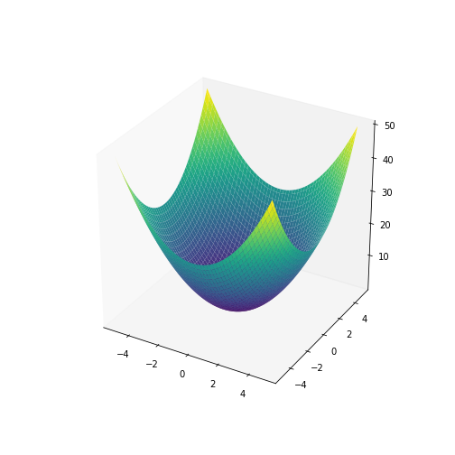
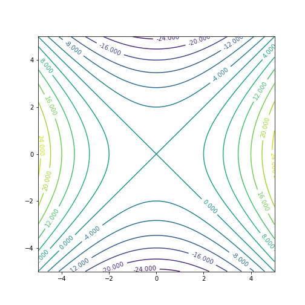
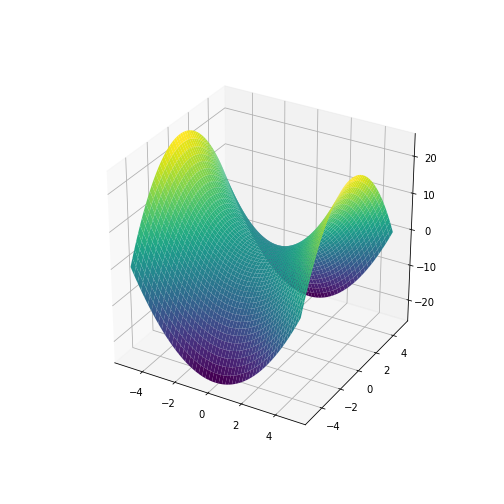
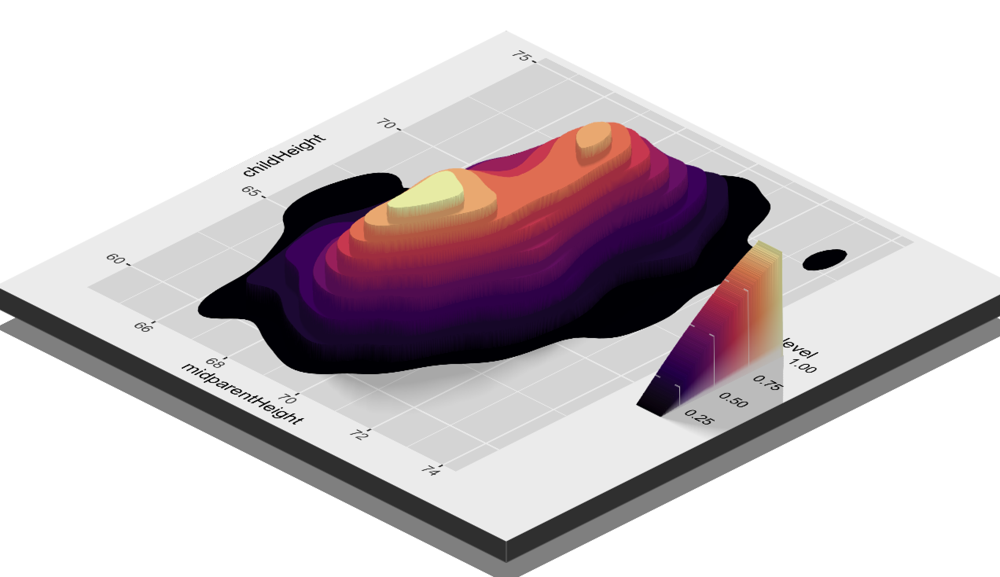
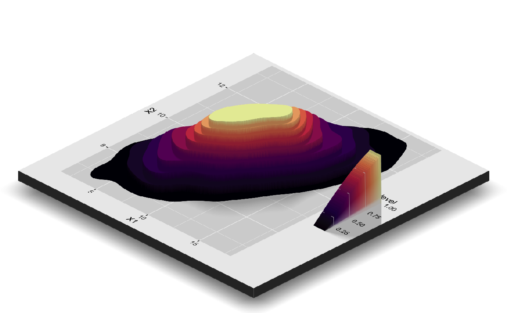
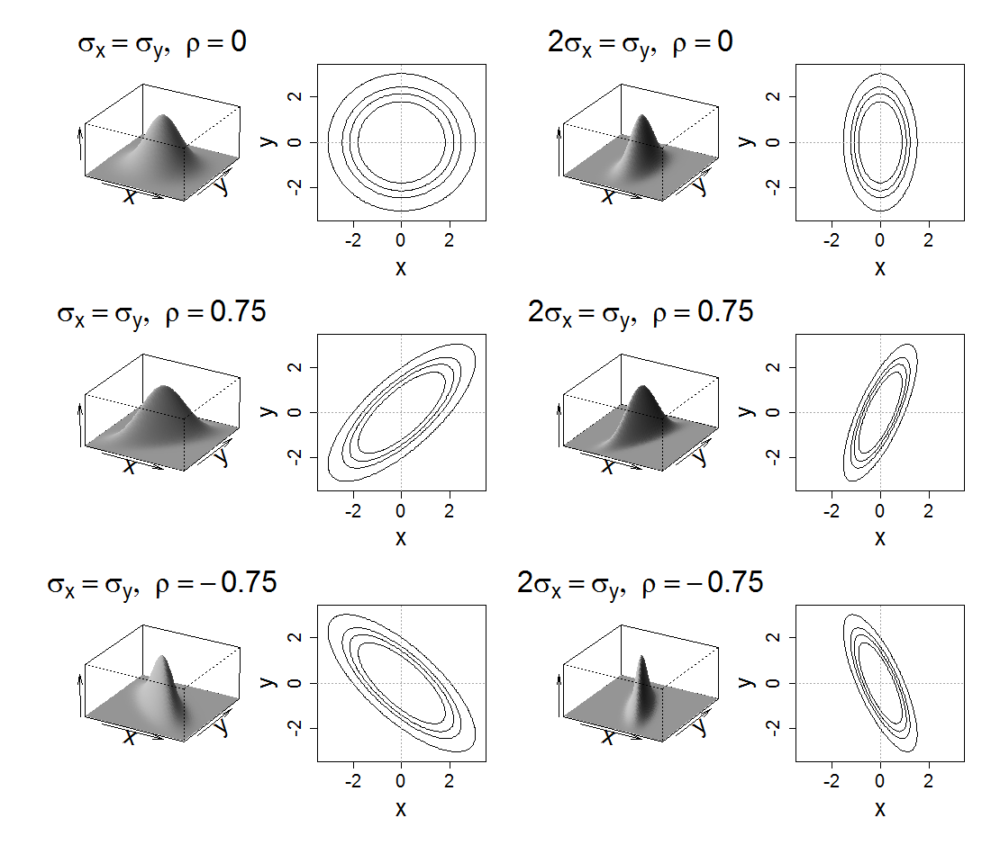
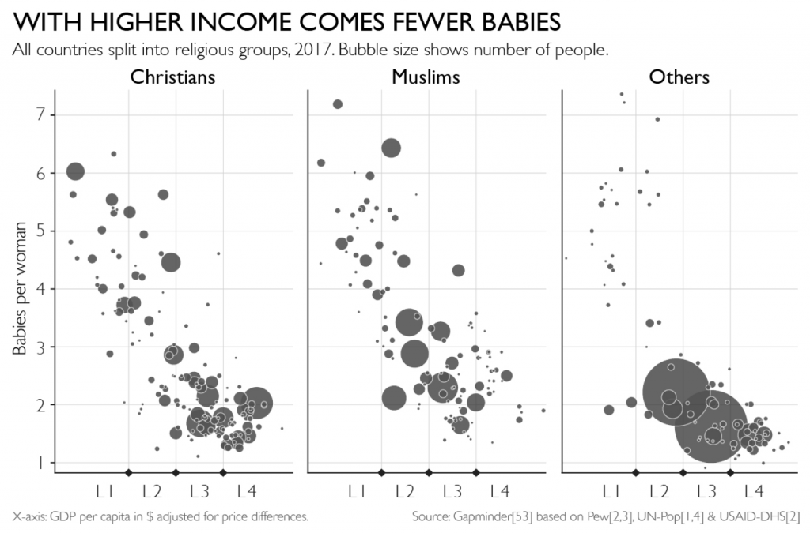

```{r setup, include=FALSE}
knitr::opts_chunk$set(echo = TRUE, tidy = F,  collapse = TRUE, warning=F, message = F, out.width = '80%', 
                      size = 'footnotesize')

options(scipen = 999)
library(ggplot2)
library(readxl)
library(dplyr)
library(MASS)
library(HistData)
library(reshape2)
library(geomapdata)
library(knitr)
library(ggcorrplot)
library(GGally)
library(ggpubr)
library(hexbin)
library(ggExtra)
```

```{r, echo = F}
def.chunk.hook  <- knitr::knit_hooks$get("chunk")
knitr::knit_hooks$set(chunk = function(x, options) {
  x <- def.chunk.hook(x, options)
  ifelse(options$size != "footnotesize", paste0("\n \\", options$size,"\n\n", x, "\n\n \\footnotesize"), x)
})
```


# Bivariate data - scatterplots
## Scatterplots

When you have two continuous variables, drawing the scatterplot is the first thing that comes to mind

The scatterplot is a useful exploratory method for providing a first look at bivariate data to see how they are distributed throughout the plane, for example, to see clusters of points, outliers, and so forth

Scatterplots have the following usages:

- Reveal linear and non-linear relationship between two variables
- Detect the strength of the association (correlation) between the variables
- Detect outliers if there are any
- Detect the clusters of data


## Scatterplots

in ggplot the scatterplot is created using geom_point()

\small
```{r, out.height='70%'}
movies <- read.csv('Data/movies_small.csv')
ggplot(movies, aes(x = Metascore, y = imdbRating)) + geom_point()
```


## Scatterplots

Overplotting

- Overplotting is when the data or labels in a data visualization overlap, making it difficult to see individual data points and draw conclusion about the concentration of the data.

- Overplotting can result from  very high sample sizes, or when one of the variables (say on x-axis) is discrete

- Fixes for overplotting include reducing the size of points, changing the shape of points, jittering, tiling, making points transparent, only showing a subset of points, and using algorithms to prevent labels from overlapping.


## Scatterplots

Look at the red point

```{r, echo=F}
dff <- data.frame(x = 19, y = 7) 
ggplot(movies, aes(x = Metascore, y = imdbRating)) + geom_point() + 
  geom_point(dff, mapping = aes(x,y), color = 'red')
```


## Scatterplots

To understand where are the most of the points concentrated, use $\alpha$ transparency parameter
alpha = 0 gives total transparency, while alpha = 1 gives no transparency at all

```{r, out.height='70%', echo=F}
p1 <- ggplot(movies, aes(x = Metascore, y = imdbRating)) + geom_point(alpha=0.6)
p2 <- ggplot(movies, aes(x = Metascore, y = imdbRating)) + geom_point(alpha=0.4)
p3 <- ggplot(movies, aes(x = Metascore, y = imdbRating)) + geom_point(alpha=0.2)
p4 <- ggplot(movies, aes(x = Metascore, y = imdbRating)) + geom_point(alpha=0.1)
ggarrange(p1,p2,p3,p4, labels = c('0.6', '0.4', '0.2', '0.1'))
```


## Scatterplots

imdbRating vs imdbVotes

```{r, out.height='70%'}
ggplot(movies, aes(x = imdbVotes, y = imdbRating)) + 
  geom_point()
```


## Scatterplots

Add transparency

```{r, out.height='70%'}
ggplot(movies, aes(x = imdbVotes, y = imdbRating)) + 
  geom_point(alpha = 0.3) 
```


## Scatterplots

If you need to see the concentration of the points, a good visual aid can be plotting the marginal distributions.

Use library ggExtra


## Scatterplots

```{r, eval = F}
p1 <- ggplot(movies, aes(x = Metascore, y = imdbRating)) + 
  geom_point()
ggMarginal(p1, type = 'histogram')
```


## Scatterplots

```{r, echo = F}
p1 <- ggplot(movies, aes(x = Metascore, y = imdbRating)) + 
  geom_point()
ggMarginal(p1, type = 'histogram')
```


## Scatterplots

```{r, out.height='70%'}
p1 <- ggplot(movies, aes(x = imdbVotes, y = imdbRating)) + 
  geom_point(alpha = 0.3)
ggMarginal(p1, type = 'histogram')
```


## Scatterplots

**Jittering** is an act of adding a bit of random noise to scatterplots, to better see the information contained in the data, usually when there is overplotting.

Seriea A football dataset

- FTHG - Full time goals by home team
- FTAG - Full time goals by away team
- Result = 1, if home team won, Result=0, if home team did not win

```{r, size = 'small'}
seriea <- read.csv('Data/seriea_games.csv')
head(seriea)
```


## Scatterplots

plot FTHG against FTAG

```{r, out.height='70%'}
ggplot(seriea, aes(FTHG, FTAG)) + geom_point()
```


## Scatterplots

add geom_jitter

```{r, out.height='70%'}
ggplot(seriea, aes(FTHG, FTAG)) + geom_jitter()
```


## Scatterplots

FTHG vs Result

```{r, out.height='70%'}
ggplot(seriea, aes(FTHG, Result)) + geom_point()
```


## Scatterplots

```{r}
ggplot(seriea, aes(FTHG, Result)) + geom_jitter()
```

## Scatterplots

The amount of jittering is controlled with two parameters

- **height** Amount of vertical jitter.
- **width** Amount of horizontal jitter

The jitter is added in both positive and negative directions, so the total spread is twice the value specified here.


## Scatterplots

```{r}
ggplot(seriea, aes(FTHG, Result)) + geom_jitter(width=0)
```


## Scatterplots

```{r}
ggplot(seriea, aes(FTHG, Result)) + geom_jitter(height=0)
```


## Scatterplots

```{r, out.height='70%'}
ggplot(seriea, aes(FTHG, Result)) + 
  geom_jitter(height=0.2, width = 0.2)
```


## Scatterplots

jitter with alpha

```{r, out.height='70%'}
ggplot(seriea, aes(FTHG, FTAG)) + 
  geom_jitter(height=0.2, width = 0.2, alpha = 0.3)
```


## Scatterplots

geom_rug() adds to scatterplot 1d marginal distribution, in a compact way

```{r, out.height='70%'}
ggplot(movies, aes(x = Metascore, y = imdbRating)) + 
  geom_point() + geom_rug()
```


## Scatterplots

Adding alpha and position = 'jitter'

```{r, out.height='70%'}
ggplot(movies, aes(x = Metascore, y = imdbRating)) + 
  geom_point() + geom_rug(alpha = 0.3, position = 'jitter')
```


## Scatterplots

Look at what are the aesthetics that can be used with geom_rug()

https://ggplot2.tidyverse.org/reference/geom_rug.html

* alpha
* colour
* group
* linetype
* size
* x
* y


## Scatterplots

Adding additional aesthetics

```{r, size = 'small', eval = F}
ggplot(movies, aes(x = Metascore, y = imdbRating)) + 
  geom_rug(mapping = aes(color = has_oscar), alpha = 0.3, 
  position = 'jitter')+
  geom_point()
```


## Scatterplots

```{r, echo = F}
ggplot(movies, aes(x = Metascore, y = imdbRating)) + 
  geom_rug(mapping = aes(color = has_oscar), alpha = 0.3, position = 'jitter')+
  geom_point()
```

# Bivariate data - smoothing
## Smoothing

 - It is always useful to add model fit line to the plot to understand what is the underlying relationship between two variables.

- In ggplot2 it is done using geom_smooth (stat_smooth if you want to use other geom)

- By default ggplot2 fits LOESS (locally estimated scatterplot smoothing) model for small data, and GAM (Generalized Additive Model) for large data


## Smoothing

```{r, out.height='70%'}
data(Cars93, package="MASS")
ggplot(Cars93, aes(Weight, MPG.city)) + geom_point()
```


## Smoothing

Fit regression line by overriding the method argument. The shaded area shows the confidence interval

\scriptsize
```{r, out.height='65%'}
ggplot(Cars93, aes(Weight, MPG.city)) + geom_point() + 
  geom_smooth(method = 'lm')
```


## Smoothing

```{r, out.height='70%'}
ggplot(Cars93, aes(Weight, MPG.city)) + geom_point() + 
  geom_smooth(se = F)
```


## Smoothing

**loess**

- Fitting is done locally. That is, for the fit at point x, the fit is made using points in a neighborhood of x, weighted by their distance from x.
- The size of the neighborhood is controlled by $\alpha$ (the span parameter).
- higher value of $\alpha$ will result in smoother fit while smaller values will produce wigglier lines.


## Smoothing

```{r, out.height='70%'}
ggplot(Cars93, aes(Weight, MPG.city)) + geom_point() + 
  geom_smooth(se = F, span=0.2)
```


## Smoothing

Actually you can define your own smoothing method and provide to geom_smooth

poly() function in r fits polynomial regression with a given order


## Smoothing

\scriptsize
```{r, out.height='70%'}
ggplot(Cars93, aes(Weight, MPG.city)) + geom_point() + 
  geom_smooth(method = 'lm', formula = y~poly(x,3), se=F)
```

# Scatterplot matrix
## Scatterplot matrix

- A scatter plot matrix is a grid (or matrix) of scatter plots used to visualize bivariate relationships between combinations of variables. 
- Each scatter plot in the matrix visualizes the relationship between a pair of variables, allowing many relationships to be explored in one chart.


## Scatterplot matrix

```{r}
mtcars <- mtcars %>%  dplyr::select(mpg:wt)
pairs(mtcars)
```


## Scatterplot matrix

ggplot style

```{r, out.height='65%'}
ggpairs(mtcars)
```


## Scatterplot matrix

The scatterplot matrix can be customized see [more](https://bit.ly/32L9G9I)

```{r, out.height='65%'}
ggpairs(mtcars, diag = list(continuous = 'barDiag'))
```


# Parallel coordinates plot
## Parallel coordinates plot

- Parallel plot or parallel coordinates plot allows to compare the feature of several individual observations (series) on a set of numeric variables. 
- Each vertical bar represents a variable and often has its own scale.
- The units can even be different. 
- Values are then plotted as series of lines connected across each axis.


## Parallel coordinates plot

- With a scatterplot, the x and y axes are perpendicular to one another. 
- In a parallel coordinate plot all axes are parallel to one another. 
- Each variable has its own individual vertical (horizontal) axis.
- The axis is usually scaled from the minimum to the maximum case values for the variable, so that the full range of each axis is used. 
- The values of each case on adjacent axes are joined by lines, so that a polygonal line across all axes defines a case. 


## Parallel coordinates plot

iris dataset

- create an id variable
- melt the data into long format with id.vars as the id variable and Species
- arrange by id

```{r, size = 'small'}
iris_melted <- iris %>% mutate(id = 1:150) %>% 
  melt(id.vars = c('id', 'Species')) %>% arrange(id)
head(iris_melted)
```


## Parallel coordinates plot

new aesthetics - group

```{r, out.height='70%'}
ggplot(data = iris_melted, aes(x = variable, y = value)) +
  geom_line(aes(group = id))
```


## Parallel coordinates plot

```{r, out.height='65%'}
ggplot(data = iris_melted, aes(x = variable, y = value)) +
  geom_line(aes(group = id, color = Species))
```


## Parallel coordinates plot

- Usually the variables will come in different scales, thus we need to normalize them first
- MinMax normalization

```{r}
min_max <- function(x){(x - min(x))/(max(x)-min(x))}
iris_melted <- iris_melted %>%  group_by(variable) %>% 
  mutate(value = min_max(value))
```


## Parallel coordinates plot

```{r, out.height='65%'}
ggplot(data = iris_melted, aes(x = variable, y = value)) +
  geom_line(aes(group = id, color = Species))
```


## Parallel coordinates plot

- GGally is a great companion for ggplot and has a wrapper functions for different complex visualization

- The dataframe melting and normalization (z- score) is done by default


## Parallel coordinates plot

```{r}
ggparcoord(data = iris, columns = 1:4, groupColumn = 'Species')
```


## Parallel coordinates plot

minmax normalization

\tiny
```{r, out.height='65%'}
ggparcoord(data = iris, columns = 1:4, groupColumn = 'Species', 
           scale = 'uniminmax')
```


## Parallel coordinates plot

result is a ggplot object, so can add layers as usual

\scriptsize
```{r, out.height='60%'}
ggparcoord(data = iris, columns = 1:4, groupColumn = 'Species', 
           scale = 'uniminmax') +
  theme(axis.title = element_blank())
```


## Parallel coordinates plot

Why to normalize ?
Look at the decathlon data


## Parallel coordinates plot

\scriptsize
```{r, out.height='65%'}
decathlon <- read_excel('Data/decathlon.xlsx')
dec_melted <- melt(decathlon)
ggplot(data = dec_melted, aes(x = variable, y = value)) +
  geom_line(aes(group = Sportsman)) + theme(axis.title = element_blank())
```


## Parallel coordinates plot

The normalized version

\scriptsize
```{r, out.height='65%'}
ggparcoord(data = decathlon, columns = 2:12, groupColumn = 'Sportsman') + 
  theme(legend.position = "none") + theme(axis.title = element_blank())
```


# Correlation heatmaps
## Correlation heatmaps

- Correlation heatmaps are used to visualize the correlation matrix.
- They are especially useful when you have multivariate data (more than two variables)

 Decathlon data

```{r, size='scriptsize'}
decathlon <- read_excel('Data/decathlon.xlsx')
colnames(decathlon)
```


## Correlation heatmaps

```{r, size = 'scriptsize'}
round(cor(decathlon[,-1]),2)
```


## Correlation heatmaps: ggplot2

To create correlation heatmap with ggplot2, we first need to transform the data into long format.

```{r}
cor_mat <- round(cor(decathlon[,-1]),2)
cor_mat <- melt(cor_mat)
head(cor_mat)
```


## Correlation heatmaps

Then use geom_tile() or geom_raster() to draw rectangles

```{r, out.height='60%'}
ggplot(data = cor_mat, aes(x=Var1, y=Var2, fill=value)) + 
  geom_tile()
```


## Correlation heatmaps

Shape the plot a little

\scriptsize
```{r, out.height='60%'}
ggplot(data = cor_mat, aes(x=Var1, y=Var2, fill=value)) + 
  geom_tile() + theme(axis.title = element_blank(), 
                      axis.text.x = element_text(angle = 90))
```


## Correlation heatmaps

- Change the color scale to a diverging one
- geom_tile() is creating rectangles, if you want squares, use coord_fixed()


## Correlation heatmaps

```{r, size = 'tiny', out.height='55%'}
ggplot(data = cor_mat, aes(x=Var1, y=Var2, fill=value)) + geom_tile() +
  theme(axis.title = element_blank(), 
  axis.text.x = element_text(angle = 90)) +
  scale_fill_gradient2(low = "blue", high = "red", mid = "white", 
   midpoint = 0, limit = c(-1,1), name="Correlation") + coord_fixed()
```


## Correlation heatmaps

Only lower or upper triangle of the correlation matrix is really needed for the analysis.

```{r}
cor_mat <- round(cor(decathlon[,-1]),2) 
cor_mat[upper.tri(cor_mat)] <- NA
cor_mat <- melt(cor_mat, na.rm = T)
```


## Correlation heatmaps

```{r, size = 'tiny', out.height='55%'}
ggplot(data = cor_mat, aes(x=Var1, y=Var2, fill=value)) + geom_tile() + 
  theme(axis.title = element_blank(), 
  axis.text.x = element_text(angle = 90)) +
  scale_fill_gradient2(low = "blue", high = "red", mid = "white", 
   midpoint = 0, limit = c(-1,1), name="Correlation") + coord_fixed()
```


## Correlation heatmaps

Use geom_text() to add the correlation coefficients on the graph

\tiny
```{r, size = 'tiny', out.height='55%'}
ggplot(data = cor_mat, aes(x=Var1, y=Var2, fill=value)) + geom_tile() + 
  theme(axis.title = element_blank(), 
  axis.text.x = element_text(angle = 90)) +
  scale_fill_gradient2(low = "blue", high = "red", mid = "white", 
   midpoint = 0, limit = c(-1,1), name="Correlation") + coord_fixed() + 
  geom_text(aes(label = value), color = "black", size = 2.5)
```


## Correlation heatmaps

A ready to go solution, library ggcorrplot will do all the plotting with a single line

\scriptsize
```{r, out.height='65%'}
cor_mat <- round(cor(decathlon[,-1]),2)
ggcorrplot(cor_mat)
```


## Correlation heatmaps

ggcorrplot() is creating a ggplot object, thus we can add standard ggplot layers to it


\scriptsize
```{r, out.height='65%'}
ggcorrplot(cor_mat) + scale_fill_gradient2(low = "green", high = "red", 
   mid = "white", midpoint = 0, limit = c(-1,1), name="Correlation")
```


## Correlation heatmaps

Keep only lower triangle

```{r, out.height='70%'}
ggcorrplot(cor_mat, type = 'lower')
```


## Correlation heatmaps

- function cor_pmat() will calculate p-values for correlation coefficients
- p.mat argument will mark non-significant coefficients


## Correlation heatmaps

```{r, out.height = '70%'}
ggcorrplot(cor_mat, type = 'lower',  p.mat = cor_pmat(cor_mat))
```


# Contour plots
## Contour plots

 - A contour plot is a graphical technique for representing a 3-dimensional surface by plotting constant z slices, called contours, on a 2-dimensional format. 
- Thus given a value for z, lines are drawn for connecting the (x,y) coordinates where that z value occurs.
- In the other cases, you need to specify the z by yourself


## Contour plots

The contour plot is formed by:

- Horizontal axis: Independent variable 1
- Vertical axis: Independent variable 2
- Lines: iso-response values

If the data (or function) do not form a regular grid, you typically need to perform a 2-D interpolation to form a regular grid.


## Contour plots

fujitopo data contains three variables on Japan's mountain Fuji:

- Longitude,
- Latitude,
- Elevation

```{r}
data("fujitopo")
fujitopo <- as.data.frame(fujitopo)
```


## Contour plots

Additional aesthetics - z

\scriptsize
```{r, out.height='65%'}
ggplot(data = fujitopo, aes(x = lon, y = lat, z = z)) + 
  geom_contour() + theme_void()
```


## Contour plots

Get the actual elevation map

\scriptsize
```{r, out.height='65%'}
ggplot(data = fujitopo, aes(x = lon, y = lat, z = z)) + 
  geom_contour() + theme_void()
```


## Contour plots

geom_contour_filled() fill geom with defined levels

```{r, out.height='65%'}
ggplot(data = fujitopo, aes(x = lon, y = lat, z = z)) + 
  geom_contour_filled() + theme_void()
```


## Contour plots

You can specify your own bins, binwidth or breaks

```{r, out.height='65%'}
ggplot(data = fujitopo, aes(x = lon, y = lat, z = z)) + 
  geom_contour_filled(binwidth = 100) + theme_void()
```


## Contour plots

Create contour plot for 3d data, where $z$ is a function of $x$ and $y$

Create a grid
```{r}
x <- seq(-5,5, length.out = 100)
grid_df <- expand.grid(x = x, y = x)
head(grid_df)
```


## Contour plots

Lets make a function $z = x^{2} + y^{2}$

```{r}
grid_df$z <- grid_df$x^2 + grid_df$y^2
head(grid_df)
```


## Contour plots

```{r}
ggplot(grid_df, aes(x = x, y = y, z = z)) + geom_contour() 
```


## Contour plots

The 3d surface plot of the contour plot for the $z = x^{2} + y^{2}$

```{r, echo=F, out.height='75%'}

```


## Contour plots

With the filled layer, we are getting better picture

\scriptsize
```{r}
ggplot(grid_df, aes(x = x, y = y, z = z)) + geom_contour_filled() 
```


## Contour plots

Change the binwidth

\scriptsize
```{r, out.height='65%'}
ggplot(grid_df, aes(x = x, y = y, z = z)) + 
  geom_contour_filled(binwidth = 2.5) 
```


## Contour plots

You can also color lines by levels

```{r, out.height='65%'}
ggplot(grid_df, aes(x = x, y = y, z = z)) + 
  geom_contour(aes(color = ..level..), binwidth = 2.5) 
```


## Contour plots

Can you guess the function from its contour plot ?

```{r, echo = F, out.height='70%'}

```


## Contour plots

The 3d function plot for the same variable
```{r, echo = F, out.height='75%'}

```


# Visualizing joint distributions
## 2d plots

- A 2D density plot or  2D histogram is an extension of the histogram. 
- It shows the distribution of values in a data set across the range of two quantitative variables. 
- It is really useful to avoid overplotting in a scatterplot, especially when you have too many points, the 2D density plot counts the number of observations within a particular area of the 2D space. 
 - This specific area can be a square (bin) or a hexagon (hexbin). 
 - We can also estimate a 2D kernel density estimation and represent it with contours.


## 2d plots
Visualize the relationship between midparent height and child height, add stat_density_2d as a layer.

\footnotesize
```{r, out.height='60%'}
ggplot(GaltonFamilies, aes(x = midparentHeight, y = childHeight)) + 
  stat_density_2d()
```


## 2d plots

Better approach is to fill the contour plot with either the count of the points or the density count

\footnotesize
```{r, out.height='60%'}
ggplot(GaltonFamilies, aes(x =midparentHeight, y = childHeight)) + 
  geom_density_2d_filled(contour_var = 'count')
```


## 2d plots

Density

\footnotesize
```{r, out.height='60%'}
ggplot(GaltonFamilies, aes(x = midparentHeight, y = childHeight)) + 
  geom_density_2d_filled(contour_var = 'density')
```


## 2d plots

3d version


```{r, echo = F}

```


## 2d plots

Faceted by gender

\footnotesize
```{r, out.height='65%'}
ggplot(GaltonFamilies, aes(x =midparentHeight, y = childHeight)) + 
  geom_density_2d_filled(contour_var = 'count') + facet_grid(.~gender)
```


## 2d plots

You can visualize with bins (stat = count)

\footnotesize
```{r, out.height='68%'}
ggplot(movies, aes(x = Metascore, y = imdbRating)) + stat_bin_2d()
```


## 2d plots

Stat = density

```{r, out.height='68%'}
ggplot(movies, aes(x = Metascore, y = imdbRating)) + 
  stat_bin_2d(aes(fill = ..density..)) 
```


## 2d plots

Hexbins

- A Hexbin plot is useful to represent the relationship of 2 numerical variables when you have a lot of data points. 
- Instead of overlapping, the plotting window is split in several hexbins, and the number of points per hexbin is counted. - The color denotes this number of points or the density.


## 2d plots

\footnotesize
```{r}
ggplot(movies, aes(x = Metascore, y = imdbRating)) + geom_hex()
```


## 2d plots

First simulate multivariate normal distribution 

```{r}
library(MASS)
sigma_m <- matrix(c(10,3,3,2),2,2)
sigma_m
```

```{r}
df_norm <- mvrnorm(n = 1000,mu = c(10,10), Sigma = sigma_m) %>% data.frame()
```


## 2d plots

```{r}
ggplot(df_norm, aes(x = X1, y = X2)) + stat_density_2d_filled()
```


## 2d plots

The 3d version

```{r, echo = F, out.height='90%'}

```


## 2d plots

What will happen if you change covariance from positive to negative?
\tiny
```{r}
sigma_m <- matrix(c(10,-3,-3,2),2,2)
df_norm <- mvrnorm(n = 1000,mu = c(10,10), Sigma = sigma_m)
df_norm <- data.frame(df_norm)
```

\tiny
```{r, out.height='55%'}
ggplot(df_norm, aes(x = X1, y = X2)) + stat_density_2d_filled()
```


## 2d plots

Plots for different covariance matrices


```{r, echo = F, out.height='85%'}

```


# Case study

## Case study: fertility and religion

The file fertility.csv contains the following variables

- Country - Country name
- Code - 3 letter ISO code of the country
- Life Expectancy at birth
- GDP_PPP GDP per capita (purchasing power parity)
- Population in millions
- Fertility rate - babies born per woman
- Region
- Main religion of the country (Christianity, Islam, Other)

Year 2015, source: https://ourworldindata.org 


## Case study: fertility and religion

```{r, size = 'tiny'}
fertility <- read.csv('Data/fertility.csv', stringsAsFactors = T)
head(fertility)
```


## Case study: fertility and religion

There is a long going myth that islamic countries have a higher fertility rate than Christian countries.

Is the religion reason why some nations are having higher population growth?


## Case study: fertility and religion

Fertility rate is higher for islamic nations

```{r, out.height='60%'}
ggplot(fertility, aes(x = Religion, y = Fertility_rate)) + 
  geom_boxplot()
```


## Case study: fertility and religion

Density plot shows the same picture

```{r, out.height='65%'}
ggplot(fertility, aes(x = Fertility_rate, color = Religion)) + 
  geom_density()
```


## Case study: fertility and religion

However, christian nations have higher per capita income

```{r, out.height='65%'}
ggplot(fertility, aes(x = Religion, y = GDP_PPP)) + 
  geom_boxplot()
```


## Case study: fertility and religion

The same picture with density plots

```{r, out.height='65%'}
ggplot(fertility, aes(x = GDP_PPP, color = Religion)) + 
  geom_density()
```


## Case study: fertility and religion

Relationship between GDP per capita and fertility rates 

```{r, out.height='65%'}
ggplot(fertility, aes(GDP_PPP, Fertility_rate)) + 
  geom_point()
```


## Case study: fertility and religion

Adding loess smooth line

```{r, out.height='65%'}
ggplot(fertility, aes(GDP_PPP, Fertility_rate)) + 
  geom_point() + geom_smooth(se=F)
```


## Case study: fertility and religion

Relationship between fertility and GDP per capita for different religions

```{r, out.height='65%'}
ggplot(fertility, aes(GDP_PPP, Fertility_rate, color = Religion)) + 
  geom_point() + geom_smooth(se=F)
```


## Case study: fertility and religion

The same picture with facet_wrap()

```{r, out.height='65%'}
ggplot(fertility, aes(GDP_PPP, Fertility_rate, color = Religion)) +
  geom_point() + facet_wrap(~Religion, scales = 'free')
```


## Case study: fertility and religion
- This is a famous example from Hans Rosling's book **"Factfulness: Ten Reasons We're Wrong About the World--and Why Things Are Better Than You Think"**. Watch out his famous TED [talk](shorturl.at/aCFY2)

```{r, echo = F}

```


## Case study: Group or not ?

What kind of relationship do you see?

```{r, out.height = '65%'}
ggplot(iris, aes(x = Sepal.Length, y = Sepal.Width)) + geom_point()
```


## Case study: Group or not ?

Weak negative relationship

\scriptsize
```{r, out.height = '50%'}
ggplot(iris, aes(x = Sepal.Length, y = Sepal.Width)) + 
  geom_smooth(method = "lm", se = FALSE) + 
  geom_point()

```


## Case study: Group or not ?

Strong positive relationship

```{r, out.height = '60%'}
ggplot(iris, aes(x = Sepal.Length, y = Sepal.Width, color = Species)) + 
  geom_smooth(method = "lm", se = FALSE) + 
  geom_point()

```


## Case study: Group or not ?

```{r}
cor(iris[, c("Sepal.Length", "Sepal.Width")])
```

Correlation by groups

```{r}
iris %>%
  group_by(Species) %>%
  summarise(cor_sepal_length_width = cor(Sepal.Length, Sepal.Width))
```


## Case study: Group or not ?

- Karl Pearson, one of the founders of modern statistics, had a thing for data collection.
- Once he collected 806 male skulls and 340 female skulls from the Paris Catacombs.
- He computed the correlation between skull length and skull breadth.


```{r, echo = F, out.height='60%'}

```


## Case study: Group or not ?

We will replicate the data

- We will create two multivariate normal pair of variables.
- Define the means (for Length and Breadth) and covariance matrices

For males

```{r}
mean <- c(188, 135)
cov <- matrix(c(6.33, 0.2, 0.2, 6.33), nrow = 2)
xy <- mvrnorm(800, mu = mean, Sigma = cov)
cor(xy[,1], xy[,2])

```


## Case study: Group or not ?

Create dataframe

```{r}
skull <- data.frame(Length = xy[,1], Breadth = xy[,2])
skull$Sex <- 'Male'
head(skull)
```


## Case study: Group or not ?

For females

```{r}
mean <- c(177, 132)
cov <- matrix(c(8.44, 0.2, 0.2, 6.13), nrow = 2)
xy <- MASS::mvrnorm(300, mu = mean, Sigma = cov)
cor(xy[,1], xy[,2])
```


## Case study: Group or not ?

Combine into a dataframe

```{r}
skull_female <- data.frame(Length = xy[,1], Breadth = xy[,2])
skull_female$Sex <- 'Female'

skull  = rbind(skull, skull_female)

```


## Case study: Group or not ?

Weak relationship when looked separately

\tiny
```{r, out.height = '60%'}
ggplot(skull, aes(x = Length, y = Breadth, color = Sex)) + 
  geom_smooth(method = "lm", se = FALSE) + 
  geom_point()

```


## Case study: Group or not ?

Strong relationship when pulled together

\scriptsize
```{r, out.height = '65%'}
ggplot(skull, aes(x = Length, y = Breadth)) + 
  geom_smooth(method = "lm", se = FALSE) + 
  geom_point()
```


## Case study: Group or not ?

If you want to know more about when to pool the data and when not, look here - 

**Judea Pearl - The Book of Why: The New Science of Cause and Effect**

