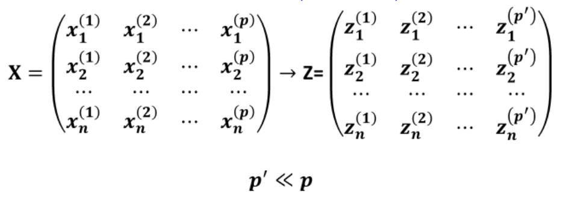
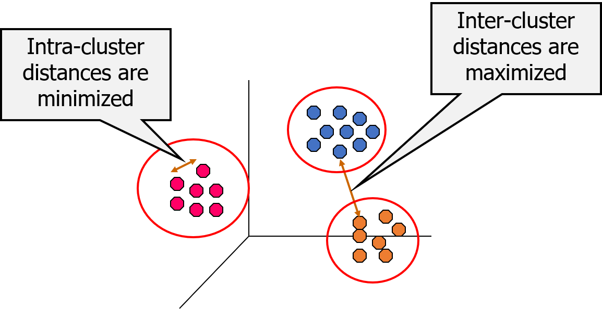

```{r setup, include=FALSE}
knitr::opts_chunk$set(echo = TRUE, warning = F, message = FALSE)


options(scipen = 999)

library(ggplot2)
library(dplyr)
library(GGally)
library(knitr)
library(ggcorrplot)
library(readxl)
library(FactoMineR)
library(factoextra)
library(pheatmap)

```

# Dimensionality Reduction / Principal Component Analysis

## Principal Component Analysis

**Why to use dimension reduction?**

Find latent hidden variables that are not/cannot be directly measured -
Reveal the hidden structure of the data - Transform the feature space
into variables that are not correlated, thus new variables can be used
in different machine learning techniques

\vspace{0.3cm}

```{r, echo = F, out.width= "80%"}

```

## Principal Components Analysis (PCA)

-   PCA is a technique that can be used to simplify a dataset

-   It is a linear transformation that chooses a new coordinate system
    for the data set such that greatest variance by any projection of
    the data set comes to lie on the first axis (called the first
    principal component), the second greatest variance on the second
    axis, and so on.

-   PCA can be used for reducing dimensionality by eliminating the later
    principal components.

## Principal Components Analysis (PCA)

Each new Component/factor is a linear combination of all variables.

Imagine we have p variables ($X_j, j = 1, 2, ..., p$)

$$
Z_i = \sum_{i=1}^p w_{ij}X_j
$$

$$
Z_i = w_{i1}X_1 + w_{i2}X_2 + ... + w_{ip}X_p
$$ where each pair of Z’s are orthogonal (correlation = 0)!

After estimating weights w, Z’s are ordered by their variance, with
$Z_1$ having the largest variance and $Z_p$ having the smallest
variance.

## Principal Component Analysis

```{r, out.height="70%", out.width="80%"}
ggpairs(iris,columns = 1:4, mapping = aes(color = Species))
```

## Principal Component Analysis

```{r}
iris_pca = prcomp(x = iris[,1:4], center = T, scale. = T)
iris_pca
```

## Principal Component Analysis

Types of visualizations

-   **Scree Plot**
    -   Shows the variance explained by each principal component.
    -   Helps determine the number of components to retain by
        visualizing where the "elbow" occurs.\
-   **Score Plot**
    -   Plots the data in the new component space, often the first two
        principal components.
    -   Reveals clusters or patterns in data points, such as grouping
        countries based on similarities.

## Principal Component Analysis

Types of visualizations

-   **Loading Plot**
    -   Visualizes how strongly each original variable contributes to
        each principal component.
    -   Helps interpret the meaning of each component based on variable
        correlations.
-   **Biplot**
    -   Combines the PCA score plot with loadings to show both data
        points (e.g., countries) and feature correlations.
    -   Useful for interpreting how original variables contribute to
        principal components.

## Principal Component Analysis - Scree plot

Variance explained

```{r}
iris_pca$sdev^2
```

Proportion of Variance explained

```{r}
var_explained = iris_pca$sdev^2/sum(iris_pca$sdev^2)
var_explained
```

## Principal Component Analysis - Scree plot

Scree plot

```{r, out.height="70%", out.width="80%"}
fviz_screeplot(iris_pca, addlabels = T)
```

## Principal Component Analysis - Score plot

```{r}
head(iris_pca$x)
```

## Principal Component Analysis - Score plot

Combine together into one dataframe and visualize

```{r}
pca_data_frame = data.frame(iris, iris_pca$x[,1:2]) 
```

```{r, out.height="50%", out.width="80%"}
ggplot(data = pca_data_frame, aes(x = PC1, y = PC2, 
    color = Species)) + geom_point()
```

## Principal Component Analysis - Score plot

Using library factoextra

```{r, out.height="70%", out.width="80%"}
fviz_pca_ind(iris_pca, geom = "point", habillage = iris$Species)
```

## Principal Component Analysis - Loading plot (Variables plot)

```{r, out.height="70%", out.width="80%"}
fviz_pca_var(iris_pca, repel = T) 
```

## Principal Component Analysis - Loading plot (Variables plot)

Loadings also help to interpret the graph.

PC1

-   **Petal.Length** has the highest positive loading on PC1, meaning it
    contributes the most to this component.
-   **Petal.Width** also has a positive loading, though smaller than
    Petal.Length, so it also influences PC1 but to a lesser extent.

```{r}
iris_pca$rotation
```

## Principal Component Analysis - Loading plot (Variables plot)

-   **Sepal.Width** has a high negative loading, indicating it is
    strongly associated with PC2 in the negative direction.
-   **Sepal.Length** also has a strong negative loading.

```{r, echo = F}
iris_pca$rotation
```

## Principal Component Analysis - Loading plot (Variables plot)

Lets look at the correlations

\scriptsize

```{r}
cor(pca_data_frame[,-5]) %>% round(4)
```

## Principal Component Analysis - Biplot

Biplot - variables and cases together

```{r, out.height="70%", out.width="80%"}
fviz_pca_biplot(iris_pca, label = "var", habillage = iris$Species)
```

## Principal Component Analysis

Decathlon data

\scriptsize

```{r}
data("decathlon")
decathlon = decathlon %>% filter(Competition == "OlympicG")
head(decathlon, 3)
```

## Principal Component Analysis

\scriptsize

```{r}
decathlon_pca = prcomp(decathlon[,1:10], center = T, scale. = T)
summary(decathlon_pca)
```

## Principal Component Analysis

Scree plot

```{r, out.height="70%", out.width="80%"}
fviz_screeplot(decathlon_pca, addlabels = TRUE)
```

## Principal Component Analysis

First lets look at the correlation heatmap

```{r, out.height="60%", out.width="80%"}
decathlon_cor_mat = cor(decathlon[,2:11])
ggcorrplot(decathlon_cor_mat , type = "lower", lab = T)
```

## Principal Component Analysis

Groups of variables:

-   **Sprints** 400m, 100m, 110m hurdle

-   **Throws** Discus, shot put, javeline

-   **Jumps** long jump, pole vault

## Principal Component Analysis (Var Plot)

```{r, out.height="70%", out.width="70%"}
fviz_pca_var(decathlon_pca, repel = T)
```

## Principal Component Analysis

400m, 100m, 110m hurdle


## Principal Component Analysis

Discus, shot put, javeline


## Principal Component Analysis

```{r out.height="70%", out.width="80%"}
fviz_pca_ind(decathlon_pca, repel = T)
```

## Principal Component Analysis

```{r out.height="70%", out.width="80%"}
fviz_pca_biplot(decathlon_pca, repel = T)
```

# Cluster Analysis

## Cluster Analysis

Finding groups of objects such that the objects in a group will be
similar (or related) to one another and different from (or unrelated to)
the objects in other groups

```{r, echo = F, out.width="80%"}

```

## Cluster Analysis

-   Cluster is a group of similar objects (cases, points, observations,
    examples, members, customers, patients, locations, etc)

-   Finding the groups of cases/observations/objects in the population
    such that the objects are

    -   Homogeneous within the group (high intra-class similarity)
    -   Heterogeneous between the groups (low inter-class similarity)

## Cluster Analysis

Clustering methods

-   Hierarchical clustering
-   Partitioning based clustering

## Cluster Analysis

Hierarchical clustersing

**Agglomerative Methods**

-   Begin with n-clusters (each record its own cluster)
-   Keep joining records into clusters until one cluster is left (the
    entire data set)
-   Most popular

\hfill\break

**Divisive Methods**

-   Start with one all-inclusive cluster
-   Repeatedly divide into smaller clusters

## Cluster Analysis

Distance measures

-   To combine similar records together we need to measure the distance,
    similarity/dissimilarity between records and clusters

-   Two groups of distance measures:

    1.  Distance between records
    2.  Distance between clusters

## Doing in R: Hierarchical Clustering

-   Read the data
-   Set country names as row names for the DataFrame
-   Select two columns for clustering
-   Scale to z-scores
-   Remove countries with NA values

\vspace{0.5cm}

\scriptsize

```{r}
countries = read.csv("data/countries.csv")

rownames(countries)=countries$ISO_code

countries_subset = countries[,c("Unemployment", "GDP.per.Capita.PPP")]

countries_subset = as.data.frame(scale(countries_subset, 
                                       center=TRUE, scale=TRUE))

countries_subset = na.omit(countries_subset)
```

## Doing in R: Hierarchical Clustering

-   Calculate the distance matrix
-   The hclust function takes distance matrix as a first argument

```{r}
countries_distance = dist(countries_subset, method="euclidian")
```

```{r}
cl  =  hclust(countries_distance, method="complete")
cl
```

## Cluster Analysis (Dendrogram)

Dendrogram represents how the clusters are created.

```{r, out.height='70%', out.width='80%'}
plot(cl, hang=-1)
```

## Cluster Analysis (Dendrogram)

Understanding a Dendrogram

-   **Hierarchical Structure:** A dendrogram visualizes hierarchical
    clustering, showing the arrangement of observations into nested
    clusters.
-   **Height of Branches:** The height (or length) of the branches
    represents the distance or dissimilarity between clusters. Higher
    branches mean greater dissimilarity.
-   **Merging Points:** Where branches join indicates clusters that have
    been combined. Lower merging points imply more similar clusters.

## Cluster Analysis (Dendrogram)

How many clusters to choose? Look for an elbow.

```{r, out.height="65%", out.width="80%"}
fviz_nbclust(countries_subset, FUNcluster = factoextra::hcut, 
             method = "wss")
```

## Cluster Analysis

If we choose **5** clusters

```{r, out.height="65%", out.width="80%"}
plot(cl, hang=-1)
rect.hclust(cl, 5)
```

## Cluster Analysis

Interpreting a Dendrogram

-   **Cutting the Dendrogram:** By "cutting" the dendrogram at a
    specific height, you can choose the number of clusters. Lower cuts
    result in more clusters, while higher cuts yield fewer.
-   **Cluster Similarity:** Observations or groups of observations that
    merge at a lower height are more similar to each other compared to
    those merging at a higher height.
-   **Cluster Size and Shape:** Dense clusters merge early, while more
    dispersed clusters join at higher levels, often indicating more
    variance within those groups.

## Cluster analysis

Using factoviz library

```{r, out.height="65%", out.width="80%"}
fviz_dend(cl, k = 5)
```

## Cluster analysis

Circular dendrogram

```{r, out.height="65%", out.width="80%"}
fviz_dend(cl, k = 5, type = "circular")
```

## Cluster analysis

We can create a new variable with cluster membership.

\hfill\break

**Cluster membership**

```{r}
countries_subset$cl_membership = as.factor(cutree(cl, k=5))
table(countries_subset$cl_membership)
```

## Cluster analysis

Visualizing clusters

\footnotesize

```{r, out.height="60%", out.width="80%"}
ggplot(data = countries_subset, aes(x = Unemployment, y = GDP.per.Capita.PPP, 
      color = cl_membership)) + geom_point()
```

# K-Means Clustering

## Cluster Analysis: K-means

-   Is used when the number of the clusters we are looking for is known
    beforehand
-   We assume that the data is divided equally among the clusters

## Cluster Analysis: K-means

The number of clusters is defined by the user

\hfill\break

Given *k*, the *k-means* algorithm consists of four steps:

-   Select initial centroids at random.
-   Assign each object to the cluster with the nearest centroid.
-   Compute each centroid as the mean of the objects assigned to it.
-   Repeat previous 2 steps until no change.

## Cluster Analysis: K-means

With this steps K-means algorithm **maximizes** Between group Sum of
Squares and **minimizes** within group Sum of Squares.

\vspace{0.5cm}

Total Sum of Squares

$$SST = \sum_{j=1}^{m}\sum_{i=1}^{n} (y_{ij} - \bar{y}_m)^2\quad$$

Between Groups Sum of Squares

$$SSB = \sum_{l=1}^{k}\sum_{j=1}^{m} (\bar{y}_{km} - \bar{y}_m)^2\quad$$

## Cluster Analysis: K-means

Within group sum of squares

$$SSW = \sum_{l=1}^{k}\sum_{j=1}^{m}\sum_{i=1}^{n} (y_{ijk} - \bar{y}_{km})^2\quad$$

Where *i* is the number of the row/case, *j* number of the variables,
*k* is the number of the groups/clusters $$SST = SSB + SSW$$

## Cluster Analysis: K-means

Doing in R

```{r}
countries_kmeans = kmeans(countries_subset[,1:2], centers = 3)
```

\hfill\break

What is inside ?

```{r}
names(countries_kmeans)
```

## Cluster Analysis: K-means

Shows the means/centers of each variable for each cluster

```{r}
countries_kmeans$centers
```

## Cluster Analysis: K-means

How good is the clustering?

```{r}
countries_kmeans$betweenss/countries_kmeans$totss
```

```{=tex}
\hfill\break
\hfill\break
```
66.7% of the total variance in the data can be explained by the clusters

## Cluster Analysis: K-means

How many clusters to chose?

```{r, out.height="65%", out.width="80%"}
fviz_nbclust(countries_subset, kmeans, method = "wss") +
  labs(title = "K-means Scree Plot")
```

## Cluster Analysis: K-means

Look at the cluster membership

```{r}
countries_kmeans = kmeans(countries_subset[,1:2], centers = 5)
countries_subset$kmeans = as.factor(countries_kmeans$cluster)
table(countries_subset$kmeans)
```

## Cluster Analysis: K-means

Visualizing the clusters

```{r, out.height='60%', out.width='80%'}
ggplot(data = countries_subset, aes(x = Unemployment, 
     y = GDP.per.Capita.PPP, color = kmeans)) + geom_point()
```

# Dendrogram Heatmaps

## Dendrogram Heatmaps

A **dendrogram heatmap** is a combined visualization that merges a
heatmap with dendrograms to represent hierarchical clustering.

-   **Heatmap Component:** A matrix-like visual where colors represent
    the intensity of values in the data, allowing quick comparison
    across rows and columns.
-   **Dendrogram Component:** Tree-like structures on the sides of the
    heatmap (typically on rows and columns) that illustrate hierarchical
    clustering, grouping similar data points together.
    -   **Clustering by Rows and Columns:** Both rows (data points) and
        columns (features) can be clustered, allowing for simultaneous
        grouping based on both samples and variables.

## Dendrogram Heatmaps

-   **Hierarchical Clustering Integration:** The dendrograms reorder the
    rows and columns of the heatmap based on similarity, making patterns
    and clusters more evident.
-   **Purpose:** Provides a dual insight by showing both the actual data
    values (via color) and the relationships between data points (via
    clusters).
-   **Usefulness:** Makes it easier to identify groups, trends, and
    outliers in complex datasets by visually clustering similar items.

## Dendrogram Heatmaps

**What a Dendrogram Heatmap Helps Us Achieve**

-   **Identify Patterns and Clusters:** Combines heatmap intensity with
    hierarchical clustering, making it easy to spot groups or clusters
    of similar data points.
-   **Reveal Data Structure:** Shows how data points or features relate
    to each other in a hierarchical way, highlighting nested groupings.
-   **Simplify Complex Data:** Reduces complexity by visually grouping
    related rows and columns, making large datasets easier to interpret.

## Dendrogram Heatmaps

Get subset of iris data and scale it

```{r}
iris_scaled <- iris[1:10, -5]  
iris_scaled <- scale(iris_scaled)
```

## Dendrogram Heatmaps

```{r, out.height="70%"}
pheatmap(iris_scaled, cluster_rows = FALSE, cluster_cols = FALSE)
```

## Dendrogram Heatmaps

```{r, out.height="65%", out.width="80%"}
iris_clust = hclust(d = dist(iris_scaled), method = "complete")
fviz_dend(iris_clust)
```

## Dendrogram Heatmaps

```{r, out.height="70%"}
pheatmap(iris_scaled, cluster_rows = T, cluster_cols = F)
```

## Dendrogram Heatmaps

-   transpose iris_scaled
-   calculate the distance matrix
-   cluster

```{r}
iris_scaled_t = t(iris_scaled)
iris_clust_t = hclust(d = dist(iris_scaled_t))
```

## Dendrogram Heatmaps

```{r, out.height="70%"}
fviz_dend(iris_clust_t, repel = T)
```

## Dendrogram Heatmaps

```{r, out.height="70%"}
pheatmap(iris_scaled, cluster_rows = T, cluster_cols = T)
```

## Dendrogram Heatmaps

Lets look at the whole dataset

```{r, out.height="60%", out.width="80%"}
iris_scaled = scale(iris[,-5]) %>% as.data.frame()
pheatmap(iris_scaled, cluster_rows = T, cluster_cols = T)
```

## Dendrogram Heatmaps

Decathlon dataset

```{r, out.height="60%", out.width="80%"}
decathlon_scaled = scale(decathlon[,1:10])
pheatmap(decathlon_scaled, cluster_rows = T, cluster_cols = T)
```

# PCA and Cluster Analysis

## PCA and Cluster Analysis

**Benefits of Using PCA and Clustering Together**

-   **Simplifies High-Dimensional Data:** PCA reduces the data's
    complexity, summarizing it into a few principal components, which
    makes it easier to visualize and interpret.
-   **Enhanced Visualization of Clusters:** By reducing the data to two
    or three dimensions, clusters become more visually distinct, helping
    reveal group structures that may not be apparent in the original
    data.
-   **Highlights Key Patterns:** PCA brings out the most influential
    variables, while clustering groups similar observations, making both
    patterns and outliers more evident.
-   **Reduces Visual Clutter:** With PCA simplifying dimensions and
    clustering organizing the data, the result is a cleaner, more
    informative visualization.

## PCA and Cluster Analysis

The dataset contains credit card usage behavior of about 9000 active
credit card holders.

Here is the link to the dataset
<https://www.kaggle.com/datasets/arjunbhasin2013/ccdata>

\tiny

```{r, out.height="60%"}
cc_data = read.csv("Data/CC GENERAL.csv")
str(cc_data)
```

## PCA and Cluster Analysis

Look at the missing values:

You can:

-   remove cases with missing values

-   do missing value imputation

\tiny

```{r, out.height="60%"}
sapply(cc_data, function(x) sum(is.na(x)))
```

## PCA and Cluster Analysis

Data cleaning:

-   Remove missing cases with missing values
-   Remove variable CUST_ID
-   Do z-score scaling

```{r}
cc_data = na.omit(cc_data)
cc_data$CUST_ID = NULL
cc_data_scaled = scale(cc_data) %>% as.data.frame()
```

## PCA and Cluster Analysis

Run PCA and visualize variance explained

\scriptsize

```{r, out.height="60%", out.width="80%"}
cc_pca = prcomp(cc_data_scaled)
fviz_screeplot(cc_pca, addlabels = T)
```

## PCA and Cluster Analysis

-   Extract cumulative variance explained
-   Make scree plot for **cumulative** variance explained

```{r}
var_explained <- cc_pca$sdev^2 / sum(cc_pca$sdev^2)       
cum_var_explained <- cumsum(var_explained)               
var_df <- data.frame(
  Component = 1:length(cum_var_explained),
  CumulativeVariance = cum_var_explained
)
```

## PCA and Cluster Analysis

```{r, eval = F}
ggplot(var_df, aes(x = Component, y = CumulativeVariance)) +
  geom_line() + geom_point(color = "red")+
  geom_text(aes(label = scales::percent(CumulativeVariance, 
     accuracy = 1)), vjust = -0.5, color = "black", size = 3.5) +
  scale_y_continuous(labels = scales::percent_format())
```

## PCA and Cluster Analysis

```{r, echo = F, out.height="80%", out.width = "90%"}
ggplot(var_df, aes(x = Component, y = CumulativeVariance)) +
  geom_line() + geom_point(color = "red")+
  geom_text(aes(label = scales::percent(CumulativeVariance, 
     accuracy = 1)), vjust = -0.5, color = "black", size = 3.5) +
  scale_y_continuous(labels = scales::percent_format())
```

## PCA and Cluster Analysis

We will chose 7 components and do k-mean clustering on this components

\tiny

```{r}
cc_pca_data = cc_pca$x[,1:7] %>% as.data.frame()
head(cc_pca_data)
```

## PCA and Cluster Analysis

-   K-means and let us go with 6 clusters
-   Add cluster membership variable to the dataframe
-   Calculate cluster quality score

```{r}
cc_kmeans = kmeans(cc_pca_data, centers = 6)
cc_pca_data$kmeans = as.factor(cc_kmeans$cluster)
cc_kmeans$betweenss/cc_kmeans$totss
```

## PCA and Cluster Analysis

```{r, out.height="70%", out.width="85%"}
ggpairs(cc_pca_data, columns = 1:6, mapping = aes(color = kmeans), 
        progress = F)
```
