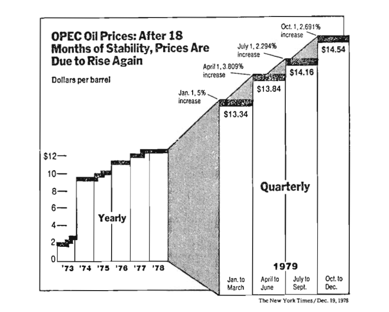

```{r setup, include=FALSE}
knitr::opts_chunk$set(echo = TRUE, tidy = F,  collapse = TRUE, warning=F, message = F,
                      size = 'footnotesize')
options(scipen = 999)
library(ggplot2)
library(dplyr)
library(reticulate)
library(Hmisc)
library(HistData)
library(knitr)
```


```{r, echo = F}
def.chunk.hook  = knitr::knit_hooks$get("chunk")
knitr::knit_hooks$set(chunk = function(x, options) {
  x = def.chunk.hook(x, options)
  ifelse(options$size != "footnotesize", paste0("\n \\", options$size,"\n\n", x, "\n\n \\footnotesize"), x)
})
```


## Chartjunk

 - The term is coined by Edward Tufte in his book *The Visual Display of Quantitative Information*
 - Chartjunk refers to all visual elements in charts and graphs that are not necessary to comprehend the information represented on the graph, or that distract the viewer from this information.
 - Thus, anything in the graph that does not convey information is a chartjunk.
 - If there is something in the graph, that if removed, will not change the message of the graph, is a chartjunk and needs to be removed.
 
## Chartjunk - data-ink
 
- Edward Tufte also coined a term data-ink
- Data-ink is the ink that is used to present information. Thus if you remove some of the data-ink, the message/ information will change. Thus, data-ink is the unremovable part of the graph.
 
 *A large share of ink on a graphic should present data-information, the ink changing as the data change. Data-ink is the non-erasable core of a graphic, the non-redundant ink arranged in response to variation in the numbers represented.*
 
## Chartjunk: data-ink ratio
 
 Data-ink ratio is calculated in the following way:
 
 $$ \text{Data-ink ratio} = {\frac{\text{Data-ink}}{\text{Total ink used in the graph}}} $$

- Data-ink ratio = proportion of a graphic ink used to display non-redundant data information.

- Data-ink ratio = 1- proportion of the graph that can be erased without losing information.
 
 
 
## Chartjunk
 
 *Edward Tufte*
 
The interior decoration of graphics generates a lot of ink that does not tell the viewer anything new. The purpose of decoration varies—to make the graphic appear more scientific and precise, to enliven the display, to give the designer an opportunity to exercise artistic skills. Regardless of its cause, it is all non-data-ink or redundant data-ink, and it is often chartjunk.

## Chartjunk

Look at the example below, how would you assess data-ink ratio here

```{r, echo=F, out.height='80%'}

```


## Chartjunk
Lets remove the junk part by part
Barplot background

```{r, echo=F, out.height='80%'}

```


## Chartjunk
Background at all

```{r, echo=F, out.height='80%'}

```


## Chartjunk

Redundant legends


```{r, echo=F, out.height='80%'}

```


## Chartjunk

Remove shadings

```{r, echo=F, out.height='80%'}

```


## Chartjunk

Remove colors of the bar
\
\

```{r, echo=F, out.height='80%'}
include_graphics('Img/chartjunk6.png')
```


## Chartjunk

Example of the chart, how can you improve the data-ink ratio ?

\scriptsize
```{r, out.height='55%'}
df = data.frame(City = c('Gyumri', 'Yerevan', 'Vanadzor', 'Kapan'),
                 Sales = c(4.3, 2.5, 3.5, 4.5))
ggplot(df, aes(x = City, y = Sales)) + geom_bar(stat='identity') + 
  geom_label(mapping = aes(label = Sales)) + 
  labs(title = "Sales by city, '000 drams")
```

## Chartjunk

What is it that we don't need?

-Redundant axis labels

\scriptsize
```{r, out.height='60%'}
ggplot(df, aes(x = City, y = Sales)) + geom_bar(stat='identity') + 
  geom_label(mapping = aes(label = Sales)) + 
  labs(title = "Sales by city, '000 drams", x = "", y = "")
```


## Chartjunk

Take out Y axis text

\scriptsize
```{r, out.height='60%'}
ggplot(df, aes(x = City, y = Sales)) + geom_bar(stat='identity') + 
  geom_label(mapping = aes(label = Sales)) + 
  labs(title = "Sales by city, '000 drams", x = "", y = "") + 
  theme(axis.text.y = element_blank())
```

## Chartjunk

Ticks add no information to the graph

\scriptsize
```{r, out.height='60%'}
ggplot(df, aes(x = City, y = Sales)) + geom_bar(stat='identity') + 
  geom_label(mapping = aes(label = Sales)) + 
  labs(title = "Sales by city, '000 drams", x = "", y = "") + 
  theme(axis.text.y = element_blank(), axis.ticks.y = element_blank())
```

## Chartjunk

Do you really need gridlines?

\scriptsize
```{r, out.height='55%'}
ggplot(df, aes(x = City, y = Sales)) + geom_bar(stat='identity') + 
  geom_label(mapping = aes(label = Sales)) + 
  labs(title = "Sales by city, '000 drams", x = "", y = "") + 
  theme(axis.text.y = element_blank(), axis.ticks.y = element_blank(),
        panel.grid = element_blank())
```

## Chartjunk

Tick marks on X axis ?

\scriptsize
```{r, out.height='55%'}
ggplot(df, aes(x = City, y = Sales)) + geom_bar(stat='identity') + 
  geom_label(mapping = aes(label = Sales)) + 
  labs(title = "Sales by city, '000 drams", x = "", y = "") + 
  theme(axis.text.y = element_blank(), axis.ticks.y = element_blank(),
        panel.grid = element_blank(), axis.ticks.x = element_blank())
```

## Chartjunk

Do we need the background ?

**Hadley Wickham on background color and gridlines**

... theme_gray(), uses a very light grey background with white gridlines. This follows from the advice of Tufte (1990, 1997, 2001, 2006) and Brewer (1994a); Carr (1994, 2002); Carr and Sun (1999). We can still see the gridlines to aid in the judgement of position (Cleveland, 1993b), but they have little visual impact and we can easily
“tune” them out. The grey background gives the plot a similar colour (in a typographical sense) to the remainder of the text, ensuring that the graphics fit in with the flow of a text without jumping out with a bright white background. Finally, the grey background creates a continuous field of colour which ensures that the plot is perceived as a single visual entity.
*H.Whickham ggplot2: Elegant Graphics for Data Analysis*

## Chartjunk

Overdoing ?

\tiny
```{r, out.height='55%'}
ggplot(df, aes(x = City, y = Sales)) + geom_bar(stat='identity') + 
  geom_label(mapping = aes(label = Sales)) + 
  labs(title = "Sales by city, '000 drams", x = "", y = "") + 
  theme(axis.text.y = element_blank(), axis.ticks.y = element_blank(),
        panel.grid = element_blank(), axis.ticks.x = element_blank(),
        panel.background = element_blank())
```

## Principles of good visualization

According to Edward Tufte (The Visual Display of Quantitative Information)

1. The representation of numbers, as physically measured on the surface of the graphic itself, should be directly proportional to the numerical quantities measured.
2. Clear, detailed, and thorough labeling should be used to defeat graphical distortion and ambiguity. Write out explanations of the data on the graphic itself. Label important events in the data.
3. Show data variation, not design variation.
4. In time-series displays of money, deflated and standardized units of monetary measurement are nearly always better than nominal units. (We will skip this).
5. The number of information-carrying (variable) dimensions depicted should not exceed the number of dimensions in the data. 
6. Graphics must not quote data out of context.


## Principles of good visualization: Principle 1

Distortion in Data graphic

- The graphic does not distort if the visual representation of the data is consistent with the numerical representation.
- Thus the visual perception of the data (area, height, length) should match the data itself.

- People perceive the length, width, area differently. 
- The experiments show that there is a power law relationship between the actual area of the circle and perceived area of the circle.

$$\text{percieved area =} (\text{actual area})^x, \text{where x}= 0.8 \pm {0.3}  $$

## Principles of good visualization: Principle 1

- As an example, the visual perception of length of the line depends on the context and what other people think.

Look at the Solomon Ash Experiment.

https://www.youtube.com/watch?v=iRh5qy09nNw

## Principles of good visualization: Principle 1

Lie factor:

Edward Tufte defines Lie factor in a following way

$$\text{Lie factor} = \frac{\text{Size of effect shown in graph}}{\text{Size of effect in data}}$$
\
\

The Lie factor should be equal to 1 with the negligent variation

## Principles of good visualization: Principle 1

Example from the book The visual display of quantitative information


## Principles of good visualization: Principle 1

Size of effect in the data:

- In 1978 the MPG was 18
- In 1985 the MPG was 27.5
 
$$ \text{The size of effect} = \frac{27.5-18}{18}*100 = 53\% $$

## Principles of good visualization: Principle 1

The magnitude of the change from 1978 to 1985 is given with the relative lengths of the lines.

- Length of the line for 1978 - 0.6 inches.
- Length of the line for 1985 - 5.3 inches

\
\

$$\text{Size of effect shown}=\frac{5.3-0.6}{0.6}*100=783\%$$

## Principles of good visualization: Principle 1

$$\text{Lie Factor} = \frac{783}{53}=14.7$$

## Principles of good visualization: Principle 1

Lie Factor with time series data 

In 2013 Twitter filled for [IPO](https://bit.ly/3dTr2TJ). Here are two charts from their SEC filling.

## Principles of good visualization: Principle 1


 

## Principles of good visualization: Principle 1


## Principles of good visualization: Principle 1


Recreate the first graph in R

What is the Lie Factor ?

\tiny
```{r, out.height='50%'}
twitter = data.frame(Users = c(138, 151, 167, 185, 204, 218),
    Quarters = c('2012 Q1', '2012 Q2', '2012 Q3', '2012 Q4', '2013 Q1', '2013 Q2'))
```

## Principles of good visualization: Principle 1

\scriptsize
```{r, out.height='60%'}
ggplot(twitter, aes(x = Quarters, y = Users)) + geom_bar(stat='identity') + 
  coord_cartesian(ylim = c(100, 250))
```


## Principles of good visualization: Principle 1

What if the Y axis starts from 0 ?

\small
```{r, out.height='60%'}
ggplot(twitter, aes(x = Quarters, y = Users)) + 
  geom_bar(stat='identity')
```

## Principles of good visualization: Principle 1

Use line charts

\scriptsize
```{r, out.height='60%'}
ggplot(twitter, aes(x = Quarters, y = Users, group = 1)) + 
  geom_line() + geom_point() + 
  coord_cartesian(ylim = c(0,NA))
```

## Principles of good visualization: Principle 1

According to Tufte, you can have origin different from 0, when you have line chart. 
Why?

\scriptsize
```{r, out.height='65%'}
ggplot(twitter, aes(x = Quarters, y = Users, group = 1)) + geom_line() + 
  geom_point()
```


## Principles of good visualization: Principle 2

2. Clear, detailed, and thorough labeling should be used to defeat graphical distortion and ambiguity. Write out explanations of the data on the graphic itself. Label important events in the data.
Your graphs need to have meaningful axis labels, title etc. No redundancies in the information. If it is on the graph it should be explained.

## Principles of good visualization: Principle 2

Height and weight data

\small
```{r, out.height='70%'}
hw = read.csv('Data/HW.csv')
ggplot(hw, aes(x = height, y = weight)) + geom_point()
```

## Principles of good visualization: Principle 2

\scriptsize
```{r, out.height='70%'}
ggplot(hw, aes(x = height, y = weight)) + geom_point() +
  labs(x = 'Height (cm)', y = 'Weight (kg)', 
       title = 'Height and Weight of Statistics Students')
```

## Principles of good visualization: Principle 3

Show data variation, not design variation.
\
\
```{r, echo = F, out.height='75%'}

```


## Principles of good visualization: Principle 3

Lies and deceptions


## Principles of good visualization: Principle 3

Avoid 3D graphs
\

```{r, echo = F, out.height='70%'}

```


## Principles of good visualization: Principle 3

Avoid 3D graphs

```{r, out.height='85%', echo = F}

```


## Principles of good visualization: Principle 5

5. The number of information-carrying (variable) dimensions depicted should not exceed the number of dimensions in the data. 

## Principles of good visualization: Principle 5

  \begin{columns}
    \begin{column}{.5\linewidth}
```{r, out.height='80%', echo = F}

```
    \end{column}
    \begin{column}{.5\linewidth}
    
If you just take the surface of the barrel than the Lie Factor of the chart will be 9.4

If you take the volume of the barrel, than the Lie factor will be 59.4 (Tufte, page 71)

    \end{column}
  \end{columns}


## Principles of good visualization: Principle 6

6. Graphics must not quote data out of context.

## Principles of good visualization: Principle 6

- In August 2019, the unemployment rate for the Black population hit the historic low - 5.4%.
- Is this the achievement of Trump administration?

## Principles of good visualization: Principle 6

Trump Period

\scriptsize
```{r, eval = F}
load('Data/unemployment.rda')
unemployment %>% filter(Date > '2017-01-01' & Date< '2019-09-01', 
                        Race == 'Black') %>%
  ggplot(aes(x = Date, y = Unemployment)) + geom_line() +
  labs(title = 'Unemployment among Black population, 2017-02 - 2019-08',
       x = "", y = "Unemployment (%)")
```


## Principles of good visualization: Principle 6

```{r, echo = F, out.height='80%'}
load('Data/unemployment.rda')
unemployment %>% filter(Date > '2017-01-01' & Date< '2019-09-01', Race == 'Black') %>%
  ggplot(aes(x = Date, y = Unemployment)) + geom_line() +
  labs(title = 'Unemployment among Black population, 2017-02 - 2019-08', x = "", y = "Unemployment (%)")
```


## Principles of good visualization: Principle 6

Can we say that it is because of Obama's policies unemployment rate among black population decreased?

\scriptsize
```{r, eval = F}
unemployment %>% filter(Date< '2019-09-01' & Date > '2010-01-01', 
                        Race == 'Black') %>% 
  ggplot(aes(x = Date, y = Unemployment)) + geom_line() +
  labs(title = 'Unemployment among Black population, 2010-01 - 2019-08',
       x = "", y = "Unemployment (%)")
```


## Principles of good visualization: Principle 6

```{r, echo = F, , out.height='80%'}
unemployment %>% filter(Date< '2019-09-01' & Date > '2010-01-01', 
                        Race == 'Black')  %>% 
  ggplot(aes(x = Date, y = Unemployment)) + geom_line() +
  labs(title = 'Unemployment among Black population, 2010-01 - 2019-08',
       x = "", y = "Unemployment (%)")
```


## Principles of good visualization: Principle 6

Unemployment for Black and white populations

\small
```{r, eval = F}
unemployment %>% filter(Date< '2019-09-01') %>% 
  ggplot(aes(x = Date, y = Unemployment, color = Race)) + 
  geom_line() + coord_cartesian(ylim = c(0, NA))
```

## Principles of good visualization: Principle 6

```{r, echo = F, out.height='80%'}
unemployment %>% filter(Date< '2019-09-01') %>% 
  ggplot(aes(x = Date, y = Unemployment, color = Race)) + 
  geom_line() + coord_cartesian(ylim = c(0, NA))
```


## Principles of good visualization: Principle 6


The big picture
```{r, echo = F, out.height='75%'}

```


## Principles of good visualization: Principle 6


"... To be truthful and revealing, data graphics must bear on the question at the heart of quantitative thinking: "Compared to what?" The emaciated, data-thin design should always provoke suspicion, for graphics often lie by omission, leaving out data sufficient for comparison... "

## Principles of good visualization: Principle 6


```{r, echo = F, out.width='95%'}

```


## Principles of good visualization: Principle 6


```{r, echo = F, out.width='95%'}

```


## Principles of good visualization: Principle 6


```{r, echo=F, out.width='95%'}

```


## Principles of visual perception

In the beginning of XX century, Gelstat school of psychology developed rules of visual perception.
Those rules are:

* Proximity
* Similarity
* Enclosure
* Closure
* Continuity
* Connection


## Principles of visual perception: Proximity

* The Gestalt law of proximity states that "objects or shapes that are close to one another appear to form groups". 

* Even if the shapes, sizes, and objects are radically different, they will appear as a group if they are close.


## Principles of visual perception: Proximity

```{r, echo = F, out.width='95%'}

```

## Principles of visual perception: Proximity

The proximity principle can be used to encourage either horizontal or vertical reading

```{r, echo = F, out.width='95%'}

```

## Principles of visual perception: Proximity

The file export.rda contains statistics for the 10 world's largest economies from 1996 to 2018 in two years intervals 

```{r}
load('Data/export.rda')
head(export)
```

## Principles of visual perception: Proximity

We want to have a bar chart faceted by year.

```{r, eval = F}
ggplot(export, aes(x = reorder(Country, Export), y = Export)) +
  geom_col() + labs(x = '') + 
  facet_wrap(Year~., scales = 'free') + 
  theme(axis.text.x = element_text(angle = 90))
```

## Principles of visual perception: Proximity

```{r, echo = F}
ggplot(export, aes(x = reorder(Country, Export), y = Export)) +
  geom_col() + labs(x = '') + facet_wrap(Year~., scales = 'free') + 
  theme(axis.text.x = element_text(angle = 90))
```

## Principles of visual perception: Proximity

Vertical alignment 

\small
```{r, eval = F}
ggplot(export, aes(x = reorder(Country, Export), y = Export)) +
  geom_col() + labs(x = '') + 
  facet_wrap(Year~., scales = 'free', dir = 'v') + 
  theme(axis.text.x = element_text(angle = 90))
```

## Principles of visual perception: Proximity

```{r, echo = F}
ggplot(export, aes(x = reorder(Country, Export), y = Export)) +
  geom_col() + labs(x = '') + 
  facet_wrap(Year~., scales = 'free', dir = 'v') + 
  theme(axis.text.x = element_text(angle = 90))
```

## Principles of visual perception: Proximity

If you want the reader to perceive the sequence of the graphs vertically, then add extra white space between the columns, using panel.spacing in theme()

\small
```{r, eval = F}
ggplot(export, aes(x = reorder(Country, Export), y = Export)) +
  geom_col() + labs(x = '') + 
  facet_wrap(Year~., scales = 'free', dir = 'v') + 
  theme(axis.text.x = element_text(angle = 90), 
        panel.spacing.x = unit(2, 'line'))
```

## Principles of visual perception: Proximity

```{r, echo = F, out.height='90%'}
ggplot(export, aes(x = reorder(Country, Export), y = Export)) +
  geom_col() + labs(x = '') + 
  facet_wrap(Year~., scales = 'free', dir = 'v') + 
  theme(axis.text.x = element_text(angle = 90), panel.spacing.x = unit(2, 'line'))
```

## Principles of visual perception: Similarity

We tend to group together objects that are similar in color, size, shape, and orientation. 


```{r, echo = F, out.width='95%'}

```


## Principles of visual perception: Similarity

* We can use this principle to show the rise of Chinese economy

* First create a variable that takes a value Yes, if the row is about China and No otherwise.

* We will use this variable for fill later on this variable.

\small
```{r, eval = F}
export$China = ifelse(export$Country == 'CHN', 'Yes','No')
ggplot(export, aes(x = reorder(Country, Export), y = Export, 
                   fill = China)) +
  geom_col() + labs(x = '') + 
  facet_wrap(Year~., scales = 'free') + 
  theme(axis.text.x = element_text(angle = 90), 
        panel.spacing.y = unit(2, 'line'))
```

## Principles of visual perception: Similarity


```{r, echo = F, out.height='90%'}
export$China = ifelse(export$Country == 'CHN', 'Yes','No')
ggplot(export, aes(x = reorder(Country, Export), y = Export, fill = China)) +
  geom_col() + labs(x = '') + 
  facet_wrap(Year~., scales = 'free') + 
  theme(axis.text.x = element_text(angle = 90), 
        panel.spacing.y = unit(2, 'line'))
```


## Principles of visual perception: Similarity

We can make the graph look better

\small
```{r, eval = F}
ggplot(export, aes(x = reorder(Country, Export), y = Export, 
                   fill = China)) +
  geom_col() + labs(x = '', y = '') + 
  facet_wrap(Year~., scales = 'free') + 
  theme(axis.text.x = element_text(angle = 90), 
        panel.spacing.y = unit(2, 'line'),
        legend.position = "none") + 
  scale_fill_manual(values = c('gray', 'red'))
```


## Principles of visual perception: Similarity

```{r, echo = F, out.height='90%'}
ggplot(export, aes(x = reorder(Country, Export), y = Export, fill = China)) +
  geom_col() + labs(x = '', y = '') + 
  facet_wrap(Year~., scales = 'free') + 
  theme(axis.text.x = element_text(angle = 90), panel.spacing.y = unit(2, 'line'),
        legend.position = "none") + 
  scale_fill_manual(values = c('gray', 'red'))
```

## Principles of visual perception: Enclosure

* We perceive objects as belonging together when they are enclosed by anything that forms a visual border around them (for example, a line or a common field of color).

* This enclosure causes the objects to appear to be set apart in a region that is distinct from the rest of what we see. 


## Principles of visual perception: Enclosure

```{r, echo = F, out.width='95%'}

```


## Principles of visual perception: Enclosure

```{r, echo = F, out.height='90%'}
ggplot(export, aes(x = reorder(Country, Export), y = Export, fill = China)) +
  geom_col() + labs(x = '', y = '') + 
  facet_wrap(Year~., scales = 'free') + 
  theme(axis.text.x = element_text(angle = 90), panel.spacing.y = unit(2, 'line'),
        legend.position = "none") + scale_fill_manual(values = c('gray', 'red'))
```


## Principles of visual perception: Closure

* Humans have a keen dislike for loose ends. 
* When faced with ambiguous visual stimuli objects that could be perceived either as open, incomplete, and unusual forms or as closed, whole, and regular forms we naturally perceive them as the latter. 
* The principle of closure asserts that we perceive open structures as closed, complete, and regular whenever there is a way that we can reasonably do so.


## Principles of visual perception: Closure


```{r, echo = F, out.width='95%'}

```


## Principles of visual perception: Closure

\small
```{r, out.height='70%'}
export %>% filter(Year ==2018) %>% 
  ggplot(aes(x = Country, y = Export)) + geom_col() + theme_bw()
```


## Principles of visual perception: Closure

\small
```{r, eval = F}
export %>% filter(Year ==2018) %>% 
  ggplot(aes(x = Country, y = Export)) + geom_col() + 
  theme_bw() + 
  theme(panel.border = element_blank(),
                     axis.line = element_line(colour = "black"),
                     panel.grid.major.x = element_blank())
```


## Principles of visual perception: Closure

```{r, echo = F, out.height='90%'}
export %>% filter(Year ==2018) %>% 
  ggplot(aes(x = Country, y = Export)) + geom_col() + 
  theme_bw() + theme(panel.border = element_blank(),
                     axis.line = element_line(colour = "black"),
                     panel.grid.major.x = element_blank())
```


## Principles of visual perception: Continuity

* We perceive objects as belonging together, as part of a single whole, if they are aligned with one another or appear to form a continuation of one another. 

* In figure below, we tend to see the individual lines as a continuation of one another, more as a dashed line than separate lines.

```{r, echo = F, out.width='95%'}

```

## Principles of visual perception: Connection

* We perceive objects that are connected in some way, such as by a line, as part of the same group. 
* In the figure below, even though the circles are nearer to one another vertically than horizontally, the lines that connect them create a clear perception of two horizontally attached pairs.

```{r, echo = F, out.width='95%', out.height='60%'}

```


## Principles of visual perception: Connection

The perception of grouping produced by connection is stronger than that produced by proximity or similarity (color, size, and shape); it is weaker only than that produced by enclosure. 

\
\

```{r, echo = F, out.width='95%'}

```


## Principles of visual perception

The dataset acs.rda contains information from American Community Survey. All the data is for male population


```{r}
load('Data/acs.rda')
head(acs)
```


## Principles of visual perception

We can start plotting

\scriptsize
```{r, out.height='70%'}
ggplot(acs, aes(x = Year, y = Income, color = Field)) + 
  geom_point()
```


## Principles of visual perception

Facet by education level

```{r, eval = F}
ggplot(acs, aes(x = Year, y = Income, color = Field)) + 
  geom_point() + facet_wrap(~Education, nrow = 1)
```

## Principles of visual perception

```{r, echo = F, out.height='85%'}
ggplot(acs, aes(x = Year, y = Income, color = Field)) + 
  geom_point() + facet_wrap(~Education, nrow = 1)
```

## Principles of visual perception

Use principle of Connectivity and add a line

```{r, eval = F}
ggplot(acs, aes(x = Year, y = Income, color = Field)) + 
  geom_point() + geom_line() +
  facet_wrap(~Education, nrow = 1)
```


## Principles of visual perception


```{r, echo = F, out.height='85%'}
ggplot(acs, aes(x = Year, y = Income, color = Field)) + 
  geom_point() + geom_line() +
  facet_wrap(~Education, nrow = 1)
```


## Principles of visual perception

If you want to emphasize the difference, use group aesthetics

```{r, eval = F}
ggplot(acs, aes(x = Year, y = Income, color = Field, 
                group = Year)) + 
  geom_point() + geom_line(color = 'black') +
  facet_wrap(~Education, nrow = 1)
```


## Principles of visual perception


```{r, echo = F, out.height='85%'}
ggplot(acs, aes(x = Year, y = Income, color = Field, 
                group = Year)) + 
  geom_point() + geom_line(color = 'black') +
  facet_wrap(~Education, nrow = 1)
```


