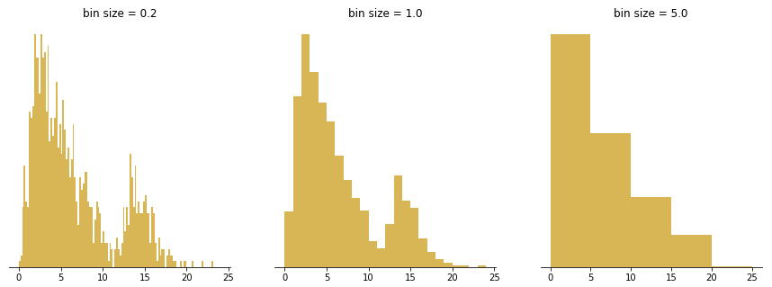

```{r setup, include=FALSE}
knitr::opts_chunk$set(echo = TRUE, tidy = F,  collapse = TRUE, warning=F, message = F, out.width = '70%', 
                      size = 'footnotesize')
options(scipen = 999)
library(knitr)
library(HistData)
library(ggplot2)
library(dplyr)
library(formatR)
library(MASS)
library(ggpubr)
```


```{r, echo = F}
def.chunk.hook  <- knitr::knit_hooks$get("chunk")
knitr::knit_hooks$set(chunk = function(x, options) {
  x <- def.chunk.hook(x, options)
  ifelse(options$size != "footnotesize", paste0("\n \\", options$size,"\n\n", x, "\n\n \\footnotesize"), x)
})
```

# Histogram

## Movies data set

\tiny
```{r, echo = TRUE}
movies <- read.csv('Data/movies.csv', stringsAsFactors = F)
str(movies)
```


## Histogram
 - A histogram displays the frequency and distribution for a range of quantitative groups.
 - Bar charts compare quantities for different categories, a histogram technically compares the number of observations across a range of value ‘bins’ using the size of lines/bars to represent the quantitative counts.
  - Histogram allows to understand the shape of the distribution of the data


## Doing with ggplot

- You need to specify only one aesthetics: x
- Use geom_histogram as a geometric object

\small
```{r, out.width = "60%"}
ggplot(data = movies, aes(x = imdbRating)) + 
  geom_histogram() + ggtitle('Histogram for iMDB rating')
```


## Doing with ggplot2

- in ggplot you can either specify the number of bins (bins) or bin width (binwidth). One can be derived from another.
- The default value for number of bins is 30.
- There is no one golden rule on choosing number of bins, however in general
  - More bins (smaller binwidth) will result in higher detalization
  - Less bins (larger binwidth) will result in lower detalization

## Doing with ggplot

Number of bins = 50

\footnotesize
```{r, out.height='70%'}
ggplot(data = movies, aes(x = imdbRating)) + geom_histogram(bins = 50) + 
  ggtitle('Histogram for iMDB rating')
```

## Doing with ggplot

Number of bins = 70
\footnotesize
```{r}
ggplot(data = movies, aes(x = imdbRating)) + 
  geom_histogram(bins = 70) + ggtitle('Histogram for iMDB rating')
```


## Doing with ggplot
Alternatively you can set up the binwidth:
binwidth = 0.5

\small
```{r}
ggplot(data = movies, aes(x = imdbRating)) +
  geom_histogram(binwidth = 0.5) + ggtitle('Histogram for iMDB rating')
```

## Doing with ggplot

Binwidth = 0.3

\small
```{r}
ggplot(data = movies, aes(x = imdbRating)) + geom_histogram(binwidth = 0.3) + 
  ggtitle('Histogram for iMDB rating')
```


## Choosing the number of bins

 - There is no one golden rule on how many bins need to be there
 - Do try and error until you get histogram that can be interpreted
 - However, there are few approaches for the calculation of optimal number of bins

## Methods for choosing the number of bins

1. Square root choice

   $$ {k=\lceil {\sqrt {n}}\rceil} $$

2. Rice rule

  $$ {k=\lceil 2{\sqrt[{3}]{n}}\rceil} $$
    
3. Sturges' formula

  $$ {k=\lceil \log _{2}n\rceil +1} $$
  
## Methods for choosing the binwidth

1. Scott's normal reference rule (when data is approximately normal)

  $$ {h={\frac {3.49{\hat {\sigma }}}{\sqrt[{3}]{n}}}} $$

2. Freedman–Diaconis' rule - a variation of Scott's rule but less sensitive to outliers

  $$ {h=2{\frac {\operatorname {IQR} (x)}{\sqrt[{3}]{n}}}} $$
  
## Doing in R

Basic R functionality for histogram allows to directly state the method for bin calculations

\tiny
```{r, out.width = '60%', eval = F}
par(mfrow = c(2,2))
hist(movies$imdbVotes, breaks = 'sturges', main = 'Sturges', )
hist(movies$imdbVotes, breaks = 'fd', main = 'Freedman-Diaconis')
hist(movies$imdbVotes, breaks = 'scott', main = 'Scott')
```


## Doing in R

```{r, out.width = '60%', echo=F}
par(mfrow = c(2,2))
hist(movies$imdbVotes, breaks = 'sturges', main = 'Sturges', )
hist(movies$imdbVotes, breaks = 'fd', main = 'Freedman-Diaconis')
hist(movies$imdbVotes, breaks = 'scott', main = 'Scott')
```


## Doing in ggplot2

In ggplot2 you need to calculate the number of the bins/binwidth then provide the result as an argument

Example: Rice rule

\tiny
```{r,eval = F}
n <- length(movies$Metascore[!is.na(movies$Metascore)])
k <- ceiling(2*(n^(1/3)))
ggplot(movies, aes(x = Metascore)) + geom_histogram(bins = k)
```


## Doing in ggplot2

```{r, echo = F}
n <- length(movies$Metascore[!is.na(movies$Metascore)])
k <- ceiling(2*(n^(1/3)))
ggplot(movies, aes(x = Metascore)) + geom_histogram(bins =k )
```


## Bumpy distribution

```{r}
data("diamonds")
ggplot(diamonds, aes(price)) + geom_histogram()
```

## Bumpy distribution

Increase the number of bins, the bump becomes more apparent

```{r}
ggplot(diamonds, aes(price)) + geom_histogram(bins = 70)
```


## Bumpy distribution

How can you detect it ?


```{r, echo = F, out.height='80%'}

```


## Density plots

- To visualize the distribution of the continuous variable, you can also use  kernel density estimate - smoothed version of the histogram. 
- In ggplot it is done with the geom_density()

## Density plots

```{r, out.width='70%'}
ggplot(movies, aes(x = Metascore)) + geom_density()
```


## Density plots: exponential distribution

```{r}
set.seed(1)
x <- rexp(1000, rate = 10)
ggplot() + geom_density(aes(x))
```


## Density plots

Scale the y axis

```{r, out.width='60%'}
ggplot() + geom_density(aes(x, y = after_stat(scaled)))
```

\tiny
*Note: We use `after_stat(scaled)` instead of the deprecated `..scaled..` syntax (changed in ggplot2 3.4.0+).*

## Density plot over the histogram

\scriptsize
```{r}
ggplot(mapping = aes(x = x))  + geom_histogram(aes(y = after_stat(density))) +
  geom_density(color = 'red')
```

\tiny
*Note: `after_stat(density)` replaces the deprecated `..density..` notation. This makes it explicit that `density` is computed by the stat layer.*

## Cumulative distribution function

 - The cumulative distribution function (CDF) of a random variable $X$, or just distribution function of $X$, evaluated at $x$ is the $P(X<x)$.
 - When we have the data, we have the empirical distribution, we can construct Empirical Cumulative Distribution Function:
 
 ${\displaystyle {\widehat {F}}_{n}(x)={\frac {{\mbox{number of elements in the sample}}\leq x}{n}}={\frac {1}{n}}\sum _{i=1}^{n}\mathbf I( {X_{i}\leq x})}$


## eCDF

```{r}
plot(ecdf(movies$imdbRating))
```


## eCDF

```{r}
ggplot(movies, aes(x = imdbRating)) + stat_ecdf(geom = 'point')
```

## eCDF

To make eCDF more informative we can add quartiles to the plot

```{r, eval = F}
quant <- quantile(movies$imdbRating, probs = c(0.25,0.5,0.75), na.rm = T) 
ggplot(movies, aes(x = imdbRating)) + stat_ecdf(geom = 'point') + 
  geom_vline(xintercept = quant, color = c('red', 'green', 'blue'))
```


## eCDF

```{r, echo = F}
quant <- quantile(movies$imdbRating, probs = c(0.25,0.5,0.75), na.rm = T) 
ggplot(movies, aes(x = imdbRating)) + stat_ecdf(geom = 'point') + 
  geom_vline(xintercept = quant, color = c('red', 'green', 'blue'))
```


## eCDF

Other distribution

\scriptsize
```{r, eval = F}
med <- median(movies$gross_adjusted)
avg <- mean(movies$gross_adjusted)
ggplot(movies, aes(x = gross_adjusted)) + stat_ecdf(geom = 'point') + 
  geom_vline(xintercept = c(med, avg), color = c('red', 'green'))
```


## eCDF

```{r, echo = F}
med <- median(movies$gross_adjusted)
avg <- mean(movies$gross_adjusted)
ggplot(movies, aes(x = gross_adjusted)) + stat_ecdf(geom = 'point') + 
  geom_vline(xintercept = c(med, avg), color = c('red', 'green'))
```


## Another skewed distribution

\footnotesize
```{r, eval = F}
med <- median(diamonds$price)
avg <- mean(diamonds$price)
ggplot(diamonds, aes(x = price)) + stat_ecdf(geom = 'point') + 
  geom_vline(xintercept = c(med, avg), col = c("red", "green"))
```


## Another skewed distribution

\footnotesize
```{r, echo = F}
med <- median(diamonds$price)
avg <- mean(diamonds$price)
ggplot(diamonds, aes(x = price)) + stat_ecdf(geom = 'point') + 
  geom_vline(xintercept = c(med, avg), col = c("red", "green"))
```


# Boxplots

## Boxplot

- Boxplot or box-whisker plot, is another way to display the distribution of the continuous variable
- Boxplots are usually used to visualize the distribution of some continuous variable by categories of a categorical variable
- They are also used to detect outliers (non-parametric way)

## Boxplot

The structure of the boxplot

```{r, echo = F, out.height='80%'}
include_graphics('Img/boxplot.png')
```


## Boxplot

Vertical Boxplot

```{r}
ggplot(data = movies, aes(y = Metascore)) + geom_boxplot()
```

## Boxplot

Horizontal boxplot

```{r}
ggplot(data = movies, aes(x = Metascore)) + geom_boxplot()
```

## Boxplot

Reading the boxplot

- The width of the box - IQR, is an indicator of the variance
- If the median is in the center and the whiskers have the same length with small to none outliers, then the variable has a bell shape

## Boxplot

Boxplot of skewed distribution

* Top whisker is longer
* Outliers on the top
* Initial conclusion: We have right skewed distribution

## Boxplot

```{r}
ggplot(data = diamonds, aes(y = price)) + geom_boxplot()
```

## Boxplot

* You can also add mean to the graph (added empty x in aesthetics)
* Mean greater than median - right skewed distribution

## Boxplot

\small
```{r}
ggplot(data = diamonds, aes(x = "", y = price)) + geom_boxplot() + 
  stat_summary(fun = mean, geom = 'point', color = 'red') + xlab("") + 
  theme(axis.ticks.x = element_blank())
```

## Comparing distributions

Sometimes will need to compare the distribution of one continuous variable by different categories of a categorical variable

- The height of males and females
- Distribution of waiting time by weekdays
- Number of goals per position in football, etc

We can do this with histograms, boxplots and eCDF


## Comparing distributions

- We will use Galton's hereditary data 
- for the full analysis refer to [Regression Towards Mediocrity in Hereditary Stature](http://www.stat.ucla.edu/~nchristo/statistics100C/history_regression.pdf)

## Comparing Distributions

\tiny
```{r}
data("GaltonFamilies")
str(GaltonFamilies)
```


## Comparing distributions

Histogram of height

\tiny
```{r}
ggplot(data=GaltonFamilies, aes(x = childHeight)) + geom_histogram()
```

## Comparing distributions

Density estimate

\tiny
```{r}
ggplot(data = GaltonFamilies, aes(x = childHeight)) + geom_density(bw = 0.7)
```

## Comparing distributions

eCDF

\tiny
```{r}
ggplot(data = GaltonFamilies, aes(childHeight)) + stat_ecdf(geom = 'point')
```

## Comparing distributions

Compare height for male and female children
There are two distinct distributions

\tiny
```{r}
ggplot(data = GaltonFamilies, aes(x = childHeight, color = gender)) + 
  geom_density()
```

## Comparing distributions
Create the eCDF

\tiny
```{r}
ggplot(data = GaltonFamilies, aes(x = childHeight, color = gender)) + 
  stat_ecdf()
```


## Comparing distributions

Boxplot

\tiny
```{r}
ggplot(data = GaltonFamilies, aes(x = gender, y = childHeight)) + 
  geom_boxplot() +
  stat_summary(fun.y = mean, geom = 'point', color = 'red')
```


## Comparing distributions

\tiny
```{r}
ggplot(movies, aes(x = genre_first, y = imdbRating)) + geom_boxplot() +
  theme(axis.text.x = element_text(angle = 90))
```


# Testing for distribution 


## Probability plots

 - The probability plot is a graphical technique for assessing whether or not a variable follows a given distribution.
 - The data is plotted against a theoretical distribution in such a way that the points should form approximately a straight line. 
 - Departures from this straight line indicate departures from the specified distribution.


## q-q plots

 - Q-Q Plots (Quantile-Quantile plots) are plots of quantiles of two variables plotted against each other. 
 - A quantile is a fraction where certain values fall below that value. 
 - The purpose of q-q plots is to find out if two sets of data come from the same distribution. 
 - If we have standard normal distribution then $45^{\circ}$ angle is plotted on the QQ plot; if the two data sets come from the same distribution, the points will fall on that reference line, thus quantiles of theoretical and sample distributions are the same.
  - The greater the departure from the reference line, the greater the evidence for the conclusion that the two data sets have come from populations with different distributions.
 - If the data does not follow standard normal distribution, then the reference line is formed with intercept = mean and slope = standard deviation


## q-q plots

We have $45^{\circ}$ line

```{r, out.height='60%'}
x <- rnorm(1000)
ggplot(mapping = aes(sample = x)) + geom_qq() + 
  geom_qq_line(color = 'red')
```


## q-q plots

q-q plot for Metascore

\scriptsize
```{r, out.height='70%'}
ggplot(movies, aes(sample = Metascore)) + geom_qq() + 
  geom_qq_line(color = 'red')
```


## q-q plots

Pay Attention

 - We have corresponding Z scores for theoretical values on x axis
 - The quantiles from the sample in the original scale
 - Line is not $45^{\circ}$ any more, but is rather estimated

## q-q plots

Lets see what happens when you define the distribution parameters

```{r, out.height='70%'}
x <- rnorm(1000, mean=10, sd = 2)
p1 <- ggplot(mapping =  aes(sample = x)) + geom_qq() + 
  geom_qq_line(color = 'red')
```

## q-q plots

```{r}
p1
```


## q-q plots

Get the data used to draw the plot

```{r}
df1 <- ggplot_build(p1)$data[[2]]
df1
```

## q-q plots

Calculate the slope

```{r}
slope <- diff(df1$y)/diff(df1$x)
slope
```

Intercept

```{r}
df1$y[1] - slope*df1$x[1]
```


## q-q plots

Define the right scale for theoretical distribution


```{r, out.height='70%'}
p1 <- ggplot(mapping =  aes(sample = x)) + 
  geom_qq(dparams = list(mean = 10, sd = 2)) + 
  geom_qq_line(color = 'red', dparams = list(mean = 10, sd = 2))
```

## q-q plots

```{r}
p1
```


## q-q plots

Calculate the slope

```{r}
df1 <- ggplot_build(p1)$data[[2]]

slope <- diff(df1$y)/diff(df1$x)
slope
```

Intercept

```{r}
df1$y[1] - slope*df1$x[1]
```


## q-q plots

Normal distribution

```{r, out.height = '70%', echo = F}
x <- rnorm(1000)
g1 <- ggplot(mapping =  aes(x = x)) + geom_histogram() + labs(x = "")
g2 <- ggplot(mapping = aes(sample = x)) + geom_qq() + 
  geom_qq_line(color = 'red')
gg <- ggarrange(g1,g2)
annotate_figure(gg, top = 'Symmetric distribution')
```


## q-q plots

Right skewed distribution

```{r, out.height = '70%', echo = F}
x <- rnorm(1000)
x_right <- c(x[x > 0] * 2.5, x)
g1 <- ggplot(mapping =  aes(x = x_right)) + geom_histogram() + labs(x = "Right skewed")
g2 <- ggplot(mapping = aes(sample = x_right)) + geom_qq() + 
  geom_qq_line(color = 'red', fullrange = T)
gg <- ggarrange(g1,g2)
annotate_figure(gg, top = 'Right skewed distribution')
```


## q-q plots

eCDF for Right skewed and Theoretical distributions

```{r, out.height = '70%', echo = F}

ggplot() + stat_ecdf(mapping = aes(x = x, color = 'Theoretical')) +  
  stat_ecdf(mapping = aes(x = x_right, color = 'Right Skewed')) + 
  geom_hline(yintercept = 0.75) + scale_color_manual(values=c("blue", "red")) + 
  labs(title = 'eCDF for Theoretical and Right skewed distribution')
```


## q-q plots

Left skewed distribution

```{r, out.height = '70%', echo = F}

x <- rnorm(1000)
x_left <- c(x[x < 0] * 2.5, x)
g1 <- ggplot(mapping =  aes(x = x_left)) + geom_histogram(bins = 50) +labs(x = "Left Skewed")
g2 <- ggplot(mapping = aes(sample = x_left)) + geom_qq() + 
  geom_qq_line(color = 'red', fullrange = F)
gg <- ggarrange(g1,g2)
annotate_figure(gg, top = 'Left skewed distribution')
```

## q-q plots

eCDF for left skewed distribution

&nbsp; 

```{r, out.height = '70%', echo = F}
ggplot() + stat_ecdf(mapping = aes(x = x, color = 'Theoretical')) +  stat_ecdf(mapping = aes(x = x_left, color = 'Left Skewed')) + 
  geom_hline(yintercept = 0.75) + scale_color_manual(values=c("blue", "red")) + 
  labs(title = 'eCDF for normal and Left skewed distribution')
```

## q-q plots


- Right skewed distribution: The points' upward trend shows that the sample quantiles are much greater than the theoretical quantiles.
- Left skewed distribution: The sample quantiles are going to be much lower than the theoretical quantiles.


## q-q plots

Heavy tail (Fat tail)

- Fat tail means that compared to the normal distribution there is more data located at the extremes of the distribution and less data in the center of the distribution. 
- In terms of quantiles this means that the first quantile is much less than the first theoretical quantile and the last quantile is greater than the last theoretical quantile


## q-q plots

Fat tails distribution

```{r, out.height = '70%', echo = F}

x <- rnorm(1000)
x_fat <- c(x* 2.5, x)
g1 <- ggplot(mapping =  aes(x = x_fat)) + geom_histogram(bins = 50) + xlab("")
g2 <- ggplot(mapping = aes(sample = x_fat)) + geom_qq() + 
  geom_qq_line(color = 'red', fullrange = F)
gg <- ggarrange(g1,g2)
annotate_figure(gg, top = 'Fat tails distribution')
```


## q-q plots

Thin tails distribution

&nbsp; 

With thin tails distribution you have less data in the tails than it should be compared to the normal distribution

&nbsp; 

```{r, out.height = '70%', echo = F}

x_thin <- rnorm(1000, sd = 0.55)
g1 <- ggplot(mapping =  aes(x = x_thin)) + geom_histogram(bins = 50) + labs(x = "")
g2 <- ggplot(mapping = aes(sample = x_thin)) + geom_qq() + 
  geom_qq_line(color = 'red', fullrange = F)
gg <- ggarrange(g1,g2)
annotate_figure(gg, top = 'Thin tails distribution')
```

## q-q plots

Setting the scale for X axis the same for all plots

```{r, echo = F}
g1 <- ggplot(mapping =  aes(x = x_fat)) + geom_histogram(bins = 50) + xlab("") + xlim(c(-5,5)) + ggtitle('Fat tail')
g2 <- ggplot(mapping =  aes(x = x_thin)) + geom_histogram(bins = 50) + xlab("") + xlim(c(-5,5)) + ggtitle('Thin tail')
g3 <- ggplot(mapping =  aes(x = x)) + geom_histogram(bins = 50) + xlab("") + xlim(c(-5,5)) + ggtitle('Normal')
ggarrange(g1,g2,g3)
```


## q-q plots

- By default the Q-Q plot is constructed with normal distribution as a theoretical distribution
- However you can use any distribution that is available in R
- Or provide your own distribution with parameters


## q-q plots

q-q plot for exponential distribution

\footnotesize
```{r}
x_exp <- rexp(10000)
ggplot(mapping = aes(sample = x_exp)) + geom_qq(distribution = stats::qexp) + 
  geom_qq_line(color = 'red', distribution =stats::qexp)
```

## q-q plots

Budget

\scriptsize
```{r, out.width='70%'}
ggplot(movies, aes(sample = budget_adjusted)) + 
  geom_qq(distribution = stats::qexp) + 
  geom_qq_line(color = 'red', distribution = stats::qexp)
```

