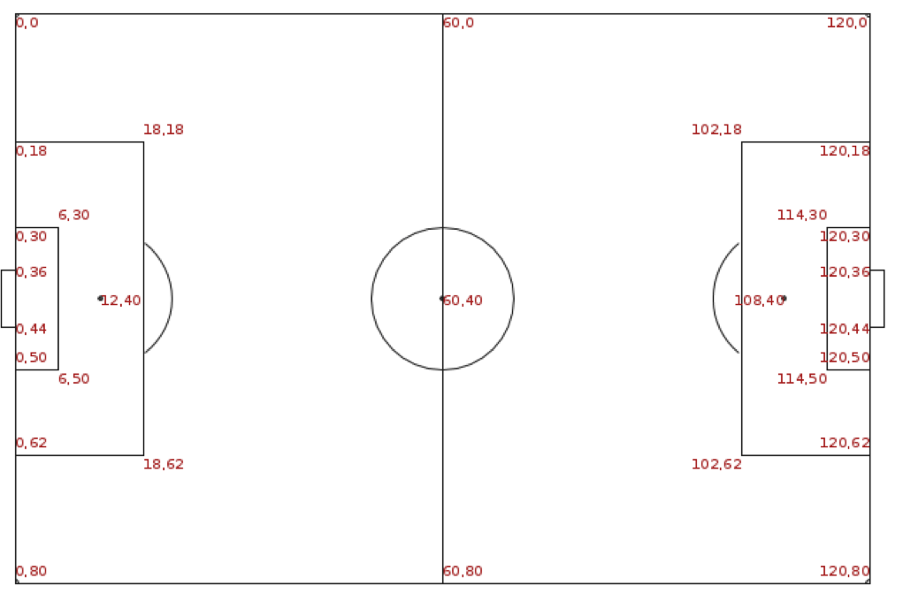

```{r setup, include=FALSE}
knitr::opts_chunk$set(echo = TRUE, tidy = F,warning=F, message = F, error = T, size = 'footnotesize')
options(scipen = 999)
library(ggplot2)
library(knitr)
library(dplyr)
library(reticulate)
library(formatR)
library(sf)
library(raster)
library(ggpubr)
library(jpeg)
library(raster)
library(maps)
library(rnaturalearth)
library(classInt)
library(ggmap)
```


## Spatial Data

When data is associated with locations, we call it spatial data.

When those locations are on the earth, we call it **geospatial data**.

Location is described with the set of coordinates and the coordinate reference system (CRS)

## Spatial Data

```{r, out.height='80%', echo=F}

```


## Spatial Data

```{r, out.height='80%', echo=F}

```


## Spatial Data

```{r, out.width='95%', out.height='80%', echo = F}

```

## Spatial Data

```{r, out.width='95%', echo = F}

```


## Geospatial Data Visualization

**Data types in GIS**

There are two main data types in GIS:

* Vector data
* Raster data

```{r, out.width='58%', out.height = '60%', echo = F}
include_graphics('Img/raster_vector.png')
```


## Geospatial Data Visualization

- Vector data is good for representing categorical and multivariate data. 
- It also has attribute tables where every record or row corresponds to a feature or an object and every column corresponds to different attributes. 

Vector data has three different types: 

1. points, 
2. lines, 
3. polygons. 


## Geospatial Data Visualization

* Points data normally refers to data collected at some point in space. 
* Examples:
  + City on the map
  + School
  + Drop off point for taxi
  + etc


## Geospatial Data Visualization

Points connect to each other to become lines and represent features such as 

* Highways, 
* Rivers,
* Taxi routes,
* etc


## Geospatial Data Visualization

If those lines add up to make a closed shape, we get a polygon.
Examples of usage of polygons are country or administrative region boundaries.

## Geospatial Data Visualization

Vector data file formats are called shapefiles.

**A shapefile is a simple, nontopological format for storing the geometric location and attribute information of geographic features.**

Shapefile is used to describe vector features such as points, lines, and polygons. 


## Geospatial Data Visualization

For doing so, shapefile uses three to seven files for a single map file to describe different components such as geometries or shape format, projection, attributes

```{r, out.width='85%', echo = F}

```


## Geospatial Data Visualization


There are few ways to read vector data into R we will use  sf library 


## Geospatial Data Visualization

Using rgdal

Specify the folder with all your spatial data 

```{r}
arm <- st_read('Data/Armenia_Marzes/Armenia_Marzes.shp')
class(arm)
```

## Geospatial Data Visualization

\scriptsize
```{r}
names(arm)
```

## Geospatial Data Visualization

You can use generic plot method

\scriptsize
```{r, out.height='80%'}
plot(arm)
```

## Geospatial Data Visualization


X is the Longitude
Y is the Latitude

\scriptsize

```{r}
arm_sf <- st_read('Data/Armenia_Marzes/Armenia_Marzes.shp', quiet = TRUE)

arm_df <- arm_sf %>% group_by(MarzID) %>% 
    st_cast("POINT")


arm_df = data.frame(Marz = arm_df$Name_Eng, st_coordinates(arm_df))

head(arm_df)
```


## Geospatial Data Visualization

Plot one region

\scriptsize
```{r, out.height='70%'}
arm_df %>% filter(Marz == "SYUNIK") %>% 
  ggplot(aes(x = X, y = Y)) + geom_point()
```

## Geospatial Data Visualization

\scriptsize
```{r, out.height = '70%'}
arm_df %>% filter(Marz == "SYUNIK") %>% 
   ggplot(aes(x = X, y = Y)) + geom_polygon()
```


## Geospatial Data Visualization

\scriptsize
```{r, out.height='70%'}
arm_df %>% filter(Marz == "SYUNIK") %>% 
   ggplot(aes(x = X, y = Y)) + 
  geom_polygon(fill = 'white', color = 'black')
```


## Geospatial Data Visualization

Or geom_path()

\scriptsize
```{r, out.height='70%'}
arm_df %>% filter(Marz == "SYUNIK") %>% 
   ggplot(aes(x = X, y = Y)) + geom_path()
```


## Geospatial Data Visualization

Add coord_fixed()

\scriptsize
```{r, out.height='70%'}
arm_df %>% filter(Marz == "SYUNIK") %>% 
   ggplot(aes(x = X, y = Y)) + geom_path() + coord_fixed()
```


## Geospatial Data Visualization

To get the whole map of Armenia, add group aesthetics

\scriptsize
```{r, out.height='70%'}
ggplot(arm_df, aes(x = X, y = Y, group = Marz)) + 
  geom_polygon(fill = 'white', color = 'black')
```


## Geospatial Data Visualization

To get the whole map of Armenia, add group aesthetics

\scriptsize
```{r, out.height='70%'}
ggplot(arm_df, aes(x = X, y = Y, group = Marz)) + 
  geom_polygon(fill = 'white', color = 'black') + coord_fixed() +theme_void()
```


## Geospatial Data Visualization

If you look at the x, y axis you can see that those are not longitude and latitude

```{r, echo = F, out.height='70%'}

```

## Geospatial Data Visualization

* Look at the **coordinate reference system** for the shapefile

* If you want to overlay maps on each other, you need to be sure that they have the same CRS

\scriptsize
```{r}
st_crs(arm) = 'EPSG: 4326'
```


## Geospatial Data Visualization

**Raster**

* Raster data is set of spatial data in the form of a grid of pixels. 
* Each pixel will hold a value which relates to some feature of interest at that point in space. 
* in R we will use library(raster) to read and work with raster data

## Geospatial Data Visualization

Raster file for Direct Normal Irradiation

\scriptsize
```{r}
arm_solar <- raster('Data/Armenia_GlobalSolarAtlas-v2_GEOTIFF/DNI.tif')
arm_solar
```

## Geospatial Data Visualization

You can use generic plot() to get the plot of the raster data

```{r, out.height='70%'}
plot(arm_solar)
```


## Geospatial Data Visualization

Transform into a dataframe

```{r}
arm_solar_df <- as.data.frame(arm_solar, xy = T)
head(arm_solar_df)
```

## Geospatial Data Visualization

Lots of Missing values

```{r}
dim(arm_solar_df)
summary(arm_solar_df)
```
## Geospatial Data Visualization

Why do we have missing values ?

\scriptsize
```{r, eval = F}
arm_solar_df %>% filter(is.na(DNI)) %>% 
  ggplot() + geom_point(aes(x =x, y = y))
```

```{r, echo = F, out.height='70%'}

```


## Geospatial Data Visualization

geom_raster() is used to visualize the raster data

\scriptsize
```{r, eval = F}
ggplot(arm_solar_df ,aes(x =x, y = y, fill = DNI)) + geom_raster() + 
  scale_fill_viridis_c()
```

```{r, out.height='70%', echo = F}

```


## Geospatial Data Visualization

Now we will try to plot DNI and administrative division of Armenia on the same plot.
But we need to have them in the same CRS.

\scriptsize
```{r}
crs(arm_solar)
crs(arm)
```


## Geospatial Data Visualization

1. Save long lat format as a string
2. Change the CRS for raster object
3. Create the dataframe again

```{r}
arm_sf <- st_transform(arm_sf, '+proj=longlat +datum=WGS84 +no_defs')

arm_df <- arm_sf %>% group_by(MarzID) %>% 
    st_cast("POINT")


arm_df = data.frame(Marz = arm_df$Name_Eng, st_coordinates(arm_df))

```

## Geospatial Data Visualization

\scriptsize
```{r}
summary(arm_df)
```


## Geospatial Data Visualization

Use geom_path on top of geom_raster()

\scriptsize
```{r, out.height='70%'}
ggplot()  + 
  geom_path(data = arm_df, aes(x = X, y = Y, group = Marz))
```


## Geospatial Data Visualization

\scriptsize
```{r, eval = F}
ggplot()  + 
  geom_raster(data = arm_solar_df, aes(x =x, y = y, fill = DNI)) + 
  geom_path(data = arm_df, aes(x = X, y = Y, group = Marz)) + 
  scale_fill_viridis_c()
```

```{r, echo=F, out.height='68%'}

```


## Geospatial Data Visualization

* ggplot has a special layer geom_sf() to deal with spatial data - shapefiles.
* In order to use it, you need to read shapefile using library(sf) function st_read
* Also change the CRS to long-lat format as with arm_soalr, but using function st_transform


The result is an object with class sf, data.frame

\scriptsize
```{r}
arm <- st_read('Data/Armenia_Marzes/Armenia_Marzes.shp', quiet = T)
arm <- st_transform(arm, crs(arm_solar))
```


## Geospatial Data Visualization

All you need at this stage is just to give ggplot the sf object for the **data** argument

\scriptsize
```{r, out.height='70%'}
ggplot(data = arm) + geom_sf()
```


## Geospatial Data Visualization

Our shape object has attributes tied to given polygons, such as Population, Name, etc, we can use them to visualize as well.

\scriptsize
```{r, out.height='70%'}
ggplot(data = arm, aes(fill = Total_Popu)) + geom_sf()
```

## Geospatial Data Visualization

The variable is a character, need to transform to numeric first.

\scriptsize
```{r}
arm$Total_Popu
```


## Geospatial Data Visualization

Remove white spaces

```{r}
arm$Total_Popu <- gsub(pattern = " ", x = arm$Total_Popu, 
                    replacement = "") %>%  as.numeric()
```


## Geospatial Data Visualization

```{r, out.height='70%'}
ggplot(data = arm, aes(fill = Total_Popu)) + geom_sf() + 
  scale_fill_viridis_c()
```

## Geospatial Data Visualization


```{r, out.height='65%'}
arm_state <- arm[-6, ]

ggplot(data = arm_state, aes(fill = Total_Popu)) + geom_sf() + 
  scale_fill_viridis_c()

```

## Geospatial Data Visualization

You can add your own variable to the sf object and use it
You can do simple operations with sf object

**Add**

```{r}
arm$test <- 1:11
```

**Delete**

```{r}
arm$test <- NULL
```

## Geospatial Data Visualization

Read GDP data

```{r}
gdp <- read.csv('Data/gdp by regions.csv')
names(gdp)
```

## Geospatial Data Visualization

Use dplyr to join two datasets together

\small
```{r}
arm <- arm %>% left_join(gdp, by = c('Name_Eng' = "Region"))
arm$Per_Capita_gdp
```


## Geospatial Data Visualization

GDP per capita

\scriptsize
```{r, out.height='70%'}
ggplot(data = arm, aes(fill = Per_Capita_gdp)) + geom_sf() + 
  scale_fill_viridis_c()
```


## Geospatial Data Visualization

sf object can be filtered and slices using dplyr, just like any other object

\scriptsize
```{r, out.height='70%'}
arm %>% filter(Name_Eng == 'SYUNIK') %>% 
  ggplot() + geom_sf()
```


## Geospatial Data Visualization

Using geom_sf() and geom_raster() together

\scriptsize
```{r, eval = F}
ggplot()  + 
  geom_raster(data = arm_solar_df, aes(x =x, y = y, fill = DNI)) + 
  geom_sf(data = arm) + scale_fill_viridis_c()
```

```{r, echo = F, out.height='68%'}

```


## Geospatial Data Visualization

We will do a trick, set fill = NA

\scriptsize
```{r, eval = F}
ggplot()  + 
  geom_raster(data = arm_solar_df, aes(x =x, y = y, fill = DNI)) + 
  geom_sf(data = arm, fill = NA) + scale_fill_viridis_c()
```

```{r, echo = F, out.height='68%'}

```


## Geospatial Data Visualization

You can use ggplot coord_layer to zoom in, you need to use coord_sf

\scriptsize
```{r, eval = F}
ggplot()  + 
  geom_raster(data = arm_solar_df, aes(x =x, y = y, fill = DNI)) + 
  geom_sf(data = arm, fill = NA) + scale_fill_viridis_c() + 
  coord_sf(xlim = c(44.6,46), ylim = c(40,41))
```

```{r, echo = F, out.height='65%'}

```


## Geospatial Data Visualization

When raster resolution is high, it can create problems such as memory usage, time needed to draw the map, etc.

To decrease the resolution of the raster image, you can use function raster::aggregate().

The function aggregates grid cells into larger grid cells using a user-defined function (for example, mean or max).

The additional argument to provide is **fact** and **fun**.

**fact** is a  positive integer. Aggregation factor is expressed as number of cells in each direction (horizontally and vertically). Or two integers (horizontal and vertical aggregation factor)

## Geospatial Data Visualization

\scriptsize
```{r, out.height='64%'}
arm_solar_df <- arm_solar %>% raster::aggregate(fact = 4) %>% 
  as.data.frame(xy = T)
ggplot()  + 
  geom_raster(data = arm_solar_df, aes(x =x, y = y, fill = DNI)) + 
  geom_sf(data = arm, fill = NA) + scale_fill_viridis_c()
```


## Case: John Snow and Cholera

* In the beginning of 19th century miasma theory was dominant, stating that diseases such as cholera and bubonic plague were caused by pollution or a noxious form of "bad air".

* John Snow was a well known physicist who was a proponent of germ theory.

* In 1854 he mapped the cholera cases and water pumps in Soho district of London. He did statistical analysis that showed that cholera cases were clustered around one water pump.  

## Case: John Snow and Cholera


**On proceeding to the spot, I found that nearly all the deaths had taken place within a short distance of the Broad Street pump. There were only ten deaths in houses situated decidedly nearer to another street-pump. In five of these cases the families of the deceased persons informed me that they always sent to the pump in Broad Street, as they preferred the water to that of the pumps which were nearer. In three other cases, the deceased were children who went to school near the pump in Broad Street.**

## Case: John Snow and Cholera

Lets look at the Snow's cholera data

\scriptsize
```{r}
deaths <- st_read('Data/SnowGIS_SHP/Cholera_Deaths.shp', quiet = T)
deaths
```


## Case: John Snow and Cholera

```{r}
pumps <- st_read('Data/SnowGIS_SHP/Pumps.shp', quiet = T)
pumps
```


## Case: John Snow and Cholera

Check if coordinate reference system is the same for both

```{r}
crs(pumps)
crs(deaths)
```


## Case: John Snow and Cholera

Plot deaths and pumps together

\scriptsize
```{r, out.height='70%'}
ggplot() +  geom_sf(data = deaths) + 
  geom_sf(data = pumps, color = 'red', shape= 3, size = 3)
```


## Case: John Snow and Cholera

We can also use the actual map of Soho.

\scriptsize
```{r, eval=F}
img <- readJPEG('Data/SnowGIS_SHP/SnowMap.jpg')
ggplot() +   background_image(img) +
  geom_sf(data = deaths) + 
  geom_sf(data = pumps, color = 'red', shape= 3, size = 3) + 
  theme(axis.text = element_blank(), axis.ticks = element_blank())
```

## Case: John Snow and Cholera

```{r, out.height='60%', echo=F}
img <- readJPEG('Data/SnowGIS_SHP/SnowMap.jpg')
ggplot() +   background_image(img) +
  geom_sf(data = deaths) + 
  geom_sf(data = pumps, color = 'red', shape= 3, size = 3) + 
  theme(axis.text = element_blank(), axis.ticks = element_blank())
```

## Case: John Snow and Cholera

* To visualize how the deaths are concentrated around the Broad Street pump, we can draw 2d density plots.

* First we need to extract coordinates.

\small
```{r}
deaths_coords <- deaths %>%  st_coordinates() %>% as.data.frame()
```

## Case: John Snow and Cholera

\scriptsize
```{r, out.height='70%'}
ggplot() +  
  geom_sf(data = pumps, color = 'red', shape= 3, size = 3) + 
  geom_density_2d(data = deaths_coords, aes(X,Y))
```


## Choropleth maps

* Choropleth maps are popular thematic maps used to represent statistical data through various shading patterns or symbols on predetermined geographic areas (i.e. countries). 

* They are used to visualize some statistical measure like mean, sum, median, across geographical regions.

* They are good at utilizing data to easily represent variability of the desired measurement, across a region.


## Choropleth maps

There are different packages in R that you can use to get the shapefiles of geographic regions.


```{r, out.height='75%'}
sf_world <- ne_countries(returnclass='sf')
ggplot() + geom_sf(data = sf_world)
```


## Choropleth maps

Read the fertility rate and join with the **sf** data

```{r}
fertility <- read.csv('Data/fertility.csv')
sf_world <- sf_world %>% 
  left_join(fertility[,c("Code", "Fertility_rate", 'Religion', 'GDP_PPP')], 
                                   by = c('iso_a3' = 'Code'))
```


## Choropleth maps

Categorical variable: Religion

```{r, out.height='90%'}
ggplot() + geom_sf(data = sf_world, aes(fill = Religion))
```

## Choropleth maps

Continuous variable: Fertility Rate

```{r, eval = F}
ggplot() + geom_sf(data = sf_world, aes(fill = Fertility_rate)) + 
  scale_fill_viridis_c()
```

## Choropleth maps

```{r, echo = F}
ggplot() + geom_sf(data = sf_world, aes(fill = Fertility_rate)) + 
  scale_fill_viridis_c()
```


## Choropleth maps

```{r, eval = F}
ggplot() + geom_sf(data = sf_world, aes(fill = GDP_PPP)) + 
  scale_fill_viridis_c()
```

## Choropleth maps

```{r, echo = F}
ggplot() + geom_sf(data = sf_world, aes(fill = GDP_PPP)) + 
  scale_fill_viridis_c()
```

## Choropleth maps

* When mapping with continuous variable, sometimes (almost always) it is hard to see the differences and individual results.
* The solution is to transform the continuous variable into categorical/ordinal variable

There are several methods to do so, we will look at some of them

* Equal length intervals
* Quantiles
* Natural breaks optimization methods
* Standard deviation

## Choropleth maps: Equal length intervals

Look at the distribution of fertility rate

```{r, out.height='75%'}
ggplot(data = sf_world, aes(x = Fertility_rate)) + geom_histogram()
```

## Choropleth maps: Equal length intervals

Let's say we want to transform the Fertility variable to a categorical one with 5 categories/intervals.

```{r}
summary(sf_world$Fertility_rate)
```


```{r, out.height='75%'}
sf_world$Fertility_cat <- cut(sf_world$Fertility_rate, 
                              breaks = 5, ordered_result = T)
```


## Choropleth maps: Equal length intervals

Let's look at the distribution

\small
```{r, out.height='70%'}
ggplot(data = sf_world, aes(x = Fertility_rate, fill = Fertility_cat)) + 
  geom_histogram(bins = 50)
```


## Choropleth maps: Equal length intervals

```{r, out.height='90%'}
ggplot() + geom_sf(data = sf_world, aes(fill = Fertility_cat)) 
```

## Choropleth maps: Quantiles

```{r}
quant <- quantile(x = sf_world$GDP_PPP, 
                  probs = seq(0,1, 0.1), na.rm = T)
sf_world$GDP_cat <- cut(sf_world$GDP_PPP,
                        breaks = quant, ordered_result = T)
```

## Choropleth maps: Equal length intervals

```{r, out.height='70%'}
ggplot(data = sf_world, aes(x = GDP_PPP, fill = GDP_cat)) + 
  geom_histogram(bins = 50)
```


## Choropleth maps: Quantiles

```{r, out.height='90%'}
ggplot() + geom_sf(data = sf_world, aes(fill = GDP_cat)) 
```

## Choropleth maps: Quantiles

If you are lost in colors, change the number of quantiles

```{r}
quant <- quantile(x = sf_world$GDP_PPP, 
                  probs = seq(0,1, 0.2), na.rm = T)
sf_world$GDP_cat <- cut(sf_world$GDP_PPP, 
                        breaks = quant, ordered_result = T)
```


## Choropleth maps: Quantiles

The distribution

\small
```{r, out.height = '70%'}
ggplot(data = sf_world, aes(x = GDP_PPP, fill = GDP_cat)) + 
  geom_histogram(bins = 50)
```


## Choropleth maps: Quantiles

```{r, out.height='80%'}
ggplot() + geom_sf(data = sf_world, aes(fill =GDP_cat)) 
```

## Choropleth maps: Natural Breaks (Optimization)

* Jenks optimization algorithm is widely used within GIS packages, these are forms of variance-minimization classification. 
* Breaks are typically uneven, and are selected to separate values where large changes in value occur. 
* May be significantly affected by the number of classes selected and tends to have unusual class boundaries.
* Does not work well when the variance in the variable is small


## Choropleth maps: Natural Breaks (Optimization)

\tiny
```{r}
jenks_int <- classInt::classIntervals(sf_world$Fertility_rate, n = 5,
                                      style = 'jenks')
jenks_int
jenks_int$brks
```


## Choropleth maps: Natural Breaks (Optimization)

Create the variable

```{r}
sf_world$Fertility_cat <- cut(x = sf_world$Fertility_rate, 
                              breaks = jenks_int$brks,
                              right = T)
```


## Choropleth maps: Natural Breaks (Optimization)

\scriptsize
```{r, out.height='78%'}
ggplot(data = sf_world, aes(x = Fertility_rate, fill = Fertility_cat)) + 
  geom_histogram(bins = 50)
```


## Choropleth maps: Natural Breaks (Optimization)

```{r}
ggplot() + geom_sf(data = sf_world, aes(fill = Fertility_cat)) 
```


## Choropleth maps: Standard deviation

* The Standard Deviation Classification method finds the mean value of the observations then places class breaks above and below the mean at intervals of either .25, .5, or 1 standard deviation until all the data values are contained within the classes.

* This classification method shows how much the feature's attribute value varies from the mean. Using a diverging color scheme to illustrate these values is useful to emphasize which observations are above the mean and which observations are below the mean.


## Choropleth maps


So how many classes ?
$$7\pm2$$
 Five is better
 
 
 
## Choropleth maps: Elections in USA

The dataset usa_elections.rda contains info on US presidential elections from 1976 by state.

```{r}
load(file = 'Data/usa_elections.rda')

usa_elections
```

 
## Choropleth maps: Elections in USA

Plot the results of the latest elections

```{r, eval = F}
usa_elections %>% filter(year == 2020) %>% 
  ggplot(aes(fill = winner)) + geom_sf()
```


## Choropleth maps: Elections in USA

```{r, echo = F}
usa_elections %>% filter(year == 2020) %>% 
  ggplot(aes(fill = winner)) + geom_sf()
```
 
 
## Choropleth maps: Elections in USA

Set up appropriate colors for democrats and republicans 

```{r, eval = F}
usa_elections %>% filter(year == 2020) %>% 
  ggplot(aes(fill = winner)) + geom_sf() + 
  scale_fill_manual(values = c('blue', 'red'))
```

## Choropleth maps: Elections in USA

```{r, echo = F}
usa_elections %>% filter(year == 2020) %>% 
  ggplot(aes(fill = winner)) + geom_sf() + scale_fill_manual(values = c('blue', 'red'))
```
 
## Choropleth maps: Elections in USA

Using margin for fill aesthetics

```{r, eval=F}
usa_elections %>% filter(year == 2020) %>% 
  ggplot(aes(fill = margin)) + geom_sf()
```

## Choropleth maps: Elections in USA

```{r, echo=F, out.height='90%'}
usa_elections %>% filter(year == 2020) %>% 
  ggplot(aes(fill = margin)) + geom_sf()
```
 
 
## Choropleth maps: Elections in USA

Margin with diverging color palette 

```{r, eval = F}
usa_elections %>% filter(year == 2020) %>% 
  ggplot(aes(fill = margin)) + geom_sf() + 
  scale_fill_gradient2(low = 'red', high = 'blue')
```

 
## Choropleth maps: Elections in USA

Margin with diverging color palette 

```{r, echo=F, out.height='85%'}
usa_elections %>% filter(year == 2020) %>% 
  ggplot(aes(fill = margin)) + geom_sf() + scale_fill_gradient2(low = 'red', high = 'blue')
```

 
## Choropleth maps: Elections in USA

Looking at the election results faceted by time

```{r, eval = F}
ggplot(usa_elections, aes(fill = winner)) + geom_sf() + 
  facet_wrap(~year,nrow=4) +
  scale_fill_manual(values = c('blue', 'red'))
```

## Choropleth maps: Elections in USA

```{r, echo=F, out.height='85%'}
ggplot(usa_elections, aes(fill = winner)) + geom_sf() + 
  facet_wrap(~year,nrow=4) +
  scale_fill_manual(values = c('blue', 'red'))
```

 
## Choropleth maps: Elections in USA

Fix few things:

* We don't need coordinates on axis
* Take out the gridlines

```{r, eval = F}
ggplot(usa_elections, aes(fill = winner)) + geom_sf() + 
  facet_wrap(~year,nrow=4) +
  scale_fill_manual(values = c('blue', 'red')) + 
  theme(axis.text = element_blank(),
        axis.ticks = element_blank(),
        panel.grid = element_blank(),
        panel.spacing.y = unit(1.5,'lines'))
```
 
 
## Choropleth maps: Elections in USA

```{r, echo = F, out.height='85%'}
ggplot(usa_elections, aes(fill = winner)) + geom_sf() + 
  facet_wrap(~year,nrow=4) +
  scale_fill_manual(values = c('blue', 'red')) + 
  theme(axis.text = element_blank(), 
        axis.ticks = element_blank(),
        panel.grid = element_blank(),
        panel.spacing.y = unit(1.5,'lines'))
```


