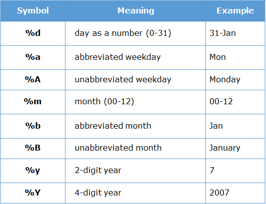
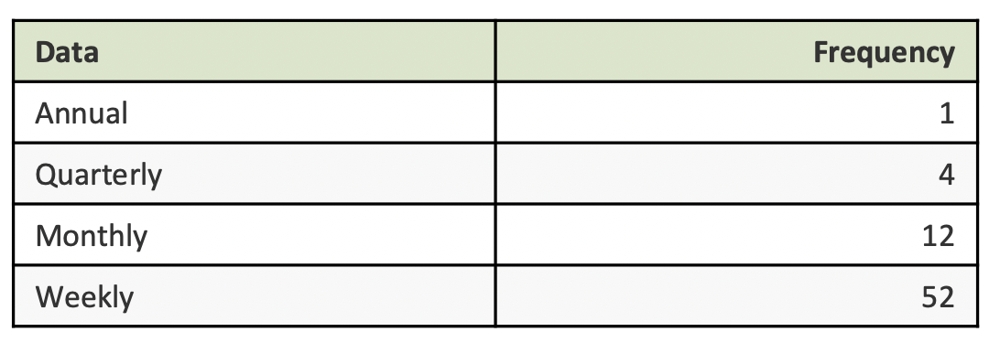

```{r setup, include=FALSE}
knitr::opts_chunk$set(echo = TRUE, warning = F, message = FALSE)
options( tinytex.verbose = TRUE)
library(forecast)
library(knitr)
library(ggplot2)
library(ggfortify)
library(dplyr)
library(fpp2)
```


## Time Series

Time Series

- Series of data observed over time 
- Anything that is observed over time are time series
- Eg.: Daily IBM stock prices, monthly rainfall in London, Annual GDP of Armenia

## Time Series

Time Series: 

- A sequence of data in chronological order 
- Data is commonly recorded sequentially, over time 
- Time series data is everywhere


## Time Series

Why to study time series separately?

- Sequence of the data does matter
- Look for the pattern in sequence
- Usually autoregressive in nature (value in time $t$ depends on the value in time $t-1$)

## Time Series

```{r}
rates <- read.csv('Data/exchange_rates.csv')
head(rates)
```

## Time Series

```{r}
str(rates)
```


## Time Series

```{r, echo = F, out.height='75%', out.width='80%'}

```


## Time Series

We have

- 2-digit year (%Y)
- month - (%m)
- day (%d)

values are separated by $-$

## Time Series

Change the format to date

```{r}
rates$Date <- as.Date(rates$Date, format = '%Y-%m-%d')
str(rates)
```


## Time Series

Now ggplot understands X axis as a $date$


```{r, out.height='70%'}
ggplot(rates, aes(x = Date, y  = USD)) + geom_line()
```

## Time Series

Customize the plot: breaks 

\scriptsize
```{r, out.height='70%'}
ggplot(rates, aes(x = Date, y  = USD)) + geom_line() + 
  scale_x_date(breaks = 'year')
```

## Time Series

Fix the angle

\scriptsize
```{r, out.height='68%'}
ggplot(rates, aes(x = Date, y  = USD)) + geom_line() + 
  scale_x_date(breaks = 'year') + 
  theme(axis.text.x = element_text(angle = 90))
```

## Time Series

Change the format of data label

```{r, out.height='65%'}
ggplot(rates, aes(x = Date, y  = USD)) + geom_line() + 
  scale_x_date(date_labels = '%b %y') + 
  theme(axis.text.x = element_text(angle = 90))
```

## Time Series

Breaks and data labels together

\scriptsize
```{r, out.height='70%', eval=F}
ggplot(rates, aes(x = Date, y  = USD)) + geom_line() + 
  scale_x_date(breaks = 'year', date_labels = '%b %y') + 
  theme(axis.text.x = element_text(angle = 90))
```

## Time Series

```{r, out.height='70%', echo=F}
ggplot(rates, aes(x = Date, y  = USD)) + geom_line() + 
  scale_x_date(breaks = 'year', date_labels = '%b %y') + 
  theme(axis.text.x = element_text(angle = 90))
```


## Time Series

R has several specific classes for time series, the basic is ts()

```{r}
t1 <- ts(c(103,44,78,52,90), start=2012)
class(t1)

```

## Time Series


```{r}
t1
```

## Time Series

- When creating a ts object, it is important to determine the “frequency” of the series.

- The frequency is the number of observations before the seasonal pattern repeats.

- Or otherwise it is showing how many times during the time period the observation was taken


## Time Series

Frequency when the time period is a year

```{r, echo = F, out.width='60%'}

```

## Time Series

Air Passengers data

Monthly totals of international airline passengers, 1949 to 1960, thousands.


```{r}
data("AirPassengers")
start(AirPassengers)
end(AirPassengers)
frequency(AirPassengers)
```


## Time Series

autplot() is a generic method from ggplot2 package that draws a plot for an object of a particular class in a single command.

```{r, out.height='65%'}
autoplot(AirPassengers)
```

## Time Series

Autoplot is a ggplot object and is used as a ggplot object!

\scriptsize
```{r, out.height='70%'}
autoplot(AirPassengers) + 
  scale_x_date(breaks = 'year', date_labels = '%b %y')
```


## Time Series

We visualize time series to see the patterns:

There are three main patterns in time series

- **Trend** pattern exists when there is a long-term increase or decrease in the series. It can be linear, exponential, or different one and can change direction during time. 
- **Seasonality** exists when data is influenced by seasonal factors, such as a day of the week, a month, and one-quarter of the year. A seasonal pattern exists for a fixed known period. 
- **Cyclic** pattern occurs when data rise and fall, but this does not happen within the fixed time and the duration of these fluctuations is usually at least 2 years.


## Time Series

What do we see ?
\  

```{r, echo = F, out.height='70%'}
autoplot(AirPassengers) + 
  scale_x_date(breaks = 'year', date_labels = '%b %y') + 
  theme(axis.text.x = element_text(angle = 90))
```


## Time Series

Few other ways of visualization to spot patterns:

- A seasonal plot is similar to a time plot except that the data are plotted against the individual “seasons” in which the data were observed. 
- An example is given for the Air Passengers data.


## Time Series


```{r, out.height='75%'}
ggseasonplot(AirPassengers, year.labels = T)
```

## Time Series

Subseries plot

```{r, out.height='70%'}
ggsubseriesplot(AirPassengers) + ylab("Number")
```

## Time Series

The plot shows the famous Canadian lynx data – the number of lynx trapped each year in the McKenzie river district of northwest Canada (1821-1934)

```{r, out.height='65%'}
autoplot(lynx)
```

## Time Series

Monthly sales of new one-family houses sold in the USA (1973-1995)

```{r, out.height='65%'}
autoplot(hsales) + theme(axis.text.x = element_text(angle = 90))
```


## Time Series

```{r, out.height='75%'}
ggsubseriesplot(hsales)
```

## Time Series

Half-hourly electricity demand in England and Wales from Monday 5 June 2000 to Sunday 27 August 2000

```{r, out.height='70%'}
autoplot(taylor)
```


## Time Series

**Time series decomposition**  

Time series data can exhibit a variety of patterns, and it is often helpful to split a time series into several components, each representing an underlying pattern category.

We have discussed three types of time series patterns: trend, seasonality and cycles. 
When we decompose a time series into the following components:

 - Combine the trend and cycle into a single trend-cycle component (sometimes called the trend for simplicity). 
 - Seasonal Component
 - A remainder component (containing anything else in the time series).

More on the mathematical functions for the decomposition can be see seen [here](https://otexts.com/fpp2/decomposition.html)


## Time Series

Monthly manufacture of electrical equipment: computer, electronic and optical products. January 1996 - March 2012.

```{r, out.height='65%'}
autoplot(elecequip)
```

## Time Series

Decomposing time series: 

- t.window is the number of consecutive observations to be used when estimating the trend-cycle; 
- s.window is the number of consecutive years to be used in estimating each value in the seasonal component.

## Time Series

\scriptsize
```{r, out.height='70%'}
decomposed <- stl(elecequip, s.window = 'periodic', t.window = 13)
autoplot(decomposed)
```

## Time Series

```{r}
head(decomposed$time.series)
```

## Time Series

\scriptsize
```{r, out.height='75%'}
df2 <- cbind(trendcycle (decomposed), elecequip)
autoplot(df2)
```

## Time Series

\scriptsize
```{r, out.height='70%'}
autoplot(df2) + 
  scale_color_discrete(labels = c('Trend', 'Data'), name = '') + 
  labs(y = "")
```

## Time Series

Decomposing AirPassangers data

\scriptsize
```{r, out.height='70%'}
air_dec <- stl(AirPassengers,s.window = 'periodic', t.window = 13)
autoplot(air_dec)
```


## Time Series

Total quarterly beer production in Australia (in megalitres) from 1956:Q1 to 2010:Q2.

\scriptsize
```{r, out.height='70%'}
autoplot(ausbeer)
```

## Time Series

\scriptsize
```{r, out.height='75%'}
dec <- stl(ausbeer, s.window = 'periodic', t.window = 4)
autoplot(dec)
```


## Time Series

STL is using LOESS for the decomposition of time series, however there are other methods as well.
decompose() function does additive or multiplicative decomposition - works with moving average

- $S_{t}$ is the seasonal component of the time series at the time period t
- $T_{t}$ is the trend-cycle period
- $R_{t}$ is the random component


**Additive decomposition**   

$y_{t} = S_{t}+T_{t}+R_{t}$

**Multiplicative decomposition**   

$y_{t} = S_{t}*T_{t}*R_{t}$


## Time Series

- Additive decomposition is used when variation in seasonal component is pretty stable
- Multiplicative decomposition is used when variation in seasonal pattern is increasing over time

## Time Series

Additive or multiplicative model ?

```{r, echo=F, out.height='70%'}
autoplot(ausbeer) + ggtitle('Australian beer production')
```

## Time Series

Additive or multiplicative model ?

```{r, echo = F, out.height='70%'}
autoplot(AirPassengers) + ggtitle('Air Passengers')
```

## Time Series
```{r, out.height='70%'}
dec <- decompose(AirPassengers, type = 'multiplicative')
autoplot(dec)
```


## Time Series: autocorrelation


- Correlation measures the extent of a linear relationship between two variables, 
- Autocorrelation measures the linear relationship between lagged values of a time series.

$$r_{k} = \frac{\sum\limits_{t=k+1}^T (y_{t}-\bar{y})(y_{t-k}-\bar{y})} {\sum\limits_{t=1}^T (y_{t}-\bar{y})^2}$$

## Time Series: autocorrelation

There are several autocorrelation coefficients, corresponding to each lag.

- $r_{1}$ correspondents to the correlation between $y_{t}$ and $y_{t-1}$
- $r_{2}$ correspondents to the correlation between $y_{t}$ and $y_{t-2}$

## Time Series: autocorrelation

Autocorrelation plot helps to:

 - Understand the trend and seasonality in the data
 - Choose appropriate forecasting method


## Time Series: autocorrelation

lag explained

```{r message=F, warning=F}
b <- as.vector(AirPassengers)
Lag1 <- Hmisc::Lag(b,1)
Lag2 <- Hmisc::Lag(b,2)
df <-data.frame(b,Lag1, Lag2)
head(df)
```


## Time Series: autocorrelation


\scriptsize
```{r, out.height='70%'}
ggAcf(AirPassengers)
```

## Time Series: autocorrelation

**Trend**

When data have a trend, the autocorrelations for small lags tend to be large and positive because observations nearby in time are also nearby in size. So the ACF of trended time series tend to have positive values that slowly decrease as the lags increase.

## Time Series: autocorrelation

```{r, echo = F, out.height='70%'}
ggAcf(AirPassengers)
```


## Time Series: autocorrelation

**Seasonality**

When data are seasonal, the autocorrelations will be larger for the seasonal lags (at multiples of the seasonal frequency) than for other lags.


## Time Series: autocorrelation

```{r, echo = F, out.height='70%'}
ggAcf(AirPassengers)
```

## Time Series: autocorrelation

When data are both trended and seasonal, you see a combination of these effects. 

```{r, echo = F, out.height='70%'}
ggAcf(AirPassengers)
```


## Time Series: autocorrelation

Ausbeer, what do we see ?

```{r, echo=F, out.height='75%'}
ggAcf(ausbeer, lag.max = 24)
```


## Time Series: autocorrelation

```{r, echo = F, out.height='75%'}
autoplot(ausbeer) + ggtitle('Australian beer')
```


## Time Series: autocorrelation

Lets look at the second part of the plot only, starting from 1992, use function window()

\scriptsize
```{r, out.height='65%'}
beer2 <- window(ausbeer, start=1992)
ggAcf(beer2)
```

## Case: California energy consumption

california.rda contains data on hourly energy consumption in California for the period of 2016-01-01 to 2019-12-31.

The sampling frequency is an **hour**

You can get more energy related data using *library(eia)* or from the website of [US Energy Information Agency](https://www.eia.gov)


## Case: California energy consumption

value shows energy demand per hour in megawatt 

```{r}
load('Data/california.rda')
summary(california)
```

## Case: California energy consumption

plot the demand

```{r, out.height = '70%'}
ggplot(california, aes(date, value)) + geom_line()
```


## Case: California energy consumption

Take a moment to think what are the seasonal periods in this data ?


## Case: California energy consumption

\scriptsize
```{r, out.height='70%'}
cali_ts <- msts(california$value, seasonal.periods=c(24,24*7,24*365), 
                start = 2016 + 1/365*24)
mstl(cali_ts) %>% autoplot()
```

## Case: California energy consumption

Autocorrelation plot

\scriptsize
```{r, out.height='75%'}
ggAcf(cali_ts, lag.max = 48)
```

