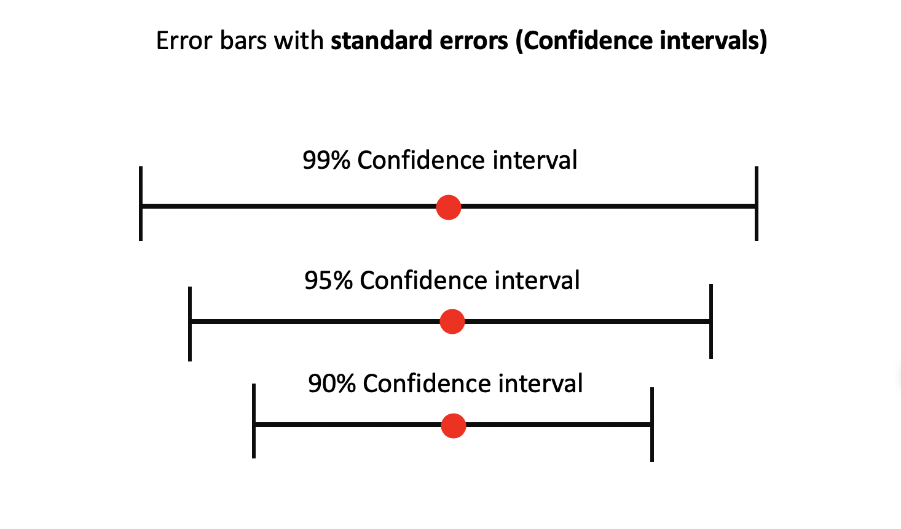
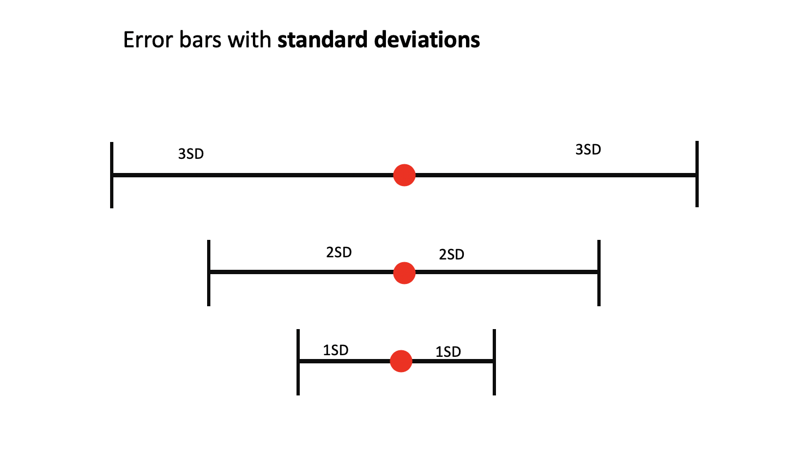

```{r setup, include=FALSE}
knitr::opts_chunk$set(echo = TRUE, tidy = F,  collapse = TRUE, warning=F, message = F, out.width = '80%', 
                      size = 'footnotesize')
options(scipen = 999)
library(knitr)
library(ggplot2)
library(dplyr)
library(reticulate)
library(Hmisc)
library(HistData)
```


```{r, echo = F}
def.chunk.hook  <- knitr::knit_hooks$get("chunk")
knitr::knit_hooks$set(chunk = function(x, options) {
  x <- def.chunk.hook(x, options)
  ifelse(options$size != "footnotesize", paste0("\n \\", options$size,"\n\n", x, "\n\n \\footnotesize"), x)
})
```


## Visualizing uncertainty

There are many sources of uncertainty

 - Uncertainty of point estimates
 - Uncertainty of distributions
 - Uncertainty of predictions (curve fit) etc..
 
 
# Uncertainty of point estimates
 
## Error bars
 
 Uncertainty of point estimates
 
 
 
```{r, echo = F}

```
 
 
## Error bars
 
 Uncertainty with standard deviations
 
```{r, echo = F}

```
 

## Error bars

```{r}
movies_small <- read.csv('Data/movies_small.csv')
summarised <-  movies_small %>% summarise(mean = mean(imdbRating), 
                                    sd = sd(imdbRating))
summarised
```

## Error bars

\scriptsize
```{r, out.height='60%'}
ggplot(summarised, mapping = aes(x = "", y = mean, ymax = mean+sd,
                                 ymin = mean-sd)) + geom_errorbar()
```

## Error bars

\scriptsize
```{r, out.height='60%'}
ggplot(summarised, mapping = aes(x = mean, y = "",  xmax = mean+sd,
                                 xmin = mean-sd)) + geom_errorbarh()
```

## Error bars

If you want to look at the error bars by groups - summarise by groups using dplyr

```{r}
summarised <-  movies_small  %>% group_by(genre_first) %>% 
  summarise(mean = mean(imdbRating), sd = sd(imdbRating))
summarised
```

## Error bars
 
 - use the grouping variable as x aesthetics 
 
\scriptsize 
```{r, out.height='50%'}
ggplot(summarised, aes(x = genre_first, y = mean, ymin=mean-sd, 
                       ymax = mean+sd)) + geom_errorbar()
```

## Error bars
 
There are few functions in R that can be used for generating the data for error bars
 
 - +- 1 SD
```{r}
smean.sdl(movies_small$imdbRating, mult = 1)
```

- +- 2sd

```{r}
smean.sdl(movies_small$imdbRating, mult = 2)
```

## Error bars

Hmisc also has functions to construct Confidence Intervals

- 95%

```{r}
smean.cl.normal(movies_small$imdbRating, conf.int = 0.95)
```

- 99% confidence interval
 
```{r}
smean.cl.normal(movies_small$imdbRating, conf.int = 0.99)
```

## Error bars

- ggplot2 has a wrapper for Hmisc functions: mean_cl_normal, mean_sdl, mean_se
- To construct the error bars with the functions we will use stat_summary() layer

stat_summary() applies defined function on y by the given values of x.
No need to summarise with dplyr and create new dataframe


## Error bars

Error bars for imdbRating by genre (+- 2 SD)

```{r, out.height='65%'}
ggplot(movies_small, aes(x = genre_first, y = imdbRating)) + 
  stat_summary(fun.data = mean_sdl, geom = "errorbar")
```

## Error bars

- By default, mult = 2.
- If you want to change this, use fun.args in stat_summary()


```{r, eval = F}
ggplot(movies_small, aes(x = genre_first, y = imdbRating)) + 
  stat_summary(fun.data = mean_sdl, geom = "errorbar", 
               fun.args = list(mult = 1))
```

## Error bars

```{r, echo = F}
ggplot(movies_small, aes(x = genre_first, y = imdbRating)) + 
  stat_summary(fun.data = mean_sdl, geom = "errorbar", 
               fun.args = list(mult = 1))
```


## Error bars

use stat_summary() again to add the mean as a red point to the error bar


```{r, eval=F}
ggplot(movies_small, aes(x = genre_first, y = imdbRating)) + 
  stat_summary(fun.data = mean_sdl, geom = "errorbar", 
               fun.args = list(mult = 1)) + 
  stat_summary(fun = mean, geom = 'point', color = 'red', size = 6)
```


## Error bars

```{r, echo=F}
ggplot(movies_small, aes(x = genre_first, y = imdbRating)) + 
  stat_summary(fun.data = mean_sdl, geom = "errorbar", 
               fun.args = list(mult = 1)) + 
  stat_summary(fun = mean, geom = 'point', color = 'red', size = 6)
```
 
# Confidence intervals
 
## Confidence intervals

We can visualize confidence intervals with error bars as well

- mean_cl_normal will create 95% CI by default


```{r, eval = F}
ggplot(movies_small, aes(x = year, y = gross_adjusted)) + 
  stat_summary(fun.data = mean_cl_normal, geom = "errorbar") + 
  stat_summary(fun = mean, geom='point', color = 'red')
```

## Confidence Intervals

```{r, echo = F}
ggplot(movies_small, aes(x = year, y = gross_adjusted)) + 
  stat_summary(fun.data = mean_cl_normal, geom = "errorbar") + 
  stat_summary(fun = mean, geom='point', color = 'red')
```

## Confidence Intervals

Subset the data with the years starting from 1987


```{r, eval = F}
movies_small %>% filter(year > 1987) %>% 
ggplot(aes(x = year, y = imdbRating)) + 
  stat_summary(fun.data = mean_cl_normal, geom = "errorbar") + 
  stat_summary(fun = mean, geom='point', color = 'red')
```


## Confidence Intervals

```{r, echo = F}
movies_small %>% filter(year > 1987) %>% 
ggplot(aes(x = year, y = imdbRating)) + 
  stat_summary(fun.data = mean_cl_normal, geom = "errorbar") + 
  stat_summary(fun = mean, geom='point', color = 'red')
```

## Confidence Intervals

Error bars with confidence intervals can help us to do initial hypothesis testing

$$ H_0: \mu_0=\mu_1$$
$$H_1: \mu_0\neq\mu_1$$

We can look at the error bars

- No intersection of the bars is an indicator of rejecting the null hypothesis
- Larger is the gap between error bars, more likely you will reject $H_0$


## Confidence intervals

Confidence intervals for Height by gender

```{r, eval = F}
ggplot(GaltonFamilies, aes(x = gender, y = childHeight)) + 
  stat_summary(fun.data = mean_cl_normal, geom = "errorbar") + 
  stat_summary(fun = mean, geom='point', color = 'red') 
```

## Confidence Intervals

```{r, echo = F}
ggplot(GaltonFamilies, aes(x = gender, y = childHeight)) + 
  stat_summary(fun.data = mean_cl_normal, geom = "errorbar") + 
  stat_summary(fun = mean, geom='point', color = 'red') 
```


## Confidence Intervals

Testing the hypothesis


$$ H_0: \mu_{male}=\mu_{female}$$
$$H_1: \mu_{male}\neq\mu_{female}$$

\scriptsize
```{r}
t.test(GaltonFamilies$childHeight~GaltonFamilies$gender)
```

## Confidence Intervals

Look at the mtcars data

- hp Horsepower
- am transmission automatics vs manual

First - t.test

\scriptsize
```{r}
t.test(mtcars$hp~mtcars$am)
```

## Confidence Intervals

Confidence interval


```{r, eval=F}
ggplot(mtcars, aes(x = factor(am), y = hp)) + 
  stat_summary(fun.data = mean_cl_normal, geom = "errorbar") + 
  stat_summary(fun = mean, geom='point', color = 'red')
```


## Confidence Intervals

```{r, echo=F, out.height='70%'}
ggplot(mtcars, aes(x = factor(am), y = hp)) + 
  stat_summary(fun.data = mean_cl_normal, geom = "errorbar") + 
  stat_summary(fun = mean, geom='point', color = 'red')
```


# Uncertainty in curve fit

## Uncertainty in curve fit

When we fit a model into the data, we sometimes look for answers to the following questions:

- What is the mean response for a particular value of x?
- In which interval will these value lie

## Uncertainty in curve fit

To answer these questions, we can construct confidence interval around the regression line, using the following formula:


$$\hat{y}_h \pm t_{\alpha / 2, n - 2} \sqrt{MSE \left(\frac{1}{n} + \frac{(x_k - \bar{x})^2}{\sum(x_i - \bar{x}^2)} \right)}$$

Wider is the confidence interval, more uncertainty we would have for that specific $x$ value.


## Uncertainty in curve fit

To get the confidence interval on the graph, specify se=TRUE (the default option) either in stat_smooth or geom_smooth

\tiny
```{r, out.height='65%'}
ggplot(mtcars, aes(x = hp, y = mpg)) + geom_point() +
  geom_smooth(method = 'lm')
```

## Uncertainty in curve fit

As you can see from the formula, further away you go from the mean, larger becomes the confidence interval

\tiny
```{r, out.height='65%'}
ggplot(mtcars, aes(x = hp, y = mpg)) + geom_point() + 
  geom_smooth(method = 'lm') + 
  geom_vline(xintercept = mean(mtcars$hp), color = 'red')
```


