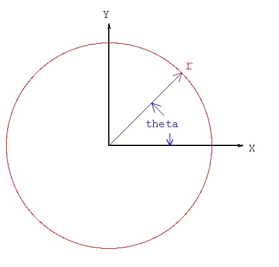
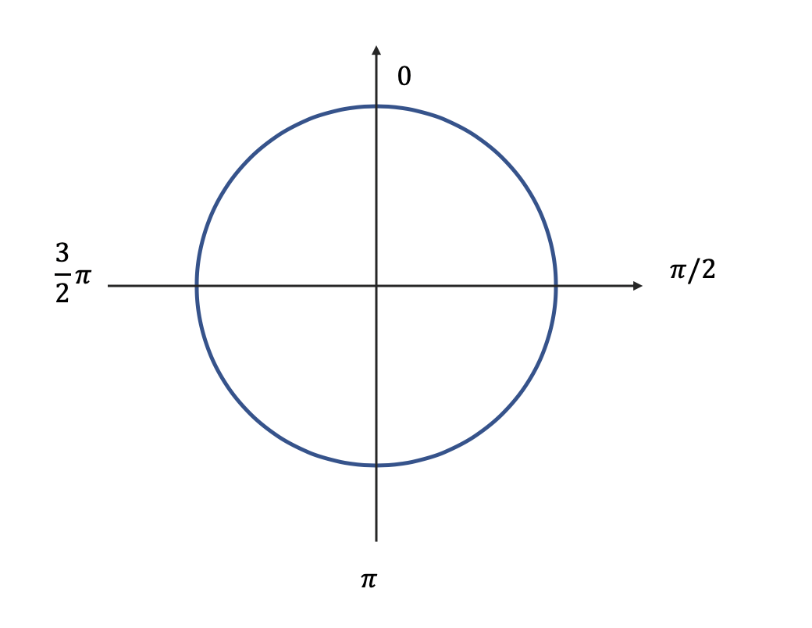

```{r setup, include=FALSE}
knitr::opts_chunk$set(echo = TRUE, tidy = F,  collapse = TRUE, warning=F, message = F, out.width = '80%', 
                      size = 'footnotesize')
options(scipen = 999)
library(ggplot2)
library(GGally)
library(dplyr)
library(HistData)
library(knitr)
library(reshape2)
```


```{r, echo = F}
def.chunk.hook  <- knitr::knit_hooks$get("chunk")
knitr::knit_hooks$set(chunk = function(x, options) {
  x <- def.chunk.hook(x, options)
  ifelse(options$size != "footnotesize", paste0("\n \\", options$size,"\n\n", x, "\n\n \\footnotesize"), x)
})
```


## Univariate categorical variable

- The first and most common way to visualize categorical variables is barchart
- A bar chart or bar graph is a chart or graph that presents categorical data with rectangular bars with heights or lengths proportional to the values that they represent. These values usually are either absolute or relative frequencies of each variable.
- The bars can be plotted vertically or horizontally. A vertical bar chart is sometimes called a column chart.


## Univariate categorical variable

Lets look at the summer.csv, the dataset that contains information on summer Olympic games

Get a subset of data for USA only

```{r}
summer <- read.csv('Data/summer.csv')
summer_usa <- summer %>% filter(Country == 'USA')
```


## Univariate categorical variable

- In ggplot2 bar chart is created with the geom_bar() layer.
- Note that you need to provide only one aesthetics - $x$,
- The $y$ aesthetics is calculated via statistical transformation **count** (the default value)

## Univariate categorical variable

```{r}
ggplot(summer_usa, aes(x = Medal)) + geom_bar(stat = 'count')
```


## Univariate categorical variable

You could also use stat_count()

```{r, out.height='70%'}
ggplot(summer_usa, aes(x = Medal)) + stat_count()
```


## Univariate categorical variable

The difference is that with stat_count you can use other geom as well

```{r, out.height='70%'}
ggplot(summer_usa, aes(x = Medal)) + stat_count(geom = 'point')
```


## Univariate categorical variable

You can get the vertical bar chart just setting y aesthetics instead of x

```{r}
ggplot(summer_usa, aes(y = Medal)) + geom_bar()
```


## Univariate categorical variable

Or use coord_flip()

```{r}
ggplot(summer_usa, aes(x = Medal)) + geom_bar() + coord_flip()
```


## Univariate categorical variable

Note these two methods are not strictly equivalent

- The first one sets *x* aesthetics to count
- coord_flip() flips the coordinates

## Univariate categorical variable

```{r, out.height='70%'}
ggplot(summer_usa, aes(x = Medal)) + geom_bar() + 
  coord_flip() +
  scale_y_continuous(breaks = c(500,750,2000))
```

## Univariate categorical variable
But

```{r, out.height='70%'}
ggplot(summer_usa, aes(y = Medal)) + geom_bar() + 
  scale_x_continuous(breaks = c(500,750,2000))
```


## Univariate categorical variable

You can create a bar chart from already aggregated data, but need to change the statistical transformation

```{r, out.height='70%'}
summer_usa %>% group_by(Medal) %>% summarise(count = n())
```


## Univariate categorical variable

And add y aesthetics

```{r, out.height='70%'}
summer_usa %>% group_by(Medal) %>% summarise(count = n()) %>% 
ggplot(aes(x = Medal, y = count)) + geom_bar(stat = 'identity')
```

## Univariate categorical variable

Alternatively, when no statistical transformation is done, you can use geom_col()

```{r, out.height='70%'}
summer_usa %>% group_by(Medal) %>% summarise(count = n()) %>% 
ggplot(aes(x = Medal, y = count)) + geom_col()
```


## Univariate categorical variable

The polar coordinate system is a two-dimensional coordinate system in which each point on a plane is determined by a distance from a reference point and an angle from a reference direction. 

parameters:

- $\theta$ - angle
- $r$ radius


## Univariate categorical variable

```{r, echo = F, out.height='80%'}

```

## Univariate categorical variable

```{r, out.height='70%'}
ggplot(data = summer_usa, aes(x = "", fill = Medal)) + 
  geom_bar()
```

## Univariate categorical variable

Counted y values are the $\theta$ parameter

```{r, out.height='70%'}
ggplot(data = summer_usa, aes(x = "", fill = Medal)) + 
  geom_bar() + coord_polar(theta = 'y')
```

## Univariate categorical variable

```{r, out.height='70%'}
ggplot(data = summer_usa, aes(x = "", fill = Medal)) + 
  geom_bar() + coord_polar(theta = 'y') + theme_void()
```


## Univariate categorical variable

With pie charts it is also useful to add count values (relative or absolute) to the plot

\scriptsize
```{r, out.height='60%'}
ggplot(data = summer_usa, aes(x = "", fill = Medal)) + geom_bar() + 
    geom_text(stat = 'count', aes(label = after_stat(count)), 
              position = position_stack(vjust = 0.5))
```

\tiny
*Note: We use `after_stat(count)` instead of the deprecated `..count..` syntax. The `after_stat()` function explicitly indicates that this variable is computed by the stat layer, not from your data.*

## Univariate categorical variable

To pie chart

\scriptsize
```{r, out.height='65%'}
ggplot(data = summer_usa, aes(x = "", fill = Medal)) + geom_bar() + 
    geom_text(stat = 'count', aes(label = after_stat(count)), 
              position = position_stack(vjust=0.5)) + 
  coord_polar(theta='y') + theme_void()
```


## Univariate categorical variable

You can control the appearance of pie chart with the parameters:

 - start - angle where the pie chart starts
 - direction - do you want it to be clockwise or anti-clockwise

## Univariate categorical variable

Understanding the **start** and **direction**

\scriptsize
```{r, out.height='65%'}
example <- data.frame(labels = LETTERS[1:4], values = rep(1,4))
ggplot(data = example, aes(x ="", y = values, fill = labels)) + 
  geom_col() + coord_polar(theta = 'y')
```

## Univariate categorical variable


```{r, echo = F}

```


## Univariate categorical variable

starting at $\frac{3}{2}\pi$

```{r, out.height='65%'}
ggplot(data = example, aes(x ="", y = values, fill = labels)) + 
  geom_col() + coord_polar(theta = 'y', start = 3*pi/2)
```

## Univariate categorical variable

starting at $\pi$

```{r, out.height='65%'}
ggplot(data = example, aes(x ="", y = values, fill = labels)) + 
  geom_col() + coord_polar(theta = 'y', start = pi)
```

## Univariate categorical variable

starting at $\frac{\pi}{2}$

```{r, out.height='65%'}
ggplot(data = example, aes(x ="", y = values, fill = labels)) + 
  geom_col() + coord_polar(theta = 'y', start = pi/2)
```

## Univariate categorical variable

Direction

\scriptsize
```{r, out.height='65%'}
ggplot(data = example, aes(x ="", y = values, fill = labels)) + geom_col() + 
  coord_polar(theta = 'y', direction = -1)
```

## Univariate categorical variable

**Don't use pie charts** !!


## Multivariate categorical variable

- We can use barcharts to visualize multivariate categorical data as well.

- Look at the distribution of the medals over time (assuming year as categorical variable)

- by default the position is "stack"

## Multivariate categorical variable

```{r}
ggplot(summer_usa, aes(x = Year, fill = Medal)) + geom_bar()
```


## Multivariate categorical variable

Position 'dodge' to get side-by-side bar chart

```{r, out.height='70%'}
ggplot(summer_usa, aes(x = Year, fill = Medal)) + 
  geom_bar(position = 'dodge')
```


## Multivariate categorical variable

position = 'fill' to have stacked bar chart with the length of 1

```{r, out.height='70%'}
ggplot(summer_usa, aes(x = Year, fill = Medal)) + 
  geom_bar(position = 'fill')
```

## Multivariate categorical variable

Change the order of variable categories

\scriptsize
```{r, out.height='65%'}
ggplot(summer_usa, aes(x = Year, fill = factor(Medal, 
      levels=c("Bronze","Silver", "Gold" )))) + 
  geom_bar(position = 'fill') 
```

## Multivariate categorical variable

\scriptsize
```{r, out.height='70%'}
ggplot(summer_usa, aes(x = Year, fill = factor(Medal, 
      levels=c("Bronze","Silver", "Gold" )))) + 
  geom_bar(position = 'fill') + labs(fill = 'Medal')
```

## Multivariate categorical variable

- Bar charts are used to visualize contingency tables
- Useful to visualize conditional probabilities
- Relationship between variables

```{r, size = 'small'}
load('Data/hr.rda')
colnames(hr)
```

## Multivariate categorical variable

Why do people leave ?

Contingency table for conditional probabilities

```{r}
prop.table(table(hr$salary, hr$left),1)
```


## Multivariate categorical variable

Why do people leave ?

```{r, out.height='70%'}
ggplot(hr, aes(x =salary, fill = left)) + 
  geom_bar(position = 'fill')
```


## Multivariate categorical variable

```{r}
prop.table(table(hr$salary, hr$left),2)
```

## Multivariate categorical variable

```{r}
ggplot(hr, aes(x = left, fill = salary)) + 
  geom_bar(position = 'fill')
```


## Multivariate categorical variable

Is promotion a factor ?

```{r, out.height='70%'}
ggplot(hr, aes(x = promotion_last_5years, fill = left)) + 
  geom_bar(position = 'fill')
```

## Case Study: Florence Nightingale

- Florence [Nightingale](https://en.wikipedia.org/wiki/Florence_Nightingale) was a British nurse during Crimean War in the middle of 19th century.
- She became very upset by a high mortality rate among British soldiers and started collecting data on the causes of deaths in hospitals.
- Based on her recommendations, sanitary conditions in hospitals were improved, which significantly decreased mortality rates in hospitals.

## Case Study: Florence Nightingale

```{r, size='small'}
data("Nightingale")
str(Nightingale)
```

## Case Study: Florence Nightingale

To use the data in ggplot we need to transform it to long format first

```{r}
nightingale_m <- melt(data = Nightingale, id.vars = 'Date', 
                measure.vars = c('Disease', 'Wounds', 'Other'))
```


We will also create a dataset with the data for deaths before the sanitation was improved

```{r}
night_before <- nightingale_m %>% filter(Date < '1855-04-01')
```


## Case Study: Florence Nightingale

Subset the data for the early periods of Nightingale work (up to March 1855)

\scriptsize
```{r, out.height='70%'}
ggplot(night_before, aes(x = Date, fill = variable, y = value)) + 
  geom_col()
```

## Case Study: Florence Nightingale

The way how Florence Nightingale visualized this data, will become known as **Nightingale rose** or **coxcomb** chart

```{r, echo = F, out.height='65%'}
include_graphics('Img/plot 3.jpg')
```


## Case Study: Florence Nightingale


- We will try to replicate Nightingale's chart
- Pay attention, theta = 'x'

\scriptsize
```{r, out.height='65%'}
ggplot(night_before, aes(x= Date, fill = variable, y = value)) +  
    geom_col(width = 1) + coord_polar(theta='x')
```

## Case Study: Florence Nightingale

Date as factor, but still ugly

\scriptsize
```{r, out.height='70%'}
ggplot(night_before, aes(x= factor(Date), fill = variable, y = value)) +  
    geom_col(width = 1) + coord_polar(theta='x')
```


## Case Study: Florence Nightingale
Make a Month variable as factor preserving the order of months

\scriptsize
```{r}
night_before$Month <- factor(months(night_before$Date, abbreviate = T), 
                             levels = month.abb)
```


## Case Study: Florence Nightingale

```{r}
ggplot(night_before, aes(x=Month, fill=variable, y=value)) +  
    geom_col(width = 1) + coord_polar(theta='x')
```


## Case Study: Florence Nightingale

Set the starting point

\scriptsize
```{r, out.height='70%'}
ggplot(night_before, aes(x = Month, fill = variable, y = value)) +  
    geom_col(width = 1) + coord_polar(theta='x', start=0.9*pi)
```


## Case Study: Florence Nightingale

making better (color = 'black')

\scriptsize
```{r, fig.show='hide', out.height='70%'}
ggplot(night_before, aes(x = Month, fill = variable, y = value)) +
  scale_y_sqrt() +
  geom_col(width = 1, color = 'black') + 
  coord_polar(theta='x', start=0.9*pi)
```

## Case Study: Florence Nightingale

```{r, echo = F}
ggplot(night_before, aes(x = Month, fill = variable, y = value)) +  scale_y_sqrt() +
    geom_col(width = 1, color = 'black') + coord_polar(theta='x', start=0.9*pi)
```

## Case Study: Florence Nightingale

Create a theme for the plot

\scriptsize
```{r}
theme_coxcomb <-   theme(panel.background = element_blank(), 
        axis.title = element_blank(),
        axis.text.y = element_blank(), axis.ticks.y = element_blank(),
        panel.grid.major.y = element_blank(),
        panel.grid = element_line(colour = 'black'))
```

## Case Study: Florence Nightingale

Apply the theme

```{r, fig.show='hide'}
ggplot(night_before, aes(x= Month, fill = variable, y = value)) +  
  scale_y_sqrt() + geom_col(width = 1, color = 'black') + 
  coord_polar(theta='x', start=0.9*pi) + labs(fill = 'Cause of Death') +
  theme_coxcomb
```

## Case Study: Florence Nightingale
```{r, echo = F}
ggplot(night_before, aes(x= Month, fill = variable, y = value)) +  
  scale_y_sqrt() + geom_col(width = 1, color = 'black') + 
  coord_polar(theta='x', start=0.9*pi) + labs(fill = 'Cause of Death') +
  theme_coxcomb
```

## Case Study: Florence Nightingale

So how effective where the sanitary measures ?

\scriptsize
```{r, out.height='80%', eval=F}
ggplot(nightingale_m, aes(x = Date, fill = variable, y = value)) + 
  geom_col() + 
  geom_vline(xintercept=as.numeric(as.Date('1855-04-01')), linetype=4) +
  labs(title = "Nightingale chart", x = "", y = "", 
       fill = "Cause of death")
```


## Case Study: Florence Nightingale

So how effective where the sanitary measures ?


\scriptsize
```{r, out.height='80%', echo=F}
ggplot(nightingale_m, aes(x = Date, fill = variable, y = value)) + 
  geom_col() + 
  geom_vline(xintercept=as.numeric(as.Date('1855-04-01')), linetype=4) +
  labs(title = "Nightingale chart", x = "", y = "", 
       fill = "Cause of death")
```


